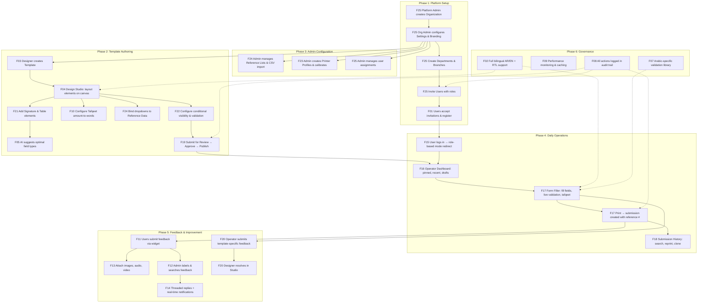
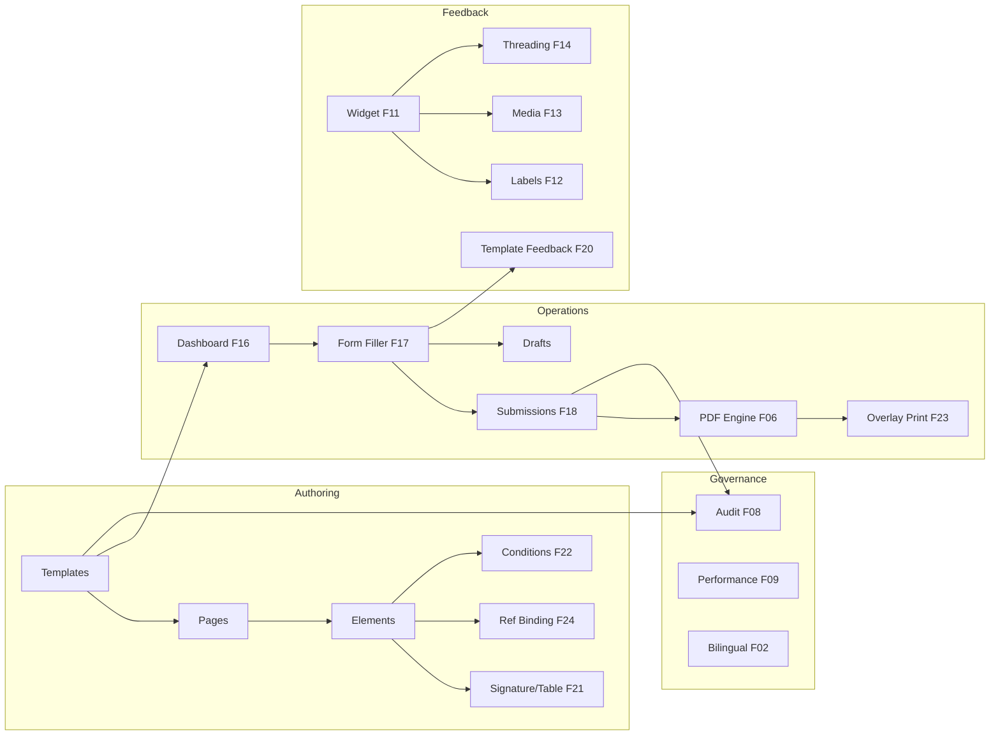

# FormCraft — Comprehensive Platform Flow

> End-to-end flow across all 25 features, tracing every major user journey from platform setup through daily operations.
> Last updated: 2026-05-22

---

## Platform lifecycle overview



---

## Phase 1: Platform Setup (F01, F25)

### 1.1 Organization creation

```
Platform Admin (is_platform_admin=true) creates a new organization
→ POST /api/organizations { name_ar, name_en, default_language, default_country, default_currency }
→ Organization created with subscription_tier="starter", is_active=true
→ RLS policies scoped to org_id from this point forward
→ Audit: ORG_CREATED
```

### 1.2 Org configuration and branding

```
Org Admin opens /admin/settings
→ Uploads logo → Supabase Storage org-logos/{org_id}/
→ Sets primary_color, custom_domain, default language
→ Configures workflow settings:
    approval_workflow (on/off), hijri_date_support,
    draft_expiry_days, data_retention_months, max_batch_size
→ PATCH /api/org-settings
→ Custom domain: /auth/branding/{domain} returns org branding for login page
```

### 1.3 Organizational structure

```
Org Admin opens /admin/departments
→ Creates departments: POST /api/departments { name_ar, name_en }
→ Opens department → creates branches: POST /api/branches { name_ar, name_en, location }
→ Hierarchy: Organization → Department → Branch
→ Templates can be scoped to departments
→ Submissions tagged with branch for reporting
```

### 1.4 User invitations

```
Org Admin opens /admin/invitations → clicks "Invite User"
→ POST /api/invitations { email, role, department_id, branch_id }
→ Roles: admin, designer, branch_manager, operator, viewer (enum-validated)
→ Invitation email sent with unique token link (72-hour expiry)
→ Invitee clicks /invite/{token} → registration form (name + password)
→ POST /api/invitations/accept/{token} → creates Supabase Auth user + profile
→ Profile scoped to org_id, department_id, branch_id
→ Audit: USER_INVITED, USER_REGISTERED
```

---

## Phase 2: Template Authoring (F03, F04, F05, F10, F19, F21, F22, F24)

### 2.1 Template creation

```
Designer opens /studio/templates → "New Template"
→ POST /api/templates { name_ar, name_en, country, category }
→ Template created: status=draft, version=1, lineage_id generated
→ Template page auto-created with default A4 dimensions
→ Opens in Design Studio canvas editor
```

### 2.2 Canvas design

```
Designer in /designer/:pageId
→ Drags elements from palette onto canvas:
    Text, Number, Date, Currency, Checkbox, Radio, Dropdown,
    Image, QR, Barcode, Tafqeet, Signature (F21), Table (F21)
→ Each element: position (x_mm, y_mm), size (w_mm, h_mm), properties
→ Properties panel: label_ar, label_en, formatting, validation rules
→ Auto-save: dirty$ observable → debounced 2s PATCH to API
→ AI Suggest (F05): analyzes field label → suggests optimal type + validators
```

### 2.3 Signature and table elements (F21)

```
Signature: pen_color, pen_width, canvas_height
→ Operator draws on HTML5 canvas → base64 PNG → stored inline or Storage bucket
→ PDF: embedded as image at exact mm position

Table: columns array with key/label/type per column, min_rows, max_rows, show_footer
→ Operator fills via Angular Material table with FormArray
→ Footer auto-sums numeric columns
→ PDF: rendered as HTML table at element coords
```

### 2.4 Tafqeet configuration (F10)

```
Designer selects tafqeet element → sets sourceElementKey to currency field
→ Configures: currency (EGP/SAR/AED), language (ar/en/both)
→ Operator types amount → tafqeet computes Arabic words in <200ms
→ Read-only field, auto-updated on source change
```

### 2.5 Reference data binding (F24)

```
Admin creates reference lists: /admin/reference-data
→ Defines schema: column definitions (key, label, type, required, unique_key)
→ Adds entries manually or imports via CSV (two-phase: preview → confirm)

Designer binds dropdown element to reference list:
→ Properties panel → Data Source → select list + display_column + value_column
→ Operator sees searchable dropdown populated from reference entries
```

### 2.6 Advanced validation and conditions (F22)

```
Designer configures per-element:
→ Conditional visibility: show/hide element based on other field values
→ Conditional required: make required based on conditions
→ Computed values: derive value from expression on other fields
→ Country-specific validators: ValidatorRegistry matches element key to country validators

Backend re-validates all conditions on submission (server-side enforcement)
```

### 2.7 Template versioning and review (F19)

```
Designer finishes edits → clicks "Submit for Review"
→ Status: draft → submitted_for_review (template becomes read-only)
→ Reviewer (admin/branch_manager) reviews:
    Approve → status: approved
    Reject with comment → status: draft (designer sees comment)
→ Admin publishes: status → published (immutable from this point)
→ Version number set; Form Desk shows this as active version

Future changes: "Create New Version" → copies all to new draft (v2)
→ v1 remains active until v2 published → v1 auto-deprecated
→ Full lineage tracked via lineage_id + parent_version_id
→ Diff view: compare any two versions element-by-element
→ Audit: TEMPLATE_SUBMITTED, _APPROVED, _REJECTED, _PUBLISHED, _ARCHIVED, _DEPRECATED
```

---

## Phase 3: Admin Configuration (F23, F24, F25)

### 3.1 Printer profiles (F23)

```
Admin opens /admin/printer-profiles
→ Creates profile: name, paper_size, margins (top/right/bottom/left mm)
→ Calibration: print test page → measure offsets → enter corrections
→ Sets default profile for org
→ Overlay print mode: PDF renders only dynamic content (no background)
→ Designer marks elements as overlay_exclude in Design Studio
```

### 3.2 Reference data management (F24)

```
Admin creates reference lists with flexible schemas
→ Entries: JSONB values matching schema columns
→ CSV import: upload → auto-map columns → preview validation → confirm
→ Insert mode: add new entries
→ Update mode: upsert by unique key column
→ All lists scoped by org_id via RLS
```

### 3.3 User management (F25)

```
Org Admin views /admin/users → all org users listed
→ Edit assignment: change role, department, branch
→ Deactivate user: is_active=false (soft delete)
→ All changes scoped by org_id
→ Audit: USER_ROLE_CHANGED, USER_DEACTIVATED
```

---

## Phase 4: Daily Operations (F15, F16, F17, F18)

### 4.1 Login and mode routing (F01, F15)

```
User opens /auth/login (custom domain shows org branding)
→ POST /api/auth/login { email, password }
→ Single org: immediate redirect
→ Multi-org: org selector cards → POST /api/auth/login/select-org

Mode routing after auth:
→ Check stored preferred_mode (if authorized for current role)
→ Fallback to role default: operator→/desk, designer→/studio/templates, admin→/admin
→ Nav bar shows only authorized mode tabs
→ Mode switch: instant SPA navigation (<200ms), preference saved (fire-and-forget)
→ Unauthorized route: toast + redirect to default mode
```

### 4.2 Operator dashboard (F16)

```
Operator lands on /desk
→ Single GET /api/desk/dashboard → aggregated response:
    Pinned Forms (max 20, persisted server-side)
    Recently Used (max 10, ordered by last_used)
    Saved Drafts (with completion %, expiry warnings)
    All Published Templates (paginated 20/page)
→ Search: 300ms debounce, filters by name + description
→ Filter by: category, country, language
→ Pin/unpin: star icon, max 20 pins
→ Template version notifications: "KYC Form updated to v2"
→ Loads within 1 second
```

### 4.3 Form filling (F17)

```
Operator clicks template card → /desk/fill/:templateId
→ Load published template → render all elements as Angular Material controls
→ Flow Layout: vertical stack by sort_order, page dividers, Tab navigation

Validation (live on blur):
→ Required: "هذا الحقل مطلوب" / "This field is required"
→ Pattern: regex match with bilingual error
→ Country-specific: ValidatorRegistry (national_id, tax_number, etc.)
→ Error banner: "3 errors remaining" — Print disabled until 0

Tafqeet: source field changes → Arabic words update in <200ms

Draft save: manual (Ctrl+S) or auto (every 60s, silent)
→ Resume: /desk/fill/:templateId?draft=:draftId → values restored

Print: all validations pass → POST /api/submissions
→ Reference number generated: FC-{YYYY}-{MM}-{org_sequence}
→ PDF rendered → browser print dialog
→ Audit: FORM_SUBMITTED

Print & Next: print → form resets for next entry (same template)
```

### 4.4 Submission history (F18)

```
Operator opens /desk/history
→ Paginated table: reference #, template, date, status, key field summary
→ Search: by ref # (exact), template name (partial), date range
→ Click row → detail view: all field values read-only + metadata

Reprint: generates PDF with original version + "REPRINT" watermark + timestamp
→ Audit: FORM_REPRINTED

Clone as New: opens Form Filler pre-filled with old data on latest version
→ Modified fields → Print → new submission with new reference #

Export: JSON or CSV per submission
```

---

## Phase 5: Feedback & Improvement (F11, F12, F13, F14, F20)

### 5.1 General feedback (F11, F13)

```
Any authenticated user can submit feedback from any page
→ Feedback widget: category, page URL, text, rating (1-5)
→ Rich media (F13): attach up to 5 images, record audio/video
→ Images: sequential upload to Supabase Storage feedback-media/
→ Video: MediaRecorder API → upload to feedback-media/ (max 100MB)
→ POST /api/feedback creates submission with media references
```

### 5.2 Feedback management (F12)

```
Admin opens /admin/feedback
→ Dashboard: paginated table with filters (status, category, date, labels)
→ Label system: admin creates labels → assigns to feedback
→ Multi-select: bulk assign labels, bulk change status
→ Search: full-text across feedback text + metadata
```

### 5.3 Threaded replies (F14)

```
Admin clicks feedback row → thread panel expands
→ Shows original submission + all replies (chronological, paginated 20/batch)
→ Admin types reply → POST /api/admin/feedback/:id/replies
→ Supabase Realtime broadcasts to submission owner within ~5s
→ User sees notification badge on /my-feedback
→ User can reply back → admin sees unread indicator
→ Status dropdown in thread panel: new → reviewed → resolved
```

### 5.4 Template-specific feedback (F20)

```
Operator in Form Filler → clicks feedback icon
→ Slide-out: category (bug/suggestion/question), page selector, element selector, text
→ Feedback linked to: template_id, version, page_number, element_key
→ Minimum 10 characters; duplicate detection within 1 minute

Designer in Design Studio → Feedback tab with open count badge
→ Filter by version, category, status, page
→ Click element-linked feedback → canvas scrolls to and highlights element
→ Resolve with optional note → badge decrements

Admin at /admin/template-feedback → overview table
→ Open/resolved counts per template → identify top issues → export CSV
```

---

## Phase 6: Governance (F02, F07, F08, F09)

### 6.1 Bilingual support (F02)

```
Every UI element served from i18n JSON (ar.json / en.json)
→ Language toggle: TranslateService.use() → all pipes re-render
→ Document direction flips: RTL ↔ LTR
→ Form labels: label_ar / label_en based on active language
→ PDF: Noto Naskh Arabic font, arabic-reshaper + python-bidi for shaping
→ Western Arabic numerals (0-9) always used
→ Preference persisted: PATCH /api/users/me { language }
```

### 6.2 Validation library (F07)

```
ValidatorRegistry: country-specific validators indexed by country + field key
→ Egypt: national_id (14 digits, Luhn), tax_number, commercial_register
→ Saudi Arabia: national_id (10 digits), CR number
→ UAE: Emirates ID
→ Validators return bilingual error messages
→ Applied on blur (frontend) AND on submission (backend re-validation)
```

### 6.3 Audit trail (F08)

```
Every state-changing action creates an audit log entry:
→ actor (user_id), action (enum), resource_type, resource_id
→ before/after state (for updates), IP address, timestamp
→ Scoped by org_id

Key events: LOGIN, LOGOUT, TEMPLATE_PUBLISHED, FORM_SUBMITTED, FORM_REPRINTED,
USER_INVITED, USER_ROLE_CHANGED, FEEDBACK_RESOLVED, ORG_SETTINGS_UPDATED, ...

Admin views: /admin/audit-logs with date, actor, action filters
```

### 6.4 Performance (F09)

```
AI suggestion caching: Redis/memory cache for repeated queries
→ PDF rendering: parallel element processing, font pre-loading
→ Lazy loading: Angular modules loaded on route activation
→ Database: RLS + indexed queries, connection pooling
→ Storage: signed URLs for media, CDN-friendly paths
```

---

## Data flow summary



---

## Key metrics across all features

| Metric | Target | Feature |
|--------|--------|---------|
| Login → mode redirect | < 1 second | F01, F15 |
| Mode switch | < 200ms | F15 |
| Dashboard load | < 1 second (200 templates) | F16 |
| Form render (50 elements) | < 1 second | F17 |
| Tafqeet computation | < 200ms | F10 |
| Field validation (blur) | < 100ms | F07, F22 |
| PDF generation (A4) | < 3 seconds | F06 |
| Draft save | < 500ms, non-blocking | F17 |
| Search results | < 500ms | F12, F16, F18 |
| Template version copy (100 elements) | < 2 seconds | F19 |
| Version diff (200 elements/version) | < 1 second | F19 |
| Feedback submission | < 500ms | F11, F20 |
| Realtime notification delivery | < 5 seconds | F14 |
| Submission history (1000 records) | < 1 second | F18 |
| CSV import preview | < 3 seconds | F24 |
| Audit log query | < 1 second | F08 |
