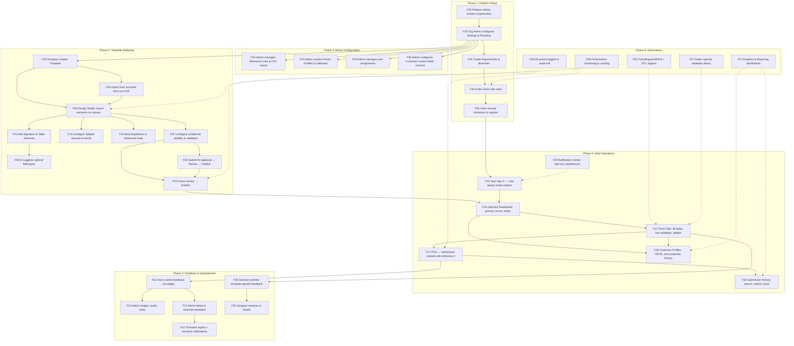
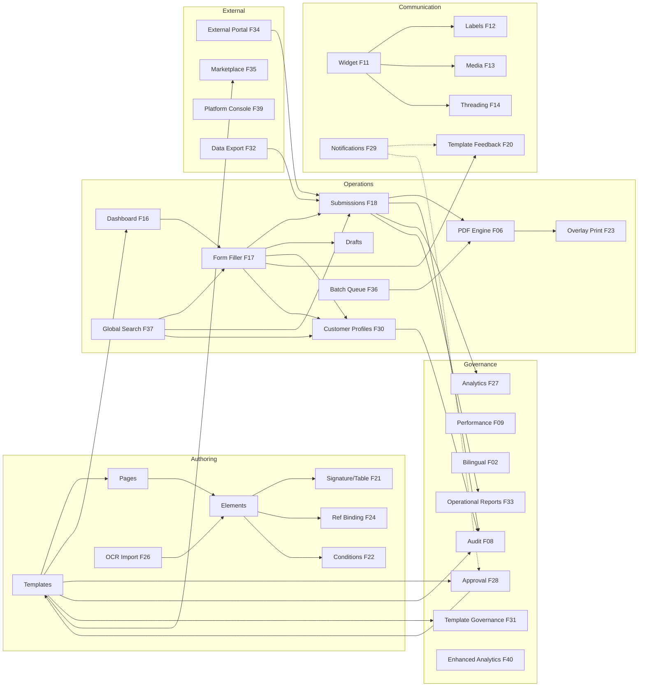

# FormCraft — Comprehensive Platform Flow

> End-to-end flow across all 28 features, tracing every major user journey from platform setup through daily operations.
> Includes UI step-by-step user flows for each phase.
> Last updated: 2026-05-25

---

## Platform lifecycle overview



---

## Phase 1: Platform Setup (F01, F25)

### 1.1 Organization creation

> **Status**: ⚠️ BACKEND ONLY — API endpoints exist (`POST/GET/PATCH /api/organizations`),
> but no frontend UI has been built. Requires **PC-01: Platform Admin Dashboard**
> (see `docs/system-critique-and-vision.md` § Platform Console Features).
> Target routes: `/platform/organizations/*`

```
Platform Admin (is_platform_admin=true) creates a new organization
-> POST /api/organizations { name_ar, name_en, default_language, default_country, default_currency }
-> Organization created with subscription_tier="starter", is_active=true
-> RLS policies scoped to org_id from this point forward
-> Audit: ORG_CREATED
```

#### UI Flow: Create Organization (PC-01 — not yet implemented)

```
1. Platform Admin logs in at /auth/login
   Screen: Login form (email + password)
   -> is_platform_admin=true detected → redirect to /platform/organizations

2. Platform Console — Organization List (/platform/organizations)
   ┌──────────────────────────────────────────────────────┐
   │ [Platform] tab active in nav bar                      │
   │                                                       │
   │  Organizations               [+ Create Organization]  │
   │  ┌──────────────────────────────────────────────────┐ │
   │  │ Name (AR/EN)    │ Tier    │ Status │ Created     │ │
   │  ├──────────────────────────────────────────────────┤ │
   │  │ شركة أ / Co A   │ starter │ Active │ 2026-01-15  │ │
   │  │ شركة ب / Co B   │ pro     │ Active │ 2026-03-01  │ │
   │  └──────────────────────────────────────────────────┘ │
   │  Search / filter / paginate                           │
   └──────────────────────────────────────────────────────┘

3. Clicks "Create Organization" → navigates to /platform/organizations/new
   ┌─────────────────────────────────────────┐
   │  Create Organization                     │
   │                                          │
   │  Name (Arabic)*:  [________________]     │
   │  Name (English):  [________________]     │
   │  Default Language: [Arabic ▼]            │
   │  Country:         [Egypt ▼]              │
   │  Currency:        [EGP ▼]               │
   │                                          │
   │              [Cancel]  [Create]           │
   └─────────────────────────────────────────┘

4. Fills fields, clicks "Create"
   -> POST /api/organizations
   -> Snackbar: "Organization created successfully"
   -> Redirect to /platform/organizations/:id (detail view)

5. Organization Detail (/platform/organizations/:id)
   -> View/edit org settings, logo upload, toggle is_active
   -> PATCH /api/organizations/:id
   -> POST /api/organizations/:id/logo
```

### 1.2 Org configuration and branding

```
Org Admin opens /admin/settings
-> Uploads logo -> Supabase Storage org-logos/{org_id}/
-> Sets primary_color, custom_domain, default language
-> Configures workflow settings:
    hijri_date_support, draft_expiry_days
    approval_workflow (on/off), auto_create_customer_profiles
-> PATCH /api/org-settings
-> Custom domain: /auth/branding/{domain} returns org branding for login page
```

#### UI Flow: Configure Organization Settings

```
1. Admin clicks "Admin Console" tab in top toolbar
   Toolbar: [FormCraft] [Studio] [Desk] [Admin*] -------- [Bell] [Avatar]
   Redirected to /admin/settings (default admin landing page)

2. Org Settings page loads with two card sections:
   Screen /admin/settings:
   ┌──────────────────────────────────────────────────────┐
   │  Organization Settings ({{ 'org.title' | translate }})│
   │                                                       │
   │  ── Branding (mat-card) ──────────────────────────── │
   │  Org Name (AR): [بنك مصر التجاري__________]  (RTL)  │
   │  Org Name (EN): [Egypt Commercial Bank_____]         │
   │  Logo:          [Upload Logo] [preview img]          │
   │  Primary Color: [#3F51B5 color picker]               │
   │  Custom Domain: [forms.ecb.com.eg_________]          │
   │                                                       │
   │  ── Settings (mat-card) ──────────────────────────── │
   │  Default Language: [Arabic ▼]                        │
   │  Default Country:  [Egypt ▼]  (EG, SA, AE)          │
   │  Default Currency: [EGP ▼]    (EGP, SAR, AED, USD)  │
   │                                                       │
   │  Approval Workflow:            [toggle OFF]          │
   │  Hijri Date Support:           [toggle ON]           │
   │                                                       │
   │  Draft Expiry (days):          [30______]            │
   │  Data Retention (months):      [24______]            │
   │  Max Batch Size:               [100_____]            │
   │                                                       │
   │                              [Save Changes]           │
   └──────────────────────────────────────────────────────┘

   Note: "Auto-create Customer Profiles" toggle and
   "Customer Custom Fields" section will be added by F29
   (Customer Profiles feature — not yet implemented).

3. Admin uploads logo via file picker
   -> Preview updates instantly (logo_url)
   -> Logo appears in toolbar for all users (T046 in app-shell)

4. Edits settings, clicks "Save Changes"
   -> PATCH /api/org-settings
   -> Snackbar: "Settings saved"
```

### 1.3 Organizational structure

```
Org Admin opens /admin/departments
-> Creates departments: POST /api/departments { name_ar, name_en }
-> Opens department -> creates branches: POST /api/branches { name_ar, name_en, location }
-> Hierarchy: Organization -> Department -> Branch
-> Templates can be scoped to departments
-> Submissions tagged with branch for reporting
```

#### UI Flow: Manage Departments & Branches

```
1. Admin clicks "Departments" in admin nav
   Screen /admin/departments:
   ┌──────────────────────────────────────────────────────────┐
   │  Departments                          [+ Add Department] │
   │                                                          │
   │  | Name (AR)         | Name (EN)      | Branches | Users | Active | Actions |
   │  | إدارة الائتمان    | Credit Dept    | 3        | 12    | ✓      | ✏ ⊘    |
   │  | إدارة الحسابات    | Accounts Dept  | 2        | 8     | ✓      | ✏ ⊘    |
   │  | إدارة تكنولوجيا   | IT Dept        | 1        | 5     | ✓      | ✏ ⊘    |
   │                                                          │
   │  (Click any row to expand branches below)                │
   └──────────────────────────────────────────────────────────┘

   Clicking "Credit Dept" row expands branches panel:
   ┌──────────────────────────────────────────────────────────┐
   │  Branches - Credit Dept                  [+ Add Branch]  │
   │                                                          │
   │  | Name (AR)         | Name (EN)       | Location | Users | Actions |
   │  | فرع المعادي       | Maadi Branch    | Maadi    | 4     | ✏ ⊘    |
   │  | فرع مدينة نصر     | Nasr City Branch| Nasr City| 5     | ✏ ⊘    |
   │  | فرع حلوان         | Helwan Branch   | Helwan   | 3     | ✏ ⊘    |
   └──────────────────────────────────────────────────────────┘

2. Clicks "+ Add Department"
   Dialog: Department name (AR)*, name (EN)*
   -> POST /api/departments -> new row in table

   Note: "Default Reviewer" per department will be added by F28
   (Approval Workflow feature).

3. Expands department, clicks "+ Add Branch"
   Dialog: Branch name (AR)*, name (EN)*, location (optional)
   -> POST /api/branches -> branch appears in expanded panel

4. ✏ Edit icon -> same dialog pre-filled for update
   ⊘ Deactivate icon -> confirm dialog -> deactivates (soft delete)
```

### 1.4 User invitations

```
Org Admin opens /admin/invitations -> clicks "Invite User"
-> POST /api/invitations { email, role, department_id, branch_id }
-> Roles: admin, designer, branch_manager, operator, viewer (enum-validated)
-> Invitation email sent with unique token link (72-hour expiry)
-> Invitee clicks /invite/{token} -> registration form (name + password)
-> POST /api/invitations/accept/{token} -> creates Supabase Auth user + profile
-> Profile scoped to org_id, department_id, branch_id
-> Audit: USER_INVITED, USER_REGISTERED
```

#### UI Flow: Invite Users

```
1. Admin clicks "Invitations" in admin nav
   Screen /admin/invitations:
   ┌──────────────────────────────────────────────────────────────┐
   │  User Invitations                                            │
   │                                                              │
   │  ── Invite User (inline mat-card form, always visible) ──── │
   │  Email*: [__________] Role*: [Operator ▼] Dept: [▼] Branch: [▼] [Send]│
   │  Roles available: designer, operator, viewer                 │
   │  Branch dropdown filters by selected department              │
   │                                                              │
   │  ── Invitations List ─────────────────────────────────────── │
   │  | Email         | Role     | Dept      | Branch  | Status  | Expires   | Act |
   │  | ali@ecb.com   | operator | Credit    | Maadi   | Accepted| May 20    |     |
   │  | sara@ecb.com  | designer | Accounts  | —       | Pending | May 27    | ⊘   |
   │  | omar@ecb.com  | viewer   | —         | —       | Expired | May 13    |     |
   │                                                              │
   │  ⊘ = Cancel invitation (only shown for pending)              │
   └──────────────────────────────────────────────────────────────┘

2. Fills inline form, clicks "Send"
   -> POST /api/invitations
   -> Snackbar: "Invitation sent"
   -> Form resets, new row appears in table

3. Invitee receives email with link -> clicks link
   Screen /invite/{token}:
   ┌───────────────────────────────────────┐
   │  [Org Logo]                           │
   │  Welcome to بنك مصر التجاري          │
   │                                       │
   │  Display Name*: [__________________]  │
   │  Password*:     [__________________]  │
   │  Confirm:       [__________________]  │
   │                                       │
   │            [Accept & Register]        │
   └───────────────────────────────────────┘

4. Fills form, clicks "Accept & Register"
   -> POST /api/invitations/accept/{token}
   -> Account created, auto-logged in
   -> Redirected to role-based default mode
```

#### UI Flow: Manage Existing Users

```
1. Admin clicks "Users" in admin nav
   Screen /admin/users:
   ┌────────────────────────────────────────────────────────────────────┐
   │  User Management                                                   │
   │                                                                    │
   │  Filters: [Department ▼] [Branch ▼] [Role ▼] [Status ▼]          │
   │  (All dropdowns filter the table on selection change)              │
   │                                                                    │
   │  | Name      | Email         | Role     | Dept   | Branch | Active | Last Login | Act |
   │  | أحمد حسن  | ahmed@ecb.com | admin    | —      | —      | ✓      | May 25     | ✏ ⊘ |
   │  | سارة أحمد | sara@ecb.com  | designer | ائتمان | المعادي| ✓      | May 24     | ✏ ⊘ |
   │  | علي محمد  | ali@ecb.com   | operator | حسابات | حلوان  | ✓      | Never      | ✏ ⊘ |
   │                                                                    │
   │  ✏ = Edit assignment   ⊘ = Deactivate (active users)              │
   │  Deactivated users show ⊕ Activate button instead                  │
   └────────────────────────────────────────────────────────────────────┘

2. Clicks ✏ -> Edit Assignment dialog:
   ┌───────────────────────────────────────┐
   │  Edit Assignment                      │
   │  سارة أحمد                            │
   │                                       │
   │  Role*:       [Designer ▼]            │
   │  Department:  [إدارة الائتمان ▼]     │
   │  Branch:      [فرع المعادي ▼]        │
   │  (Branch filters by selected dept)    │
   │                                       │
   │            [Cancel]  [Save]           │
   └───────────────────────────────────────┘

3. Changes role/assignment, clicks "Save"
   -> PATCH /api/admin/users/:id
   -> Table refreshes
```

---

## Phase 2: Template Authoring (F03, F04, F05, F10, F19, F21, F22, F24, F26, F28, F38)

### 2.1 Template creation

```
Designer opens /studio/templates -> "New Template"
-> POST /api/templates { name_ar, name_en, country, category }
-> Template created: status=draft, version=1, lineage_id generated
-> Template page auto-created with default A4 dimensions
-> Opens in Design Studio canvas editor
```

#### UI Flow: Create a New Template

```
1. Designer clicks "Design Studio" tab in toolbar
   Toolbar: [FormCraft] [Studio*] [Desk] -------- [Bell] [Avatar]
   Redirected to /templates

2. Template list page loads
   Screen /templates:
   ┌──────────────────────────────────────────────────────┐
   │  Templates (toolbar)                      [+ Create]  │
   │                                                       │
   │  (Card grid — no search, filters, or pagination)     │
   │  ┌─────────────┐  ┌─────────────┐  ┌─────────────┐  │
   │  │ شهادة خبرة  │  │ عقد عمل     │  │ نموذج KYC   │  │
   │  │ draft · v2   │  │ published·v1│  │ draft · v3   │  │
   │  │ (description)│  │ (description)│  │ (description)│  │
   │  │ [Designer]   │  │ [Designer]   │  │ [Designer]   │  │
   │  │ [📋Clone]    │  │ [📋Clone]    │  │ [📋Clone]    │  │
   │  │ [Publish]    │  │ [New Version]│  │ [Publish]    │  │
   │  │ [🗑]         │  │ [🗑]         │  │ [🗑]         │  │
   │  └─────────────┘  └─────────────┘  └─────────────┘  │
   │                                                       │
   │  Note: Search, filters, and pagination not yet        │
   │  implemented.                                         │
   └──────────────────────────────────────────────────────┘

3. Clicks "+ Create" button
   Dialog (520px):
   ┌───────────────────────────────────────┐
   │  Create Template                      │
   │                                       │
   │  Name*:        [__________________]  │
   │                (single field, fcAutoDir)│
   │  Description:  [__________________]  │
   │                [__________________]  │
   │  Category*:    [General ▼]           │
   │    (general/government/finance/       │
   │     healthcare/education)             │
   │  Language*:    [Arabic ▼]            │
   │  Country*:     [Egypt ▼]             │
   │                                       │
   │            [Cancel]  [Save]           │
   └───────────────────────────────────────┘

   Note: No separate AR/EN name fields. No department
   assignment at creation time.

4. Fills form, clicks "Save"
   -> POST /api/templates
   -> Template created: status=draft, version=1
   -> Dialog closes, template list refreshes
   -> Click "Designer" on card → /designer/{templateId}
```

#### UI Flow: Template Creation Wizard (F38/DS-02 — not yet implemented)

> ⚠️ **NOT YET IMPLEMENTED** — Current UI uses a simple dialog (above).
> Vision: multi-step wizard with page setup and 4 starting points.

```
1. Designer clicks "+ Create" → wizard opens (full-screen overlay)

   Step 1 — Basic Info:
   ┌───────────────────────────────────────────────┐
   │  Create Template     Step 1 of 4              │
   │  ──────────────────────────────────           │
   │  Name*:        [__________________]  fcAutoDir │
   │  Description:  [________________________]     │
   │  Category*:    [General ▼]                    │
   │  Tags:         [tag1] [tag2] [+ Add]          │
   │                                               │
   │                          [Cancel]  [Next →]   │
   └───────────────────────────────────────────────┘

   Step 2 — Locale:
   ┌───────────────────────────────────────────────┐
   │  Create Template     Step 2 of 4              │
   │  ──────────────────────────────────           │
   │  Language*:    [Arabic ▼]   (AR/EN/Both)      │
   │  Country*:     [Egypt ▼]    (EG/SA/AE)        │
   │  Currency*:    [EGP ▼]                        │
   │                                               │
   │  (Org defaults pre-selected)                  │
   │                                               │
   │                  [← Back]  [Cancel]  [Next →] │
   └───────────────────────────────────────────────┘

   Step 3 — Page Setup:
   ┌───────────────────────────────────────────────┐
   │  Create Template     Step 3 of 4              │
   │  ──────────────────────────────────           │
   │  Page Size*:   [A4 ▼]                         │
   │    (A4 / A3 / Letter / Legal / Custom mm)     │
   │  Orientation:  (●) Portrait  (○) Landscape    │
   │  Margins (mm): Top [10] Bottom [10]           │
   │                Left [10] Right [10]           │
   │                                               │
   │  ┌────────────────┐ Live page preview         │
   │  │                │ 210mm × 297mm             │
   │  │    (preview)   │                           │
   │  │                │                           │
   │  └────────────────┘                           │
   │                  [← Back]  [Cancel]  [Next →] │
   └───────────────────────────────────────────────┘

   Step 4 — Starting Point:
   ┌───────────────────────────────────────────────┐
   │  Create Template     Step 4 of 4              │
   │  ──────────────────────────────────           │
   │  How do you want to start?                    │
   │                                               │
   │  ┌──────────┐ ┌──────────┐ ┌──────────┐ ┌──────────┐
   │  │  Blank   │ │  Clone   │ │  Import  │ │ Package  │
   │  │  Canvas  │ │ Existing │ │  Scan    │ │ .formcraft│
   │  │  (icon)  │ │  (icon)  │ │  (icon)  │ │  (icon)  │
   │  └──────────┘ └──────────┘ └──────────┘ └──────────┘
   │                                               │
   │  [Clone]: Browse template list → select → preview
   │  [Import Scan]: Upload image/PDF → OCR pipeline
   │  [Package]: Upload .formcraft file → parse → preview
   │                                               │
   │             [← Back]  [Cancel]  [Create →]    │
   └───────────────────────────────────────────────┘

2. On "Create":
   -> POST /api/templates with all wizard config
   -> Template created with page size, margins, locale
   -> If Clone: all elements + validators + bindings copied
   -> If Package: elements imported, missing bindings warned
   -> Canvas editor opens with configured settings applied
```

### 2.2 Canvas design

```
Designer in /designer/:templateId
-> Drags elements from palette onto canvas:
    Text, Number, Date, Currency, Checkbox, Radio, Dropdown,
    Image, QR, Barcode, Tafqeet, Signature (F21), Table (F21)
-> Each element: position (x_mm, y_mm), size (w_mm, h_mm), properties
-> Properties panel: label_ar, label_en, formatting, validation rules
-> Auto-save: dirty$ observable -> debounced 2s PATCH to API
-> AI Suggest (F05): analyzes field label -> suggests optimal type + validators
```

#### UI Flow: Design Studio Canvas

```
1. Designer lands on the canvas editor
   Screen /designer/{templateId}:
   ┌──────────────────────────────────────────────────────────────────────────┐
   │ [StatusBadge] شهادة راتب [Dept ▼]  ··  [Submit] [History] [Feedback]   │
   │ [Pin Palette] [Pin Props] [Import Cheque] [Zoom+/-] [Snap] [Undo/Redo]│
   │ [Save]                                                                  │
   ├──────────┬──────────────────────────────────┬──────────────────────────┤
   │ Elements │     Konva Canvas (A4 210x297mm)   │   Properties            │
   │(mat-sidenav│ ┌──────────────────────────┐    │  (mat-sidenav,          │
   │ pin/float)│ │                          │     │   pin/float)            │
   │ [T] Text │  │   (drag elements here)   │     │                         │
   │ [#] Number│  │                          │     │ Selected: None          │
   │ [D] Date │  │                          │     │                         │
   │ [$] Currency│ │                         │     │ -- No element --        │
   │ [v] Checkbox│ │                         │     │                         │
   │ [o] Radio│  │                          │     │                         │
   │ [▼] Dropdown│ │                         │     │                         │
   │ [Sig] Sign│ │                          │     │                         │
   │ [T] Table│  │                          │     │                         │
   │ [QR] QR  │  │                          │     │                         │
   │ [img] Image│ └──────────────────────────┘    │                         │
   │          │   Import/Detections overlay panel  │                         │
   └──────────┴──────────────────────────────────┴──────────────────────────┘
   
   Toolbar features (actual implementation):
   - StatusBadge: draft/published/in_review
   - Department dropdown: assign template to department
   - Submit for Review (F28 approval workflow)
   - Version History panel (F19)
   - Feedback panel + unread badge (F01)
   - Palette & Properties panels: pinnable or floating (draggable)
   - Import Cheque: OCR field detection (F26)
   - Zoom in/out, Snap grid, Undo/Redo
   - Manual Save button (disabled when not dirty)

2. Drags "Text" element from left palette onto canvas
   -> Element appears on Konva canvas (drag-from-palette or click-to-add)
   -> Right panel updates with properties:

   Properties panel (when element selected):
   ┌───────────────────┐
   │ Text Field         │
   │                    │
   │ Key*: [emp_name__]│
   │ Label AR: [اسم___]│
   │ Label EN: [Name__]│
   │ X: [20] Y: [40]  │
   │ W: [80] H: [10]  │
   │                    │
   │ ── Validation ──  │
   │ Required: [toggle] │
   │ Pattern:  [______]│
   │ Min Len:  [______]│
   │                    │
   │ ── Format ──────  │
   │ Font Size: [12▼]  │
   │ Bold: [toggle]    │
   │ Alignment: [R▼]   │
   └───────────────────┘

3. Drags more elements to build the form layout
   -> Each element snaps to position on A4 paper
   -> Auto-save triggers every 2 seconds on changes
   -> Status indicator: "Saved" / "Saving..." in toolbar

4. Clicks "AI" button in toolbar
   -> AI analyzes field labels and suggests:
     "Field 'national_id' -> suggest type: Number, add national ID validator"
   -> Designer accepts/dismisses chip suggestions
```

#### UI Flow: Canvas Enhancements (DS-03 — not yet implemented)

> ⚠️ **NOT YET IMPLEMENTED** — Vision enhancements beyond current canvas.

```
Enhanced canvas features (beyond current grid-snap):

1. Alignment guides
   -> Drag an element → blue dashed lines appear when aligned
      with edges/centers of other elements (not just grid)

2. Smart distribute
   -> Select 3+ elements → right-click → "Distribute Equally"
   -> Elements spaced evenly (horizontal or vertical)

3. Group/ungroup
   -> Select multiple → Ctrl+G to group
   -> Grouped elements move/resize together
   -> Ctrl+Shift+G to ungroup

4. Element search
   -> Ctrl+F in canvas → search by element key or label
   -> Matching element highlighted and scrolled into view

5. Ruler with mm markings
   ┌──┬──┬──┬──┬──┬──┬──┬──┬──┬──┬──┬──┐
   │ 0│10│20│30│40│50│60│70│80│90│..│210│  ← mm ruler (top)
   ├──┼──────────────────────────────────┤
   │10│                                  │
   │20│        (canvas area)             │  ← mm ruler (left)
   │30│                                  │
   │..│                                  │
   └──┴──────────────────────────────────┘
```

#### UI Flow: AI Batch Analysis & Quality Score (DS-04 — not yet implemented)

> ⚠️ **NOT YET IMPLEMENTED** — Requires AWS Bedrock credentials.

```
1. Designer clicks "Analyze All Fields" in AI toolbar section
   -> POST /api/ai/analyze-all { template_id, elements: [...] }
   -> AI reviews all elements simultaneously

2. Cross-field suggestion panel opens (slide-in from right):
   ┌──────────────────────────────────────┐
   │  AI Analysis Results                  │
   │                                       │
   │  ⚡ 3 fields look like an address    │
   │     group — add section header?       │
   │     [Accept] [Dismiss]               │
   │                                       │
   │  ⚡ Currency field has no linked      │
   │     tafqeet — add one?               │
   │     [Accept] [Dismiss]               │
   │                                       │
   │  ⚡ National ID detected but no       │
   │     IBAN — typical KYC forms have both│
   │     [Accept] [Dismiss]               │
   └──────────────────────────────────────┘

3. Template Quality Score (shown on template card in library):
   ┌─────────────┐
   │ نموذج KYC   │
   │ ⭐ Score: 85 │  ← Quality badge
   │ published·v3│
   │ Validators: 92%  │
   │ Bilingual: 100%  │
   │ Help text: 60%   │
   └─────────────┘
```

#### UI Flow: PDF Engine Enhancements (DS-06 — not yet implemented)

> ⚠️ **NOT YET IMPLEMENTED** — Enhancements beyond current PDF rendering.

```
Enhanced PDF capabilities (beyond current WeasyPrint rendering):

1. Watermark support (template settings):
   Print Mode:     [Full ▼]
   Watermark:      [✓ Enabled]
   Watermark Text: [DRAFT________]
   Position:       [Center ▼]
   Opacity:        [30% ───●────]

2. Header/footer engine (per template):
   ┌───────────────────────────────────────────┐
   │ Page 1 of 3  |  KYC Form v2.0  |  [Logo] │  ← auto header
   ├───────────────────────────────────────────┤
   │                                           │
   │         (form content)                    │
   │                                           │
   ├───────────────────────────────────────────┤
   │ Printed: 2026-05-25  |  Ref: FC-0042     │  ← auto footer
   └───────────────────────────────────────────┘

3. Conditional rendering in PDF:
   -> Elements with visible_when rules evaluated against data
   -> Hidden elements do NOT occupy space in PDF output

4. Batch rendering:
   -> POST /api/pdf/batch { template_id, records: [{...}, ...] }
   -> Returns ZIP of individual PDFs or single merged PDF
   -> Background job with progress tracking
```

### 2.3 Signature and table elements (F21)

```
Signature: pen_color, pen_width, canvas_height
-> Operator draws on HTML5 canvas -> base64 PNG -> stored inline or Storage bucket
-> PDF: embedded as image at exact mm position

Table: columns array with key/label/type per column, min_rows, max_rows, show_footer
-> Operator fills via Angular Material table with FormArray
-> Footer auto-sums numeric columns
-> PDF: rendered as HTML table at element coords
```

#### UI Flow: Add Signature Element

```
1. Designer drags "Signature" from palette onto canvas
   -> Signature placeholder rectangle appears on canvas

2. Right panel shows signature properties:
   ┌───────────────────────┐
   │ Signature Properties   │
   │                        │
   │ Key*: [emp_signature] │
   │ Label AR: [التوقيع__] │
   │ Pen Color: [#000 ●]   │
   │ Pen Width: [2px ▼]    │
   │ Canvas H:  [40mm]     │
   │ Required:  [toggle ON]│
   └───────────────────────┘

3. On Form Desk (operator side), element renders as a drawing pad
   -> Operator draws signature with mouse/stylus
   -> "Clear" button to reset
```

#### UI Flow: Add Table Element

```
1. Designer drags "Table" from palette onto canvas
   -> Table config dialog opens:
   ┌──────────────────────────────────────────┐
   │  Table Configuration                      │
   │                                           │
   │  Columns:                                 │
   │  | Key        | Label AR    | Type    |   │
   │  | item_name  | اسم الصنف   | text    |   │
   │  | quantity   | الكمية      | number  |   │
   │  | unit_price | سعر الوحدة  | currency|   │
   │  | total      | الإجمالي    | computed|   │
   │  [+ Add Column]                           │
   │                                           │
   │  Min Rows: [1]  Max Rows: [20]           │
   │  Show Footer Totals: [toggle ON]         │
   │                                           │
   │             [Cancel]  [Apply]             │
   └──────────────────────────────────────────┘

2. Configures columns, clicks "Apply"
   -> Table preview renders on canvas with column headers
```

### 2.4 Tafqeet configuration (F10)

```
Designer selects tafqeet element -> sets sourceElementKey to currency field
-> Configures: currency (EGP/SAR/AED), language (ar/en/both)
-> Operator types amount -> tafqeet computes Arabic words in <200ms
-> Read-only field, auto-updated on source change
```

#### UI Flow: Configure Tafqeet

```
1. Designer drags "Tafqeet" element onto canvas
   Right panel:
   ┌───────────────────────┐
   │ Tafqeet Properties     │
   │                        │
   │ Source Field: [salary_amount ▼]│
   │ Currency:    [EGP ▼]  │
   │ Language:    [Arabic ▼]│
   │                        │
   │ Preview:               │
   │ "خمسة آلاف جنيه مصري" │
   └───────────────────────┘

2. Selects source field (a currency element on same page)
   -> Preview updates with sample conversion
   -> On Form Desk: operator types "5000" in salary field
      -> Tafqeet auto-fills: "خمسة آلاف جنيه مصري فقط لا غير"
```

### 2.5 Reference data binding (F24)

```
Designer binds dropdown element to reference list:
-> Properties panel -> Data Source -> select list + display_column + value_column
-> Operator sees searchable dropdown populated from reference entries
```

#### UI Flow: Bind Dropdown to Reference Data

```
1. Designer selects a Dropdown element on canvas
   Right panel shows "Data Source" section:
   ┌───────────────────────┐
   │ Dropdown Properties    │
   │                        │
   │ Key: [job_title____]  │
   │ Label: [المسمى الوظيفي]│
   │                        │
   │ ── Data Source ──────  │
   │ Source: [Reference ▼]  │
   │ List:   [Job Titles ▼] │
   │ Display: [name_ar ▼]  │
   │ Value:   [code ▼]     │
   │ Searchable: [toggle ON]│
   └───────────────────────┘

2. Selects "Job Titles" reference list
   -> Dropdown preview shows sample entries from the list
   -> On Form Desk: operator sees searchable dropdown with all job titles
```

### 2.6 Advanced validation and conditions (F22)

```
Designer configures per-element:
-> Conditional visibility: show/hide element based on other field values
-> Conditional required: make required based on conditions
-> Computed values: derive value from expression on other fields
-> Country-specific validators: ValidatorRegistry matches element key to country validators

Backend re-validates all conditions on submission (server-side enforcement)
```

#### UI Flow: Configure Conditional Visibility

```
1. Designer selects an element, clicks "Advanced" tab in properties
   ┌──────────────────────────────┐
   │ Advanced Properties           │
   │                               │
   │ ── Conditions ──────────────  │
   │ Visibility: [Conditional ▼]  │
   │                               │
   │ Show this field when:         │
   │ [employment_type ▼] [== ▼]   │
   │ [contract____________]        │
   │ [+ Add Condition] [AND/OR ▼]  │
   │                               │
   │ ── Computed Value ─────────── │
   │ Expression:                   │
   │ [basic_salary * 12___________]│
   │                               │
   │ ── Required When ───────────  │
   │ [Always ▼]                    │
   └──────────────────────────────┘

2. Sets condition: show "contract_end_date" only when employment_type == "contract"
   -> Canvas shows dotted border on conditionally visible elements
   -> On Form Desk: field appears/hides dynamically as operator fills
```

### 2.7 Template versioning (F19)

```
Designer finishes edits -> Admin publishes: status -> published
-> Version number set; Form Desk shows this as active version

New version: "Create New Version" -> copies all pages + elements to new draft (v2)
-> v1 remains active until v2 published -> v1 auto-deprecated
-> Full lineage tracked via lineage_id + parent_version_id
-> Audit: TEMPLATE_PUBLISHED, _ARCHIVED, _DEPRECATED
```

#### UI Flow: Create New Version & Publish

```
1. On template list, clicks "..." menu on a published template
   Menu: [Create New Version] [View History] [Clone] [Archive]

2. Clicks "Create New Version"
   -> Confirm dialog: "Create v2 draft from v1? v1 stays active until v2 is published."
   -> Clicks "Create"
   -> New draft (v2) opens in Design Studio
   -> Original v1 remains published and usable in Form Desk

3. Makes edits to v2, then submits for review or publishes directly

4. To view version history, clicks "View History"
   Screen (dialog or page):
   ┌──────────────────────────────────────────┐
   │  Version History: شهادة راتب              │
   │                                           │
   │  v3 Draft ─── May 25 ── Designer: سارة   │
   │     │                                     │
   │  v2 Published ─ May 20 ── Admin: أحمد    │
   │     │                                     │
   │  v1 Deprecated ─ May 15 ── Admin: أحمد   │
   │                                           │
   │  [Compare v1 vs v2]                       │
   └──────────────────────────────────────────┘
```

### 2.8 Form import via OCR (F26)

```
Designer in Design Studio -> clicks "Import from Scan"
-> Upload form image (PNG/JPEG/PDF)
-> Azure Document Intelligence analyzes document
-> Detection review panel: accept/reject/clear per detection
```

#### UI Flow: Import Form via OCR

```
1. In Design Studio, designer clicks "Import from Scan" button in toolbar
   File picker opens -> selects scanned form image (PNG/JPEG/PDF)

2. Upload progress bar shows while Azure AI processes (up to 30s)
   -> Loading overlay: "Analyzing document..."

3. Detection review panel opens over canvas
   Screen:
   ┌──────────────────────────────────────────────────────┐
   │  OCR Detection Review          [Accept All] [Clear]  │
   │                                                       │
   │  Canvas shows scanned image with colored bounding     │
   │  boxes around detected fields:                        │
   │                                                       │
   │  ┌──[green box: "الاسم" confidence 95%]──┐           │
   │  │  Detected: Text field                  │           │
   │  │  [Accept ✓] [Reject ✗]                │           │
   │  └───────────────────────────────────────┘           │
   │                                                       │
   │  ┌──[yellow box: "التاريخ" confidence 72%]──┐        │
   │  │  Detected: Date field                     │        │
   │  │  [Accept ✓] [Reject ✗]                   │        │
   │  └──────────────────────────────────────────┘        │
   │                                                       │
   │  Detections: 12 found  |  Accepted: 0  |  Rejected: 0│
   └──────────────────────────────────────────────────────┘

4. Designer reviews each detection
   -> "Accept" creates an element on canvas at the detected position
   -> "Reject" dismisses the detection
   -> Accepted elements can be further edited in properties panel
```

### 2.9 Approval workflow (F28)

```
Designer submits template for review -> enters review queue
-> Branch Manager or Admin reviews: approve / reject with feedback
-> Approved templates can be published by Admin
```

#### UI Flow: Submit for Review & Approve

```
1. Designer finishes editing, clicks "Submit for Review" in Studio toolbar
   Dialog:
   ┌───────────────────────────────────────┐
   │  Submit for Review                    │
   │                                       │
   │  Notes for reviewer:                  │
   │  [Updated salary fields per___]       │
   │  [new HR policy requirements__]       │
   │                                       │
   │            [Cancel]  [Submit]          │
   └───────────────────────────────────────┘

2. Template status changes: draft -> in_review
   -> Notification sent to department default reviewer (F29)
   -> Template card shows "In Review" badge on template list

3. Reviewer (Branch Manager/Admin) sees notification bell badge
   Clicks bell -> "شهادة راتب submitted for review"
   -> Navigates to /admin/reviews

4. Review Queue page
   Screen /admin/reviews:
   ┌──────────────────────────────────────────────────────┐
   │  Review Queue                                        │
   │                                                       │
   │  | Template        | Submitter | Dept     | Date     │
   │  | شهادة راتب v2   | سارة أحمد | ائتمان   | May 25   │
   │  | نموذج KYC v3    | محمد علي  | حسابات   | May 24   │
   │                                                       │
   │  Pending: 2                                           │
   └──────────────────────────────────────────────────────┘

5. Clicks template row -> Review panel opens
   Shows: template preview, submission notes, review timeline
   Actions: [Approve] [Reject] [Request Changes]

6. Clicks "Approve" -> status changes to approved
   -> Notification sent to designer
   -> Admin can now "Publish" the template
```

---

## Phase 3: Admin Configuration (F23, F24, F25, F30, F31, F32)

### 3.1 Printer profiles (F23)

```
Admin opens /admin/printer-profiles
-> Creates profile: name, paper_size, margins (top/right/bottom/left mm)
-> Calibration: print test page -> measure offsets -> enter corrections
-> Sets default profile for org
-> Overlay print mode: PDF renders only dynamic content (no background)
-> Designer marks elements as overlay_exclude in Design Studio
```

#### UI Flow: Create & Calibrate Printer Profile

```
1. Admin clicks "Printer Profiles" in admin nav
   Screen /admin/printer-profiles:
   ┌──────────────────────────────────────────────────────┐
   │  Printer Profiles                   [+ Add Profile]  │
   │                                                       │
   │  | Name              | Paper | Default | Actions     │
   │  | HP LaserJet Main  | A4    | ★       | [Edit] [Cal]│
   │  | Canon Reception   | A4    | -       | [Edit] [Cal]│
   └──────────────────────────────────────────────────────┘

2. Clicks "+ Add Profile"
   Dialog:
   ┌──────────────────────────────────────┐
   │  New Printer Profile                  │
   │                                       │
   │  Name:        [________________]      │
   │  Paper Size:  [A4 ▼]                 │
   │  Margins (mm):                        │
   │  Top: [10]  Right: [10]              │
   │  Bottom: [10]  Left: [10]            │
   │  Set as Default: [toggle]             │
   │                                       │
   │           [Cancel]  [Save]            │
   └──────────────────────────────────────┘

3. After saving, clicks "Cal" (Calibrate) button
   -> Prints a test page with alignment markers
   -> Admin measures actual offsets with ruler
   -> Enters corrections in calibration dialog
   -> Corrections applied to all future prints with this profile
```

### 3.2 Reference data management (F24)

```
Admin creates reference lists with flexible schemas
-> Entries: JSONB values matching schema columns
-> CSV import: upload -> auto-map columns -> preview validation -> confirm
-> All lists scoped by org_id via RLS
```

#### UI Flow: Create Reference List & Import CSV

```
1. Admin clicks "Reference Data" in admin nav
   Screen /admin/reference-data:
   ┌──────────────────────────────────────────────────────┐
   │  Reference Data Lists                  [+ New List]  │
   │                                                       │
   │  | List Name         | Entries | Last Updated        │
   │  | المسميات الوظيفية  | 145     | May 20, 2026       │
   │  | البنوك المعتمدة    | 32      | May 15, 2026       │
   │  | المدن والفروع      | 89      | May 10, 2026       │
   └──────────────────────────────────────────────────────┘

2. Clicks "+ New List"
   Dialog step 1 - Define Schema:
   ┌──────────────────────────────────────────┐
   │  New Reference List                       │
   │                                           │
   │  List Name (AR)*: [المسميات الوظيفية___] │
   │  List Name (EN):  [Job Titles___________] │
   │                                           │
   │  Schema Columns:                          │
   │  | Key*     | Label AR  | Type   | Unique │
   │  | code     | الكود     | text   | ✓      │
   │  | name_ar  | الاسم     | text   | -      │
   │  | name_en  | Name      | text   | -      │
   │  [+ Add Column]                           │
   │                                           │
   │             [Cancel]  [Create]            │
   └──────────────────────────────────────────┘

3. After creating, navigates to entries page
   Screen /admin/reference-data/{listId}/entries:
   ┌──────────────────────────────────────────────────────┐
   │  المسميات الوظيفية (Job Titles)                      │
   │  [+ Add Entry]  [Import CSV]  [Search..._____]      │
   │                                                       │
   │  | code  | name_ar        | name_en          |       │
   │  | MGR   | مدير           | Manager          | [x]   │
   │  | ENG   | مهندس          | Engineer         | [x]   │
   │  | ACC   | محاسب          | Accountant       | [x]   │
   │                                                       │
   │  Showing 3 of 145 entries  [< Prev] [Next >]        │
   └──────────────────────────────────────────────────────┘

4. Clicks "Import CSV"
   Step 1: File upload -> drag & drop or browse
   Step 2: Column mapping preview:
   ┌──────────────────────────────────────────┐
   │  CSV Import Preview                       │
   │                                           │
   │  Mode: [Insert New ▼] / [Upsert by Key] │
   │                                           │
   │  Column Mapping:                          │
   │  CSV "الكود"  -> [code ▼]               │
   │  CSV "الاسم"  -> [name_ar ▼]            │
   │  CSV "Name"   -> [name_en ▼]            │
   │                                           │
   │  Preview (first 5 rows):                 │
   │  | code | name_ar   | name_en     |      │
   │  | DIR  | مدير عام  | Director    | ✓   │
   │  | SUP  | مشرف     | Supervisor  | ✓   │
   │  |      | --missing--| --missing-- | ✗   │
   │                                           │
   │  Valid: 48/50  |  Errors: 2              │
   │                                           │
   │          [Cancel]  [Import 48 Entries]    │
   └──────────────────────────────────────────┘

5. Clicks "Import 48 Entries"
   -> Progress bar -> Snackbar: "48 entries imported successfully"
```

### 3.3 Customer custom fields schema (F30)

```
Admin configures org-level custom fields for customer profiles
-> Schema builder in org settings
-> All customers in the org share the same custom field schema
```

#### UI Flow: Configure Customer Custom Fields

```
1. Admin goes to /admin/settings -> scrolls to "Customer Custom Fields" section
   (See Phase 1.2 Org Settings UI above)

2. Clicks "+ Add Field"
   Inline row appears:
   ┌──────────────────────────────────────────────────────┐
   │  Customer Custom Fields                               │
   │                                                       │
   │  | Field Name (AR) | Field Name (EN) | Type    | Req │
   │  | رقم الحساب      | Account Number  | text    | No  │
   │  | التصنيف الائتماني| Credit Rating   | dropdown| No  │
   │  | [______________]| [______________]| [text▼] | [ ] │ <- new row
   │  [+ Add Field]                                       │
   │                                                       │
   │  For dropdown type, configure options:               │
   │  Credit Rating options: [A] [B] [C] [D] [+ Add]     │
   └──────────────────────────────────────────────────────┘

3. Fills field name, selects type, clicks checkmark to confirm
   -> Field added to schema
   -> All customer create/edit forms now show this field
   -> Values validated against schema on save
```

### 3.4 Template governance (F31/AC-03 — not yet implemented)

> ⚠️ **NOT YET IMPLEMENTED** — Spec: formcraft-specs/specs/031-template-governance/

```
Admin oversight of all templates: list, filter, bulk actions,
read-only canvas preview for reviewers, element-level comments,
compliance dashboard.
```

#### UI Flow: Template Admin Oversight

```
1. Admin navigates to /admin/templates
   ┌──────────────────────────────────────────────────────────┐
   │  Template Governance                          [Compliance]│
   │                                                           │
   │  Filters: [Status ▼] [Designer ▼] [Dept ▼] [Category ▼] │
   │  Search:  [________________________] 🔍                  │
   │                                                           │
   │  [☐ Select All]                  Bulk: [Archive] [Reassign]
   │                                                           │
   │  | ☐ | Name        |Designer|Status  |Dept   |Ver|Score|  │
   │  |---|-------------|--------|--------|-------|---|-----|  │
   │  | ☐ | نموذج KYC   | أحمد   |published| Retail|v3 | 85 |  │
   │  | ☐ | عقد عمل     | سارة   |draft   | HR    |v1 | 62 |  │
   │  | ☐ | شيك بنكي    | محمد   |submitted| Ops   |v2 | 91 |  │
   │  | ☐ | شهادة خبرة  | أحمد   |archived| HR    |v1 | 45 |  │
   │                                                           │
   │  Showing 48 templates                  [< 1 2 3 >]       │
   └──────────────────────────────────────────────────────────┘

2. Admin selects 3 templates, clicks "Reassign"
   Dialog: Select new designer: [سارة ▼] → [Confirm]
   -> PATCH /api/admin/templates/bulk { ids: [...], designer_id }
```

#### UI Flow: Reviewer Canvas Preview

```
1. Reviewer clicks "Review" on a submitted template
   Opens read-only canvas with review side panel:
   ┌──────────────────────────────────────┬──────────────┐
   │                                      │ Review Panel │
   │    (Read-only canvas preview)        │              │
   │                                      │ ── Diff ──   │
   │    Elements visible but not          │ +2 fields    │
   │    editable. Click element to        │ ~1 modified  │
   │    add comment.                      │ -0 removed   │
   │                                      │              │
   │                                      │ ── Notes ──  │
   │    ┌─────────┐                       │ Designer:    │
   │    │ field_1 │ ← click to comment    │ "Added IBAN" │
   │    └─────────┘                       │              │
   │                                      │ ── Comments ─│
   │                                      │ (none yet)   │
   │                                      │              │
   │                                      │ [Approve]    │
   │                                      │ [Reject]     │
   │                                      │ [Request     │
   │                                      │  Changes]    │
   └──────────────────────────────────────┴──────────────┘

2. Reviewer clicks a field → comment dialog:
   "This IBAN field needs SA format validator" → [Add Comment]
   -> Comment pinned to element coordinates

3. Clicks "Request Changes" with comments
   -> Template returns to "draft" status
   -> Designer sees pinned comments on canvas
```

#### UI Flow: Compliance Dashboard

```
1. Admin clicks "Compliance" button on template governance page
   ┌──────────────────────────────────────────────────────────┐
   │  Template Compliance Dashboard                            │
   │                                                           │
   │  ┌──────────┐ ┌──────────┐ ┌──────────┐ ┌──────────┐   │
   │  │ Avg Score│ │Validators│ │Bilingual │ │  Stale   │   │
   │  │   78%    │ │   85%    │ │   72%    │ │  12 🔴   │   │
   │  └──────────┘ └──────────┘ └──────────┘ └──────────┘   │
   │                                                           │
   │  Templates Needing Attention:                             │
   │  | Template     | Issue              | Score | Action   | │
   │  |--------------|--------------------| ------| ---------| │
   │  | شهادة خبرة   | 3 fields no validator| 45  | [Fix →]  | │
   │  | نموذج قرض    | No bilingual labels | 58  | [Fix →]  | │
   │  | إيصال دفع    | Not updated 8 months| 71  | [Review] | │
   │                                                           │
   │  Regulatory Changes:                                      │
   │  ⚠ IBAN format updated for SA — 4 templates affected     │
   └──────────────────────────────────────────────────────────┘
```

### 3.5 Data export & integration (F32/AC-07 — not yet implemented)

> ⚠️ **NOT YET IMPLEMENTED** — Spec: formcraft-specs/specs/032-data-export-integration/

```
Submission data export (CSV/Excel/JSON), template packages,
webhook configuration, and API key management.
```

#### UI Flow: Export Submission Data

```
1. Admin navigates to /admin/export
   ┌──────────────────────────────────────────────────────────┐
   │  Data Export                                              │
   │                                                           │
   │  Template*:     [KYC Form ▼]                             │
   │  Date Range:    [2026-01-01] to [2026-05-25]             │
   │  Department:    [All ▼]                                   │
   │  Branch:        [All ▼]                                   │
   │  Operator:      [All ▼]                                   │
   │  Status:        [All ▼]                                   │
   │                                                           │
   │  Format:        (●) CSV  (○) Excel  (○) JSON             │
   │  Scope:         (●) Flattened  (○) Nested JSON            │
   │                                                           │
   │  Preview: 1,247 matching submissions (~3.2 MB)            │
   │                                                           │
   │  [Download Now]   [Schedule Recurring ▼]                  │
   │                                                           │
   │  Schedule options: Daily / Weekly / Monthly               │
   │  Deliver to: [admin@bank.eg________] via [Email ▼]       │
   └──────────────────────────────────────────────────────────┘
```

#### UI Flow: Webhook Configuration

```
1. Admin navigates to /admin/integrations/webhooks
   ┌──────────────────────────────────────────────────────────┐
   │  Webhooks                                   [+ Add]       │
   │                                                           │
   │  | Event              | URL                 | Status    | │
   │  |--------------------|---------------------|-----------|│
   │  | on_form_submitted  | https://api.bank/in | ✅ Active  │
   │  | on_batch_completed | https://api.bank/ba | ⚠️ 2 fails │
   │  |                    |                     |           | │
   └──────────────────────────────────────────────────────────┘

2. Clicks "+ Add"
   ┌──────────────────────────────────────────────┐
   │  Add Webhook                                  │
   │                                               │
   │  Event*:  [on_form_submitted ▼]              │
   │           (submitted/printed/published/batch) │
   │  URL*:    [https://___________________]      │
   │  Secret:  [________________________] (HMAC)  │
   │                                               │
   │  [Test Webhook]   Result: ✅ 200 OK           │
   │                                               │
   │             [Cancel]  [Save]                  │
   └──────────────────────────────────────────────┘

3. Webhook delivery log (click row to expand):
   | Timestamp          | Status | Response | Retry |
   |--------------------|--------|----------|-------|
   | 2026-05-25 14:30   | ✅ 200  | OK       | 0/3   |
   | 2026-05-25 14:15   | ❌ 500  | Timeout  | 3/3   |
```

#### UI Flow: API Key Management

```
1. Admin navigates to /admin/integrations/api-keys
   ┌──────────────────────────────────────────────────────────┐
   │  API Keys                                   [+ Generate]  │
   │                                                           │
   │  | Name           | Created     | Last Used  | Actions  | │
   │  |----------------|-------------|------------|----------| │
   │  | ERP Integration| 2026-03-15  | 2026-05-25 | [Revoke] | │
   │  | BI Dashboard   | 2026-04-01  | 2026-05-24 | [Revoke] | │
   └──────────────────────────────────────────────────────────┘

2. Clicks "+ Generate"
   ┌──────────────────────────────────────────────┐
   │  Generate API Key                             │
   │                                               │
   │  Name*:  [ERP Integration_________]          │
   │  Scope:  [☑ Read submissions]                │
   │          [☑ Read templates]                  │
   │          [☐ Write submissions]               │
   │                                               │
   │  ⚠ Copy this key now — it won't be shown    │
   │  again:                                       │
   │  [fc_sk_a1b2c3d4e5f6g7h8...]  [📋 Copy]     │
   │                                               │
   │                        [Done]                 │
   └──────────────────────────────────────────────┘
```

---

## Phase 4: Daily Operations (F15, F16, F17, F18, F29, F30, F36, F37)

### 4.1 Login and mode routing (F01, F15)

```
User opens /auth/login (custom domain shows org branding)
-> POST /api/auth/login { email, password }
-> Single org: immediate redirect
-> Multi-org: org selector cards -> POST /api/auth/login/select-org

Mode routing after auth:
-> Check stored preferred_mode (if authorized for current role)
-> Fallback to role default: operator->/desk, designer->/studio/templates, admin->/admin
-> Nav bar shows only authorized mode tabs
-> Mode switch: instant SPA navigation (<200ms), preference saved (fire-and-forget)
-> Unauthorized route: toast + redirect to default mode
```

#### UI Flow: Login & Mode Switching

```
1. User opens the app (custom domain shows org logo + branding colors)
   Screen /auth/login:
   ┌───────────────────────────────────────┐
   │         [Org Logo]                    │
   │      بنك مصر التجاري                  │
   │                                       │
   │  Email:    [__________________]       │
   │  Password: [__________________]       │
   │                                       │
   │          [Login]                      │
   │                                       │
   │  [AR/EN toggle]                       │
   └───────────────────────────────────────┘

2. Enters credentials, clicks "Login"
   -> If user belongs to multiple orgs, org selector appears:
   ┌───────────────────────────────────────┐
   │  Select Organization                  │
   │                                       │
   │  ┌─────────────┐  ┌─────────────┐   │
   │  │ [Logo]       │  │ [Logo]       │   │
   │  │ بنك مصر     │  │ شركة النيل  │   │
   │  │ Admin        │  │ Designer     │   │
   │  └─────────────┘  └─────────────┘   │
   └───────────────────────────────────────┘

3. Selects org -> Redirected to role-based default mode:
   - Operator/Branch Manager -> /desk (Form Desk dashboard)
   - Designer -> /templates (Template list in Studio)
   - Admin -> /admin/settings (Admin Console)

4. Top toolbar shows mode tabs based on role:
   Admin sees:    [Studio] [Desk] [Admin]
   Designer sees: [Studio] [Desk]
   Operator sees:          [Desk]

5. Clicks a different mode tab -> instant SPA navigation (<200ms)
   -> Active tab highlighted, URL updates
   -> Preference saved silently in background
```

### 4.2 Operator dashboard (F16)

```
Operator lands on /desk
-> Single GET /api/desk/dashboard -> aggregated response
-> Pinned Forms, Recently Used, Saved Drafts, All Published Templates
-> Search, filter, pin/unpin
```

#### UI Flow: Operator Dashboard

```
1. Operator lands on /desk after login
   Screen /desk:
   ┌──────────────────────────────────────────────────────────┐
   │  [Search templates..._______] [Category▼] [Country▼]     │
   │  [Language▼] [Clear Filters]              [History]       │
   │                                                           │
   │  ── Pinned Forms ──────────────────────────────────────── │
   │  ┌──────────┐ ┌──────────┐ ┌──────────┐                  │
   │  │★ شهادة   │ │★ عقد عمل │ │★ نموذج   │                  │
   │  │  راتب    │ │          │ │  KYC     │                  │
   │  │  v2      │ │  v1      │ │  v3      │                  │
   │  │ [Fill]   │ │ [Fill]   │ │ [Fill]   │                  │
   │  └──────────┘ └──────────┘ └──────────┘                  │
   │                                                           │
   │  ── Recently Used ────────────────────────────────────── │
   │  شهادة خبرة (2 hrs ago) | عقد عمل (yesterday)            │
   │                                                           │
   │  ── Saved Drafts ─────────────────────────────────────── │
   │  | Template      | Progress | Expires    |                │
   │  | شهادة راتب    | 60%      | May 30     | [Resume]      │
   │  | نموذج فتح حساب| 30%      | May 26     | [Resume]      │
   │                                                           │
   │  ── Version Notifications ────────────────────────────── │
   │  "شهادة راتب v3 published" [Dismiss]                     │
   │                                                           │
   │  ── All Forms ────────────────────────────────────────── │
   │  ┌──────────┐ ┌──────────┐ ┌──────────┐ ┌──────────┐    │
   │  │ شهادة    │ │ نموذج    │ │ إقرار    │ │ خطاب     │    │
   │  │ راتب     │ │ KYC      │ │ ضريبي    │ │ تعريف    │    │
   │  │[Fill][★] │ │[Fill][☆] │ │[Fill][☆] │ │[Fill][☆] │    │
   │  └──────────┘ └──────────┘ └──────────┘ └──────────┘    │
   │                                                           │
   │  [mat-paginator]                                          │
   └──────────────────────────────────────────────────────────┘

   Note: Customer Profiles button not yet in dashboard
   (routes exist at /desk/customers but no entry point in UI;
   will be added as part of F29 Customer Profiles feature).

2. Clicks ★ star icon on a template card -> toggles pin/unpin
   -> Pinned templates move to top section

3. Clicks "Resume" on a draft -> navigates to /desk/fill/{templateId}?draft={draftId}
   -> Form filler opens with previously saved values restored

4. Clicks "Fill" on any template card
   -> Navigates to /desk/fill/{templateId} with fresh empty form

5. Clicks "History" -> navigates to /desk/history (submission history)
```

### 4.3 Form filling (F17)

```
Operator clicks template card -> /desk/fill/:templateId
-> Load published template -> render all elements as Angular Material controls
-> Validation, Tafqeet, draft save, print
```

#### UI Flow: Fill a Form

```
1. Operator clicks "Fill" on "شهادة راتب" (Salary Certificate)
   Screen /desk/fill/{templateId}:
   ┌──────────────────────────────────────────────────────┐
   │  [← Back] [Feedback]  ···  [Clear All] [Save Draft] │
   │                              [Print] [Print & Next]  │
   ├──────────────────────────────────────────────────────┤
   │                                                       │
   │  ── Page 1 ──────────────────────────────────────── │
   │                                                       │
   │  اسم الموظف (Employee Name)*:                        │
   │  [أحمد حسن محمد________________________]             │
   │                                                       │
   │  الرقم القومي (National ID)*:                         │
   │  [29001011234567_______________________]             │
   │  ✓ Valid national ID                                 │
   │                                                       │
   │  المسمى الوظيفي (Job Title)*:                        │
   │  [▼ محاسب أول - Senior Accountant_____]             │
   │                                                       │
   │  الراتب الأساسي (Basic Salary)*:                      │
   │  [5000________] EGP                                  │
   │                                                       │
   │  المبلغ بالحروف (Amount in Words):                    │
   │  [خمسة آلاف جنيه مصري فقط لا غير_____] (auto)      │
   │                                                       │
   │  توقيع الموظف (Signature)*:                          │
   │  ┌──────────────────────────────┐                    │
   │  │  [signature drawing pad]     │                    │
   │  │                              │  [Clear]           │
   │  └──────────────────────────────┘                    │
   │                                                       │
   │  ── Error Summary ─────────────────────────────────  │
   │  ⚠ 1 error remaining: "Phone number is required"    │
   │                                                       │
   │  [Print] button disabled until 0 errors              │
   └──────────────────────────────────────────────────────┘

2. Fills all required fields
   -> Live validation on each field blur
   -> Tafqeet auto-updates when salary changes
   -> Dropdown populated from reference data (searchable)
   -> Error summary decrements as errors are fixed

3. Clicks "Save Draft" (or Ctrl+S)
   -> Draft saved silently, snackbar: "Draft saved"
   -> Auto-save also triggers every 60 seconds

4. All validations pass -> "Print" button enables
   Clicks "Print"
   -> Print dialog:
   ┌──────────────────────────────────────┐
   │  Print Submission                     │
   │                                       │
   │  Printer Profile: [HP LaserJet ▼]   │
   │  Copies: [1]                         │
   │  Overlay Mode: [toggle OFF]          │
   │                                       │
   │  Reference #: FC-2026-05-00123       │
   │                                       │
   │        [Cancel]  [Print & Close]      │
   │                  [Print & Next]       │
   └──────────────────────────────────────┘

5. Clicks "Print & Next"
   -> PDF generated, browser print dialog opens
   -> Submission saved with reference number
   -> Form resets for next customer (same template)
```

#### UI Flow: Select Customer & Auto-Populate (F30)

> **Status**: ⚠️ NOT YET IMPLEMENTED — No "Select Customer" button
> exists in the form toolbar. This requires the F29/F30 Customer
> Profiles feature. The toolbar currently has: Back, Feedback,
> Clear All, Save Draft, Print, Print & Next.

```
1. In the form filler toolbar, operator clicks "Select Customer"
   Customer selection dialog opens:
   ┌──────────────────────────────────────────┐
   │  Select Customer              [x close]  │
   │                                           │
   │  [Search by name or ID..._____________]  │
   │                                           │
   │  ── Recent (last 5) ──────────────────── │
   │  ● أحمد حسن محمد - 29001011234567       │
   │  ● شركة الابتكار - CR-123456            │
   │  ● سارة أحمد - 29002021234567           │
   │                                           │
   │  ── Search Results ───────────────────── │
   │  (type to search)                        │
   │                                           │
   │          [Clear Selection]  [Select]      │
   └──────────────────────────────────────────┘

2. Types "أحمد" in search bar
   -> Results appear within 1 second:
   ● أحمد حسن محمد - National ID: 29001011234567 - +966501234567
   ● أحمد سعيد - Passport: A12345678

3. Clicks "أحمد حسن محمد" then "Select"
   -> Dialog closes
   -> All matching fields auto-populate (<500ms):
     national_id -> 29001011234567
     customer_name_ar -> أحمد حسن محمد
     phone -> +966501234567
   -> Fields that don't match any customer field remain empty
   -> Snackbar: "3 fields auto-populated"

4. Operator can override any auto-populated value
   -> Overridden fields are NOT synced back to customer profile

5. To clear: clicks "Select Customer" again -> "Clear Selection"
   -> Auto-populated fields reset to empty (unless manually edited)
```

#### UI Flow: Auto-Create Customer from Submission (F30)

> **Status**: ⚠️ NOT YET IMPLEMENTED — Requires F29/F30 Customer
> Profiles and the `auto_create_customer_profiles` org setting.

```
1. Operator fills a form with new customer data (no customer selected)
   -> Enters national_id: 29003031234567, name: "محمد علي"

2. Clicks "Print" -> submission saved successfully

3. If org setting "auto_create_customer_profiles" is ON:
   Post-submission dialog:
   ┌───────────────────────────────────────┐
   │  Create Customer Profile?             │
   │                                       │
   │  No matching customer found for       │
   │  National ID: 29003031234567          │
   │                                       │
   │  Create profile from this submission? │
   │  Name: محمد علي                       │
   │  ID: 29003031234567                   │
   │  Phone: +966501234567                 │
   │                                       │
   │         [Dismiss]  [Create Profile]   │
   └───────────────────────────────────────┘

4. Clicks "Create Profile"
   -> Customer profile created automatically
   -> Available for future auto-populate
```

### 4.4 Submission history (F18)

```
Operator opens /desk/history
-> Paginated table: reference #, template, date, status, key field summary
-> Search, reprint, clone
```

#### UI Flow: View & Reprint Submissions

```
1. Operator navigates to submission history
   (via toolbar link or /desk/history)
   Screen /desk/history:
   ┌──────────────────────────────────────────────────────┐
   │  Submission History                                   │
   │  [Search ref#/template...__] [Date From▼] [Date To▼]│
   │                                                       │
   │  | Ref #           | Template    | Customer  | Date  │
   │  | FC-2026-05-0123 | شهادة راتب  | أحمد حسن  | May 25│
   │  | FC-2026-05-0122 | عقد عمل     | سارة أحمد | May 25│
   │  | FC-2026-05-0121 | نموذج KYC   | محمد علي  | May 24│
   │  | FC-2026-05-0120 | شهادة خبرة  | --        | May 24│
   │                                                       │
   │  Showing 1-25 of 312  [< Prev] [Next >]             │
   └──────────────────────────────────────────────────────┘

2. Clicks a row -> navigates to submission detail
   Screen /desk/submissions/{id}:
   ┌──────────────────────────────────────────────────────┐
   │  Submission FC-2026-05-0123                           │
   │  Template: شهادة راتب v2  |  Date: May 25, 2026     │
   │  Operator: علي محمد  |  Customer: أحمد حسن محمد      │
   │                         [Reprint] [Clone as New]     │
   ├──────────────────────────────────────────────────────┤
   │                                                       │
   │  اسم الموظف: أحمد حسن محمد                           │
   │  الرقم القومي: 29001011234567                        │
   │  المسمى الوظيفي: محاسب أول                            │
   │  الراتب: 5,000 EGP                                   │
   │  المبلغ بالحروف: خمسة آلاف جنيه مصري فقط لا غير     │
   │                                                       │
   │  (all fields read-only)                              │
   └──────────────────────────────────────────────────────┘

3. Clicks "Reprint"
   -> PDF generated with "REPRINT" watermark + current timestamp
   -> Browser print dialog opens
   -> Audit: FORM_REPRINTED

4. Clicks "Clone as New"
   -> Opens form filler pre-filled with this submission's data
   -> Uses latest template version (may differ from original)
   -> Operator edits as needed -> Print -> new submission with new ref#
```

### 4.5 Customer profiles (F30)

> **Status**: ⚠️ PARTIAL — Frontend CRUD components exist
> (`customer-list.component`, `customer-detail.component`,
> `customer.service`). Routes registered at `/desk/customers/*`.
> **Missing**: No entry point in dashboard, no "Select Customer"
> in form filler, no auto-create-customer post-submission, no
> admin merge/delete, no form history per customer.

```
Operators manage customer directory for auto-populate
-> CRUD, search, form history, admin merge/deactivate/delete
```

#### UI Flow: Customer Profiles List & CRUD

```
1. Operator navigates to /desk/customers (direct URL — no button in dashboard yet)
   Screen /desk/customers:
   ┌──────────────────────────────────────────────────────┐
   │  Customer Profiles                   [+ Add Customer]│
   │  [Search name, ID, phone...__________________]       │
   │                                                       │
   │  | Name              | ID Type    | Identifier      | │
   │  | أحمد حسن محمد      | national_id| 29001011234567 | │
   │  |  Ahmed Hassan     |            | +966501234567   | │
   │  |──────────────────────────────────────────────────│ │
   │  | شركة الابتكار     | comm_reg   | CR-123456      | │
   │  |  Innovation Co.   |            | +966512345678   | │
   │  |──────────────────────────────────────────────────│ │
   │  | سارة أحمد         | national_id| 29002021234567 | │
   │  |  Sara Ahmed       |            | (deactivated)   | │
   │                                                       │
   │  Showing 1-25 of 487  [< Prev] [Next >]             │
   │  Sort by: [Name ▼] [Created ▼] [Last Updated ▼]    │
   └──────────────────────────────────────────────────────┘

2. Clicks "+ Add Customer"
   Dialog:
   ┌──────────────────────────────────────────┐
   │  New Customer                             │
   │                                           │
   │  Name (Arabic)*: [__________________]    │
   │  Name (English): [__________________]    │
   │  ID Type*:       [National ID ▼]        │
   │  Identifier*:    [__________________]    │
   │  Phone:          [__________________]    │
   │  Email:          [__________________]    │
   │  Address:        [__________________]    │
   │                                           │
   │  ── Custom Fields ──────────────────── │
   │  Account Number:   [__________________]  │
   │  Credit Rating:    [-- Select -- ▼]      │
   │                                           │
   │            [Cancel]  [Save]               │
   └──────────────────────────────────────────┘

3. Fills details, clicks "Save"
   -> If duplicate identifier exists: error "Customer already exists" with link to existing record
   -> Otherwise: snackbar "Customer created", navigates to detail page

4. Clicks a customer row -> navigates to detail page
   Screen /desk/customers/{id}:
   ┌──────────────────────────────────────────────────────┐
   │  أحمد حسن محمد                        [Edit] [Back] │
   │  Ahmed Hassan                                        │
   │  National ID: 29001011234567                         │
   │  Phone: +966501234567 | Email: ahmed@example.com    │
   │                                                       │
   │  [Profile Info]  [Form History]                      │
   │  ─────────────────────────────                       │
   │                                                       │
   │  Tab: Profile Info                                    │
   │  Address: Riyadh, Saudi Arabia                       │
   │  Account Number: SA1234567890                        │
   │  Credit Rating: A                                    │
   │  Created: May 15, 2026 by علي محمد                   │
   │  Last Updated: May 25, 2026                          │
   └──────────────────────────────────────────────────────┘

5. Clicks "Form History" tab
   ┌──────────────────────────────────────────────────────┐
   │  Form History for أحمد حسن محمد                      │
   │  [Filter: Template ▼] [Date From ▼] [Date To ▼]    │
   │                                                       │
   │  ── شهادة راتب (Salary Certificate) ── 3 submissions │
   │  | Ref #           | Date    | Operator  | Status   │
   │  | FC-2026-05-0123 | May 25  | علي محمد  | completed│
   │  | FC-2026-04-0089 | Apr 20  | علي محمد  | completed│
   │  | FC-2026-03-0045 | Mar 15  | سارة أحمد | completed│
   │                                                       │
   │  ── نموذج KYC (KYC Form) ── 1 submission            │
   │  | FC-2026-05-0100 | May 22  | علي محمد  | completed│
   │                                                       │
   │  Total: 4 submissions across 2 templates             │
   └──────────────────────────────────────────────────────┘

6. Clicks submission row -> navigates to read-only submission detail
```

#### UI Flow: Admin — Merge Duplicate Customers (F30)

```
1. Admin navigates to /desk/customers, selects two duplicates via checkboxes
   -> "Merge" button appears in toolbar

2. Clicks "Merge"
   Side-by-side merge dialog:
   ┌──────────────────────────────────────────────────────┐
   │  Merge Customers                                      │
   │                                                       │
   │  Select which value to keep for each field:          │
   │                                                       │
   │  Field      | Customer A (keep) | Customer B (remove)│
   │  ──────────────────────────────────────────────────── │
   │  Name AR    | ● محمد علي        | ○ محمد علي أحمد    │
   │  Name EN    | ○ Mohamed Ali     | ● Mohamed Ali Ahmed│
   │  Phone      | ● +966501111111   | ○ +966502222222    │
   │  Email      | ○ --              | ● m.ali@email.com  │
   │                                                       │
   │  Submissions to re-link: 5 (3 from A + 2 from B)    │
   │                                                       │
   │  ⚠ This action cannot be undone.                     │
   │  Customer B will be permanently deleted.             │
   │                                                       │
   │             [Cancel]  [Confirm Merge]                │
   └──────────────────────────────────────────────────────┘

3. Selects preferred values per field, clicks "Confirm Merge"
   -> Atomic operation: values merged, all submissions re-linked, duplicate deleted
   -> Snackbar: "Customers merged. 5 submissions re-linked."
   -> Audit: CUSTOMER_MERGED
```

#### UI Flow: Admin — Deactivate/Delete Customer (F30)

```
1. Admin opens customer detail -> clicks "..." menu
   Options: [Deactivate] [Delete]

2. Clicks "Deactivate"
   -> Customer hidden from operator search results
   -> Shows "(Deactivated)" badge on detail page
   -> Admin can still find via is_active=false filter
   -> "Reactivate" option appears in menu

3. Clicks "Delete"
   Confirmation dialog:
   ┌───────────────────────────────────────┐
   │  Delete Customer?                     │
   │                                       │
   │  ⚠ Warning: This customer has 4      │
   │  linked form submissions that will    │
   │  lose their customer reference.       │
   │                                       │
   │  This action cannot be undone.        │
   │                                       │
   │         [Cancel]  [Delete]            │
   └───────────────────────────────────────┘
```

### 4.6 Notification center (F29)

> **Status**: ⚠️ PARTIAL — Bell icon exists in app-shell toolbar
> with unread badge count. However, it navigates to `/my-feedback`
> page (feedback thread view), NOT a general notification center.
> **Missing**: Dropdown notification panel, mark-all-read, notification
> preferences, and general event notifications (template published,
> draft expiring, etc.). Currently only feedback-related notifications.

```
In-app + email notifications for template transitions
-> Bell icon with unread badge in toolbar
-> Notification preferences per type
```

#### UI Flow: Notifications

```
Current implementation:
   - Bell icon in toolbar → navigates to /my-feedback (full page)
   - Shows feedback thread items per template (not general notifications)
   - Unread badge count from feedback service
   - No dropdown panel, no mark-all-read, no notification preferences

Planned (F29 — not yet built):

1. User sees bell icon in toolbar with unread count badge
   Toolbar: [...tabs...] ──── [🔔 3] [Avatar]

2. Clicks bell icon -> notification dropdown panel opens:
   ┌──────────────────────────────────────────┐
   │  Notifications                [Mark All] │
   │                                           │
   │  ● شهادة راتب v2 approved                │
   │    by أحمد حسن  •  2 hours ago           │
   │                                           │
   │  ● New feedback on نموذج KYC              │
   │    from علي محمد  •  5 hours ago          │
   │                                           │
   │  ● نموذج فتح حساب submitted for review   │
   │    by سارة أحمد  •  yesterday            │
   │                                           │
   │  ○ Draft expiring: عقد عمل               │
   │    expires in 2 days  •  2 days ago       │
   │                                           │
   │  [View All Notifications]                │
   └──────────────────────────────────────────┘
   (● = unread, ○ = read)

3. Clicks a notification
   -> Marks as read, badge decrements
   -> Navigates to relevant page (e.g., template, review queue, form)

4. Clicks "Mark All" -> all notifications marked as read, badge clears

5. For notification preferences:
   User menu -> Profile -> Notification Preferences tab
   ┌──────────────────────────────────────────────────────┐
   │  Notification Preferences                             │
   │                                                       │
   │  | Event                      | In-App | Email |     │
   │  | Template submitted         | [ON]   | [ON]  |     │
   │  | Template approved          | [ON]   | [ON]  |     │
   │  | Template rejected          | [ON]   | [OFF] |     │
   │  | Template published         | [ON]   | [ON]  |     │
   │  | Feedback received          | [ON]   | [OFF] |     │
   │  | Draft expiring             | [ON]   | [ON]  |     │
   │  | System announcements       | [ON]   | [ON]  |     │
   │                                                       │
   │                              [Save Preferences]       │
   └──────────────────────────────────────────────────────┘
```

### 4.7 Form Desk rendering modes (FD-02 enhancement — not yet implemented)

> ⚠️ **NOT YET IMPLEMENTED** — Current Form Filler has one layout only.
> Vision: three rendering modes + offline resilience.

#### UI Flow: Rendering Mode Toggle

```
1. Operator opens form filler → toolbar includes mode toggle:
   [Print Layout*] [Flow Layout] [Split View]

   Print Layout (current — WYSIWYG):
   ┌───────────────────────────────────────┐
   │ (A4 page representation)              │
   │                                       │
   │  ┌──────────┐                        │
   │  │ Name: [__│__________]             │ ← exact mm position
   │  └──────────┘                        │
   │  ┌──────────┐                        │
   │  │ ID:   [__│__________]             │
   │  └──────────┘                        │
   │  (background image visible)          │
   └───────────────────────────────────────┘

   Flow Layout (new — keyboard-optimized):
   ┌───────────────────────────────────────┐
   │ ── Personal Information ──            │
   │ Name*:          [________________________] │
   │ National ID*:   [________________________] │
   │ Phone:          [________________________] │
   │                                       │
   │ ── Financial Details ──               │
   │ Account Type*:  [Savings ▼]          │
   │ Amount*:        [________________________] │
   │ Currency:       [EGP ▼]              │
   │                                       │
   │ Tab to next field, Enter to submit section│
   └───────────────────────────────────────┘

   Split View (new — verification):
   ┌──────────────────┬────────────────────┐
   │  Flow Layout     │  Live PDF Preview  │
   │  (left panel)    │  (right panel)     │
   │                  │                    │
   │  Name: [______]  │  ┌──── A4 ────┐   │
   │  ID:   [______]  │  │ Name: أحمد │   │
   │  Phone: [_____]  │  │ ID: 290... │   │
   │                  │  │            │   │
   │  (fills here)    │  │ (updates   │   │
   │                  │  │  live)     │   │
   │                  │  └────────────┘   │
   └──────────────────┴────────────────────┘
```

#### UI Flow: Offline Resilience

```
1. Form state auto-saved to localStorage every 30 seconds
   Toast (brief): "Auto-saved locally ✓"

2. If network drops:
   ┌──────────────────────────────────────┐
   │ ⚠ Connection lost                     │
   │ Your work is saved locally.           │
   │ Reconnecting...                       │
   └──────────────────────────────────────┘

3. On reconnection:
   -> Local data synced to server
   -> Toast: "Connection restored — data synced ✓"

4. If user closes browser while offline:
   -> On next login, "Resume Draft" prompt shows
   -> Draft restored from localStorage
```

### 4.8 Form Desk search & quick fill (F37/FD-07 — not yet implemented)

> ⚠️ **NOT YET IMPLEMENTED** — Spec: formcraft-specs/specs/037-desk-search-quickfill/

```
Global search bar across templates, submissions, and customers.
Quick Fill mode auto-populates customer data.
```

#### UI Flow: Global Search

```
1. Operator uses global search bar at top of /desk
   ┌──────────────────────────────────────────────────────┐
   │  Form Desk    [🔍 Search templates, submissions...]   │
   │                                                       │
   │  Type "KYC" →                                        │
   │  ┌────────────────────────────────────────┐          │
   │  │ 📄 Templates                           │          │
   │  │   نموذج KYC — published v3            │          │
   │  │   KYC Corporate — published v1        │          │
   │  │                                       │          │
   │  │ 📋 Submissions                         │          │
   │  │   FC-2026-05-0042 — KYC (25 May)      │          │
   │  │   FC-2026-05-0038 — KYC (24 May)      │          │
   │  │                                       │          │
   │  │ 👤 Customers                           │          │
   │  │   محمد علي — 3 forms this month       │          │
   │  └────────────────────────────────────────┘          │
   │                                                       │
   │  Results grouped by type, instant as you type         │
   └──────────────────────────────────────────────────────┘

2. Click template → open form filler
   Click submission → open submission detail
   Click customer → open customer profile with form history
```

#### UI Flow: Quick Fill

```
1. Operator selects template → clicks "Quick Fill" (or toolbar button)
   Customer search dialog opens:
   ┌──────────────────────────────────────┐
   │  Select Customer                      │
   │                                       │
   │  Search: [محمد_______________] 🔍    │
   │                                       │
   │  | Name        | ID            | Phone│
   │  |-------------|---------------|------|│
   │  | محمد علي    | 290030312345  | +966 |│
   │  | محمد أحمد   | 285041234567  | +20  |│
   │                                       │
   │  [Skip — Fill Blank]  [Select]       │
   └──────────────────────────────────────┘

2. Selects customer → form loads with auto-populated fields:
   ┌──────────────────────────────────────┐
   │  نموذج KYC              Quick Fill  │
   │                                       │
   │  Name*:    [محمد علي________] 🔵     │ ← blue = auto-filled
   │  Nat ID*:  [29003031234567__] 🔵     │
   │  Phone:    [+966501234567___] 🔵     │
   │  Address:  [الرياض, حي____] 🔵      │
   │                                       │
   │  Amount*:  [________________]         │ ← empty, fill manually
   │  Purpose*: [________________]         │
   │                                       │
   │  Auto-filled fields editable (blue bg)│
   │  Submission linked to customer profile│
   └──────────────────────────────────────┘
```

### 4.9 Batch operations & print queue (F36/FD-06 — not yet implemented)

> ⚠️ **NOT YET IMPLEMENTED** — Spec: formcraft-specs/specs/036-batch-operations/

```
Batch form generation from CSV/Excel, queue dashboard,
scheduled recurring batches.
```

#### UI Flow: Create Batch Job

```
1. Operator navigates to /desk/queue → clicks "New Batch Job"
   Step 1 — Select Template:
   ┌──────────────────────────────────────────────────┐
   │  New Batch Job                   Step 1 of 5     │
   │                                                   │
   │  Select template: [🔍 Search published templates] │
   │                                                   │
   │  ┌─────────────┐ ┌─────────────┐ ┌─────────────┐│
   │  │ نموذج KYC   │ │ شيك بنكي    │ │ شهادة راتب  ││
   │  │ published v3 │ │ published v2│ │ published v1││
   │  └─────────────┘ └─────────────┘ └─────────────┘│
   │                                   [Next →]       │
   └──────────────────────────────────────────────────┘

   Step 2 — Upload Data:
   ┌──────────────────────────────────────────────────┐
   │  New Batch Job                   Step 2 of 5     │
   │                                                   │
   │  ┌──────────────────────────────────────┐        │
   │  │     Drag & drop CSV or Excel file    │        │
   │  │     or click to browse               │        │
   │  │     or paste from clipboard          │        │
   │  └──────────────────────────────────────┘        │
   │                                                   │
   │  Uploaded: employees.csv (500 rows)              │
   │                         [← Back] [Next →]        │
   └──────────────────────────────────────────────────┘

   Step 3 — Column Mapping:
   ┌──────────────────────────────────────────────────┐
   │  New Batch Job                   Step 3 of 5     │
   │                                                   │
   │  CSV Column        →    Template Field           │
   │  ─────────────────────────────────────           │
   │  "employee_name"   →    [Name ▼]        ✅ auto  │
   │  "national_id"     →    [National ID ▼] ✅ auto  │
   │  "salary"          →    [Amount ▼]      🔧 manual│
   │  "dept"            →    [Department ▼]  🔧 manual│
   │  "start_date"      →    [— unmapped — ▼]        │
   │                                                   │
   │  Preview (first 5 rows):                         │
   │  | Name    | ID          | Amount  | Dept    |   │
   │  |---------|-------------|---------|---------|   │
   │  | محمد علي| 29003031234 | 15,000  | IT      |   │
   │  | سارة    | 28504123456 | 12,500  | Finance |   │
   │                         [← Back] [Next →]        │
   └──────────────────────────────────────────────────┘

   Step 4 — Validation:
   ┌──────────────────────────────────────────────────┐
   │  New Batch Job                   Step 4 of 5     │
   │                                                   │
   │  Validation Results: 480 ✅ valid, 20 ❌ invalid  │
   │                                                   │
   │  Invalid rows:                                   │
   │  | Row | Field      | Error                   |  │
   │  |-----|------------|-------------------------|  │
   │  | 23  | national_id| Invalid format (12 digits)|│
   │  | 47  | amount     | Negative value           | │
   │  | 89  | national_id| Empty required field      | │
   │                                                   │
   │  (○) Generate valid rows only (480)              │
   │  (○) Fix errors first                            │
   │                         [← Back] [Generate →]    │
   └──────────────────────────────────────────────────┘

   Step 5 — Generation:
   ┌──────────────────────────────────────────────────┐
   │  Generating PDFs...                               │
   │                                                   │
   │  ████████████████████░░░░░  327/480 (68%)        │
   │  Estimated: 2 min remaining                      │
   │                                                   │
   │                                     [Cancel]      │
   └──────────────────────────────────────────────────┘
```

#### UI Flow: Queue Dashboard

```
1. Operator navigates to /desk/queue
   ┌──────────────────────────────────────────────────────────┐
   │  Print Queue                              [+ New Batch]   │
   │                                                           │
   │  Active Jobs:                                             │
   │  ┌─────────────────────────────────────────────────────┐ │
   │  │ شهادة راتب — 480 PDFs                               │ │
   │  │ ████████████████░░░░░  327/480 (68%) — 2 min left   │ │
   │  │                                          [Cancel]    │ │
   │  └─────────────────────────────────────────────────────┘ │
   │                                                           │
   │  Completed:                                               │
   │  | Template    | Rows | Success | Date       | Actions  | │
   │  |-------------|------|---------|------------|----------| │
   │  | شيك بنكي    | 200  | 200/200 | 25 May 10am| [⬇ ZIP]  | │
   │  | نموذج KYC   | 500  | 485/500 | 24 May 3pm | [⬇ ZIP]  | │
   │                                                           │
   │  Scheduled:                                               │
   │  | Template    | Source     | Schedule   | Next Run    |  │
   │  |-------------|------------|------------|-------------|  │
   │  | Monthly Stmt| API: /salaries| 1st monthly| Jun 1    |  │
   └──────────────────────────────────────────────────────────┘
```

---

## Phase 5: Feedback & Improvement (F11, F12, F13, F14, F20)

### 5.1 General feedback (F11, F13)

```
Any authenticated user can submit feedback from any page
-> Feedback widget: category, page URL, text, rating (1-5)
-> Rich media (F13): attach up to 5 images, record audio/video
```

#### UI Flow: Submit Feedback

```
1. User clicks the floating feedback button (available on every page)
   Bottom-right corner: [💬 Feedback] FAB

2. Feedback widget expands:
   ┌───────────────────────────────────────┐
   │  Send Feedback                [close] │
   │                                       │
   │  Category*: [Bug Report ▼]           │
   │             Bug / Suggestion /        │
   │             Question / Other          │
   │                                       │
   │  Your Feedback*:                      │
   │  [________________________________] │
   │  [________________________________] │
   │  [________________________________] │
   │  (min 10 characters)                 │
   │                                       │
   │  Rating: ★★★★☆                       │
   │                                       │
   │  Attachments:                         │
   │  [📷 Image] [🎤 Record] [📹 Video]  │
   │  [screenshot1.png] [x]               │
   │                                       │
   │  Page: /desk/fill/abc-123 (auto)     │
   │                                       │
   │            [Submit Feedback]           │
   └───────────────────────────────────────┘

3. Fills category, text, optionally attaches media
   -> Image: file picker (max 5 images)
   -> Audio: browser MediaRecorder, records in-place
   -> Video: browser MediaRecorder (max 100MB)

4. Clicks "Submit Feedback"
   -> Snackbar: "Feedback submitted. Thank you!"
   -> Widget closes
```

### 5.2 Feedback management (F12)

```
Admin opens /admin/feedback
-> Dashboard: paginated table with filters (status, category, date, labels)
-> Label system, bulk actions, search
```

#### UI Flow: Admin Feedback Dashboard

```
1. Admin clicks "Admin Console" tab -> navigates to /admin/feedback
   Screen /admin/feedback:
   ┌──────────────────────────────────────────────────────┐
   │  Feedback Management              [Manage Labels]    │
   │  [Search..._________] [Status▼] [Category▼] [Labels▼]│
   │                                                       │
   │  [☐ Select All]                                      │
   │  | ☐ | Status  | Category | User       | Date  | Labels│
   │  | ☐ | 🟡 New  | Bug      | علي محمد   | May 25| [UI] │
   │  | ☐ | 🔵 Review| Suggest | سارة أحمد | May 24| --   │
   │  | ☐ | 🟢 Done | Bug      | محمد علي  | May 23| [API]│
   │                                                       │
   │  Bulk actions: [Assign Label ▼] [Change Status ▼]   │
   │                                                       │
   │  Total: 45  |  New: 12  |  In Review: 8  |  Resolved: 25│
   └──────────────────────────────────────────────────────┘

2. Clicks "Manage Labels"
   Dialog: create/edit/delete labels with name + color
   Labels: [UI] [API] [Urgent] [Duplicate] [+ New Label]

3. Selects multiple items via checkboxes
   -> Bulk assign label or bulk change status

4. Clicks a feedback row -> thread panel expands (see 5.3)
```

### 5.3 Threaded replies (F14)

```
Admin clicks feedback row -> thread panel expands
-> Shows original submission + all replies
-> Real-time notifications via Supabase Realtime
```

#### UI Flow: Feedback Thread

```
1. Admin clicks a feedback row -> thread panel expands below:
   ┌──────────────────────────────────────────────────────┐
   │  Feedback Thread                     Status: [New ▼] │
   │                                                       │
   │  ┌─ Original ────────────────────────────────────── │
   │  │ علي محمد (operator) • May 25, 10:30 AM           │
   │  │ "The salary field doesn't validate correctly      │
   │  │  when I enter amounts above 100,000"              │
   │  │ [screenshot1.png 📷]                              │
   │  │ Page: /desk/fill/abc-123                          │
   │  │ Rating: ★★★☆☆                                    │
   │  └──────────────────────────────────────────────────│
   │                                                       │
   │  ┌─ Reply ──────────────────────────────────────── │
   │  │ أحمد حسن (admin) • May 25, 11:00 AM              │
   │  │ "Thanks for reporting. Can you share the exact    │
   │  │  amount that causes the error?"                   │
   │  └──────────────────────────────────────────────────│
   │                                                       │
   │  [Type your reply..._______________________] [Send] │
   └──────────────────────────────────────────────────────┘

2. Admin types reply, clicks "Send"
   -> Reply appears in thread
   -> User receives real-time notification (badge on /my-feedback)

3. Changes status: New -> Reviewed -> Resolved
   -> Each status change visible in thread as system message
```

#### UI Flow: User's My Feedback Page

```
1. User clicks feedback icon in toolbar (non-admin)
   Screen /my-feedback:
   ┌──────────────────────────────────────────────────────┐
   │  My Feedback                                          │
   │                                                       │
   │  | Status  | Category | Date    | Replies | Unread  │
   │  | 🔵 Open | Bug      | May 25  | 2       | ● 1    │
   │  | 🟢 Done | Suggest  | May 20  | 4       | --     │
   │  | 🟡 New  | Question | May 18  | 0       | --     │
   │                                                       │
   │  Unread replies: 1                                   │
   └──────────────────────────────────────────────────────┘

2. Clicks row with unread reply -> thread opens
   -> Can reply back to admin
   -> Unread badge clears on view
```

### 5.4 Template-specific feedback (F20)

```
Operator in Form Filler -> clicks feedback icon
-> Feedback linked to template, version, page, element
-> Designer resolves in Studio
```

#### UI Flow: Submit Template Feedback (Operator)

```
1. Operator in form filler (/desk/fill/{id}) clicks "Template Feedback" button
   Slide-out panel:
   ┌───────────────────────────────────────┐
   │  Template Feedback           [close]  │
   │  شهادة راتب v2                        │
   │                                       │
   │  Category*: [Bug ▼]                  │
   │  Page: [Page 1 ▼]                    │
   │  Element: [salary_amount ▼] (optional)│
   │                                       │
   │  Feedback*:                           │
   │  [The salary field doesn't accept____]│
   │  [decimal values for fils/halalas____]│
   │  (min 10 characters)                  │
   │                                       │
   │            [Submit]                    │
   └───────────────────────────────────────┘

2. Fills category, selects page/element, types feedback
   -> Clicks "Submit"
   -> Snackbar: "Feedback submitted to design team"
   -> Notification sent to template designer (F29)
```

#### UI Flow: Resolve Template Feedback (Designer)

```
1. Designer in Design Studio (/designer/{templateId})
   -> Sees "Feedback" tab with badge count: [Feedback (3)]

2. Clicks "Feedback" tab -> panel shows:
   ┌───────────────────────────────────────┐
   │  Template Feedback (3 open)           │
   │  [Version▼] [Category▼] [Status▼]    │
   │                                       │
   │  ● Bug - salary_amount (Page 1)      │
   │    "Doesn't accept decimal values"    │
   │    by علي محمد • May 25              │
   │    [Resolve] [Go to Element]         │
   │                                       │
   │  ● Suggestion - header (Page 1)      │
   │    "Logo should be larger"           │
   │    by سارة أحمد • May 24             │
   │    [Resolve] [Go to Element]         │
   └───────────────────────────────────────┘

3. Clicks "Go to Element"
   -> Canvas scrolls to and highlights the referenced element

4. Fixes the issue, then clicks "Resolve" with optional note:
   ┌───────────────────────────────────────┐
   │  Resolve Feedback                     │
   │                                       │
   │  Resolution Note (optional):          │
   │  [Fixed decimal support in v2.1_____]│
   │                                       │
   │          [Cancel]  [Resolve]          │
   └───────────────────────────────────────┘

5. Badge decrements: [Feedback (2)]
```

#### UI Flow: Template Feedback Overview (Admin)

```
1. Admin navigates to /admin/template-feedback
   Screen:
   ┌──────────────────────────────────────────────────────┐
   │  Template Feedback Overview           [Export CSV]    │
   │                                                       │
   │  | Template       | Version | Open | Resolved | Total│
   │  | شهادة راتب     | v2      | 3    | 12       | 15   │
   │  | نموذج KYC      | v3      | 1    | 8        | 9    │
   │  | عقد عمل        | v1      | 0    | 5        | 5    │
   │                                                       │
   │  Top Issues: salary validation (3), layout bugs (2)  │
   └──────────────────────────────────────────────────────┘
```

---

## Phase 6: Governance (F02, F07, F08, F09, F27, F33, F40)

### 6.1 Bilingual support (F02)

```
Every UI element served from i18n JSON (ar.json / en.json)
-> Language toggle: TranslateService.use() -> all pipes re-render
-> Document direction flips: RTL <-> LTR
-> PDF: Noto Naskh Arabic font, arabic-reshaper + python-bidi for shaping
-> Preference persisted: PATCH /api/users/me { language }
```

#### UI Flow: Switch Language

```
1. User clicks avatar icon in toolbar -> user menu opens
   Menu items:
   ┌──────────────────┐
   │ أحمد حسن محمد     │
   │ مدير النظام       │
   │──────────────────│
   │ 👤 Profile       │
   │ 🌐 English       │  <- shows opposite language
   │──────────────────│
   │ 🚪 Logout        │
   └──────────────────┘

2. Clicks "English"
   -> Entire UI re-renders in English
   -> Layout flips from RTL to LTR
   -> All labels, buttons, menus switch language
   -> Toolbar now shows "العربية" as the toggle option
   -> Preference saved: PATCH /api/users/me { language: "en" }
```

### 6.2 Validation library (F07)

```
ValidatorRegistry: country-specific validators indexed by country + field key
-> Validators return bilingual error messages
-> Applied on blur (frontend) AND on submission (backend re-validation)
```

#### UI Flow: Validation in Action

```
1. Operator fills a form field (e.g., National ID for Egypt)
   -> Tabs out of field (blur event triggers validation)

2. If invalid:
   Field turns red with error message below:
   ┌──────────────────────────────────────┐
   │  الرقم القومي (National ID)*:        │
   │  [1234567_________________________] │
   │  ✗ الرقم القومي يجب أن يكون 14 رقم  │
   │    National ID must be 14 digits     │
   └──────────────────────────────────────┘

3. If valid:
   Field shows green check:
   ┌──────────────────────────────────────┐
   │  الرقم القومي (National ID)*:        │
   │  [29001011234567___________________] │
   │  ✓ Valid                             │
   └──────────────────────────────────────┘

4. Error summary banner at bottom of form:
   "⚠ 2 errors remaining" -> Print button disabled
   As operator fixes errors, count decrements
   At 0 errors -> Print button enables
```

### 6.3 Audit trail (F08)

> **Status**: ⚠️ BACKEND ONLY — Audit log entries are created by
> the backend on state-changing actions, but no frontend UI exists
> to view them. No `/admin/audit-logs` route in the admin module.

```
Every state-changing action creates an audit log entry
-> Admin views: /admin/audit-logs with date, actor, action filters
```

#### UI Flow: View Audit Logs (not yet implemented)

```
1. Admin navigates to /admin/audit-logs (if implemented as a route)
   or accesses via Admin Console nav
   Screen:
   ┌──────────────────────────────────────────────────────┐
   │  Audit Log                                           │
   │  [Search..._________] [Action Type▼] [User▼] [Date▼]│
   │                                                       │
   │  | Timestamp           | User       | Action          │
   │  | May 25, 14:30:22   | علي محمد   | FORM_SUBMITTED  │
   │  |   Resource: submission/FC-2026-05-0123             │
   │  |──────────────────────────────────────────────────│ │
   │  | May 25, 14:28:15   | علي محمد   | CUSTOMER_AUTO_POPULATED│
   │  |   Resource: customer/abc-uuid  Template: شهادة راتب│
   │  |──────────────────────────────────────────────────│ │
   │  | May 25, 11:00:05   | أحمد حسن   | TEMPLATE_PUBLISHED│
   │  |   Resource: template/شهادة راتب v2                │
   │  |──────────────────────────────────────────────────│ │
   │  | May 25, 09:15:33   | أحمد حسن   | USER_INVITED    │
   │  |   Resource: invitation/sara@ecb.com  Role: designer│
   │                                                       │
   │  Showing 1-25 of 1,230  [< Prev] [Next >]           │
   └──────────────────────────────────────────────────────┘

2. Filters by action type (e.g., CUSTOMER_* events)
   -> Only customer-related audit entries shown
   -> Each entry expandable to show before/after state for updates

3. Filters by user -> see all actions by a specific user
   Useful for compliance: "show me everything user X did last week"
```

### 6.4 Performance (F09)

```
AI suggestion caching: Redis/memory cache for repeated queries
-> PDF rendering: parallel element processing, font pre-loading
-> Lazy loading: Angular modules loaded on route activation
-> Database: RLS + indexed queries, connection pooling
-> Storage: signed URLs for media, CDN-friendly paths
```

#### UI Flow: Performance in Action (User-Facing)

```
Performance optimizations are invisible to the user but manifest as:

1. Mode switching: < 200ms (lazy-loaded Angular modules)
   -> Clicking Studio/Desk/Admin tabs feels instant

2. Dashboard load: < 1 second
   -> Pinned, recent, drafts, templates all load in single API call
   -> Skeleton loading states shown during fetch

3. Form filler: < 1 second render for 50 elements
   -> Template elements render progressively
   -> Validation runs on blur, not on every keystroke

4. Search: < 500ms results
   -> Debounced 300ms input -> results stream in
   -> Skeleton rows shown during search

5. Customer search: < 1 second for 50,000 records
   -> PostgreSQL full-text search with GIN index
   -> Results appear as user types (debounced)

6. PDF generation: < 3 seconds
   -> Progress indicator shown during generation
   -> Font pre-loading eliminates cold-start delay
```

### 6.5 Analytics & reporting (F27)

> **Status**: ⚠️ NOT YET IMPLEMENTED — No analytics backend API
> or frontend components exist. The governance dashboard at
> `/admin/governance` shows review queue metrics only (review
> counts, avg review time) — not submission analytics. F27
> analytics (charts, KPIs, operator stats, PDF export) needs
> to be built end-to-end.

```
Admin dashboards with charts and KPIs
-> Submissions over time, by template, by department
-> Operator performance metrics
-> Export to PDF
```

#### UI Flow: Analytics Dashboard (not yet implemented)

```
1. Admin navigates to analytics (from Admin Console)
   Screen /admin/analytics:
   ┌──────────────────────────────────────────────────────┐
   │  Analytics Dashboard      [Date Range▼] [Dept▼]     │
   │                           [Export PDF]               │
   │                                                       │
   │  ── KPI Cards ────────────────────────────────────── │
   │  ┌──────────┐ ┌──────────┐ ┌──────────┐ ┌─────────┐│
   │  │ 1,234    │ │ 312      │ │ 15       │ │ 487     ││
   │  │Submissions│ │This Month│ │Templates │ │Customers││
   │  │ Total    │ │ +12%     │ │Published │ │ Active  ││
   │  └──────────┘ └──────────┘ └──────────┘ └─────────┘│
   │                                                       │
   │  ── Submissions Over Time (Line Chart) ────────────  │
   │  ┌──────────────────────────────────────────┐        │
   │  │ 📈 [line chart: daily submissions]       │        │
   │  │     Jan  Feb  Mar  Apr  May              │        │
   │  └──────────────────────────────────────────┘        │
   │                                                       │
   │  ── By Template (Bar) ──── ── By Dept (Pie) ─────── │
   │  ┌──────────────────┐     ┌──────────────────┐      │
   │  │ شهادة راتب ████  │     │    [pie chart]    │      │
   │  │ نموذج KYC  ███   │     │  ائتمان: 45%     │      │
   │  │ عقد عمل   ██    │     │  حسابات: 35%     │      │
   │  │ خطاب تعريف █    │     │  IT: 20%         │      │
   │  └──────────────────┘     └──────────────────┘      │
   │                                                       │
   │  ── Operator Performance ───────────────────────────  │
   │  | Operator    | Submissions | Avg Time | Drafts    │
   │  | علي محمد    | 89          | 2.5 min  | 3         │
   │  | سارة أحمد   | 76          | 3.1 min  | 1         │
   │  | محمد علي    | 64          | 2.8 min  | 5         │
   └──────────────────────────────────────────────────────┘

2. Changes date range -> all charts and tables update
3. Filters by department -> scoped view
4. Clicks "Export PDF" -> downloads formatted PDF report
```

#### UI Flow: Operator Stats Widget

```
1. Operator on /desk sees a stats widget (if enabled)
   ┌──────────────────────────────────────┐
   │  My Stats Today                       │
   │  Submissions: 12  |  Avg: 2.3 min   │
   │  This Week: 45    |  Trend: ↑ +8%   │
   └──────────────────────────────────────┘
```

### 6.6 Enhanced analytics (F40/AC-05 — not yet implemented)

> ⚠️ **NOT YET IMPLEMENTED** — Extends F27 analytics.
> Spec: formcraft-specs/specs/040-enhanced-analytics/

```
Field-level analytics, operator performance, compliance scorecards,
enhanced template usage analytics with completion funnels.
```

#### UI Flow: Field-Level Analytics

```
1. Admin navigates to /admin/analytics/fields → selects template
   ┌──────────────────────────────────────────────────────────┐
   │  Field Analytics — نموذج KYC (v3)                        │
   │  Date range: [2026-01-01] to [2026-05-25]               │
   │                                                           │
   │  | Field         | Error Rate | Top Error     | Empty % │ │
   │  |---------------|------------|---------------|---------|│
   │  | national_id   | 18% ⚠     | Invalid format| 0%      │ │
   │  | iban          | 12%        | Wrong prefix  | 5%      │ │
   │  | phone         | 3%         | Missing +     | 2%      │ │
   │  | employer_name | 0%         | —             | 15%     │ │
   │  | address       | 1%         | Too short     | 8%      │ │
   │                                                           │
   │  ⚠ national_id has 18% error rate — top errors:          │
   │    1. "Must be 14 digits" (65%)                          │
   │    2. "Invalid checksum" (25%)                           │
   │    3. "Contains letters" (10%)                           │
   └──────────────────────────────────────────────────────────┘
```

#### UI Flow: Operator Performance

```
1. Admin navigates to /admin/analytics/operators
   ┌──────────────────────────────────────────────────────────┐
   │  Operator Performance         Period: [This Month ▼]     │
   │                                                           │
   │  | Operator  | Forms | Avg Time | Errors | Trend       | │
   │  |-----------|-------|----------|--------|-------------|│
   │  | علي محمد   | 342   | 1.8 min  | 2.1%   | ↑ +12%     │ │
   │  | سارة أحمد  | 285   | 2.4 min  | 3.5%   | ↓ -5%      │ │
   │  | محمد حسن   | 198   | 3.1 min  | 8.2% 🔴| → stable   │ │
   │                                                           │
   │  Busiest Hours (heatmap):                                │
   │  | Hour | Mon | Tue | Wed | Thu | Sun |                  │
   │  |------|-----|-----|-----|-----|-----|                   │
   │  | 9am  | ██  | ███ | ██  | ██  | ███ |                  │
   │  | 10am | ████| ████| ████| ████| ████|                  │
   │  | 11am | ███ | ██  | ███ | ███ | ██  |                  │
   │  | 12pm | █   | █   | █   | █   | █   |                  │
   └──────────────────────────────────────────────────────────┘
```

#### UI Flow: Compliance Analytics

```
1. Admin navigates to /admin/analytics/compliance
   ┌──────────────────────────────────────────────────────────┐
   │  Compliance Dashboard                                     │
   │                                                           │
   │  ┌──────────┐ ┌──────────┐ ┌──────────┐ ┌──────────┐   │
   │  │Validators│ │Bilingual │ │ Quality  │ │ Access   │   │
   │  │Coverage  │ │ Labels   │ │ Score>80 │ │ Spikes   │   │
   │  │  85%     │ │  72%     │ │  68%     │ │  0 ⚠    │   │
   │  └──────────┘ └──────────┘ └──────────┘ └──────────┘   │
   │                                                           │
   │  Non-Compliant Templates:                                │
   │  | Template     | Issue              | Action           | │
   │  |--------------|--------------------|-----------------| │
   │  | شهادة خبرة   | 3 fields no valid  | [View Template]  │ │
   │  | إيصال قبض    | No AR labels       | [View Template]  │ │
   │                                                           │
   │  Customer Data Access Log:                               │
   │  Normal pattern — no unusual access spikes detected      │
   └──────────────────────────────────────────────────────────┘
```

### 6.7 Operational reports (F33/AC-08 — not yet implemented)

> ⚠️ **NOT YET IMPLEMENTED** — Spec: formcraft-specs/specs/033-operational-reports/

```
Pre-built operational reports: transaction register, daily reconciliation,
period summary, beneficiary report, void register, signatory usage.
Custom report builder with scheduling.
```

#### UI Flow: Transaction Register

```
1. Admin navigates to /admin/reports/transactions
   ┌──────────────────────────────────────────────────────────┐
   │  Transaction Register                                     │
   │                                                           │
   │  Date: [2026-05-01] to [2026-05-25]                     │
   │  Template: [All ▼] Operator: [All ▼] Branch: [All ▼]    │
   │  Status: [All ▼]  Customer: [_______________] 🔍        │
   │                                                           │
   │  Results: 1,247 submissions                              │
   │                                                           │
   │  | Ref #        | Template  |Operator| Customer | Amount  │
   │  |------------- |-----------|--------|----------|--------│
   │  | FC-2026-0042 | شيك بنكي  | علي    | محمد علي | 15,000  │
   │  | FC-2026-0041 | شهادة راتب| سارة   | أحمد     | 12,500  │
   │  | FC-2026-0040 | نموذج KYC | علي    | سمير     | —       │
   │                                                           │
   │  Totals: 1,247 transactions | EGP 2,450,000             │
   │                                                           │
   │  [Export Excel] [Export CSV] [Export PDF]  [< 1 2 3 >]   │
   └──────────────────────────────────────────────────────────┘
```

#### UI Flow: Daily Reconciliation

```
1. Branch manager navigates to /admin/reports/reconciliation
   ┌──────────────────────────────────────────────────────────┐
   │  Daily Reconciliation           Date: [2026-05-25 ▼]     │
   │  Branch: Cairo Main (auto-scoped by RLS)                 │
   │                                                           │
   │  | Operator  | Submissions | Amount (EGP)| Templates     │
   │  |-----------|-------------|-------------|---------------|│
   │  | علي محمد   | 28          | 125,000     | شيك(18) KYC(10)│
   │  | سارة أحمد  | 22          | 98,500      | شيك(15) راتب(7)│
   │  | محمد حسن   | 15          | 67,200      | شيك(10) KYC(5)│
   │  |-----------|-------------|-------------|---------------|│
   │  | TOTAL     | 65          | 290,700     |               │
   │                                                           │
   │  Auto-generate: [✓ Daily at 5:00 PM]                    │
   │  Email to: branch_mgr@bank.eg                           │
   │                                                           │
   │  [Export PDF] [Print]                                    │
   └──────────────────────────────────────────────────────────┘
```

#### UI Flow: Custom Report Builder

```
1. Admin navigates to /admin/reports/builder
   ┌──────────────────────────────────────────────────────────┐
   │  Custom Report Builder                                    │
   │                                                           │
   │  Dimensions (drag to include):                           │
   │  [Template Name] [Operator] [Branch] [Department]        │
   │  [Amount] [Customer] [Date] [Status] [Custom Fields...]  │
   │                                                           │
   │  Selected: [Template Name ×] [Amount ×] [Branch ×]       │
   │                                                           │
   │  Filters:                                                │
   │  Date: [2026-Q1]  Template: [شيك بنكي ▼]                │
   │                                                           │
   │  Aggregation: [Sum ▼] of Amount, grouped by [Branch ▼]   │
   │  Chart type:  (○) Table (●) Bar Chart (○) Line (○) Pie  │
   │                                                           │
   │  Preview:                                                │
   │  ┌────────────────────────────────────────┐              │
   │  │ Amount by Branch (Q1 2026)             │              │
   │  │ Cairo Main  ████████████████ 1.2M      │              │
   │  │ Riyadh      ██████████████ 980K        │              │
   │  │ Dubai       ████████████ 750K          │              │
   │  └────────────────────────────────────────┘              │
   │                                                           │
   │  [Save Report] Name: [Q1 Branch Summary___]             │
   │  [Schedule] [Weekly ▼] to [cfo@bank.eg___] [Excel ▼]    │
   └──────────────────────────────────────────────────────────┘
```

### 6.8 Enhanced audit compliance (AC-04 — not yet implemented)

> ⚠️ **NOT YET IMPLEMENTED** — Enhancements beyond current audit logging.

#### UI Flow: Compliance Reporting & Data Retention

```
1. Admin navigates to /admin/audit-logs → "Compliance" tab
   ┌──────────────────────────────────────────────────────────┐
   │  Audit Compliance                                         │
   │                                                           │
   │  Scheduled Reports:                                      │
   │  | Report        | Frequency | Recipients  | Last Sent  │ │
   │  |---------------|-----------|-------------|------------|│
   │  | Daily Summary | Daily     | admin@bank  | May 25     │ │
   │  | Weekly Audit  | Weekly    | compliance@ | May 22     │ │
   │                                                           │
   │  [+ Schedule Report]                                     │
   │                                                           │
   │  Data Retention:                                         │
   │  Auto-archive submissions after: [12 months ▼]           │
   │  Purge archived after:           [7 years ▼]             │
   │  ⚠ Purge requires admin confirmation                     │
   │                                                           │
   │  Legal Holds:                                            │
   │  | Submission Ref  | Reason         | Since     |        │
   │  |-----------------|----------------|-----------|        │
   │  | FC-2024-0012    | Investigation  | Jan 2025  | [Remove]│
   │                                                           │
   │  [Export Audit Logs CSV] for period: [___] to [___]      │
   └──────────────────────────────────────────────────────────┘
```

---

## Phase 7: External & Platform (F34, F35, F39)

### 7.1 External form portal (F34/EXT-01 — not yet implemented)

> ⚠️ **NOT YET IMPLEMENTED** — Spec: formcraft-specs/specs/034-external-form-portal/

```
Public form access via URL/QR code, OTP verification,
anonymous submission, admin portal configuration.
```

#### UI Flow: Public Form Submission

```
1. External user receives link: https://forms.formcraft.io/acme-bank/kyc
   Opens in browser (no login required):
   ┌──────────────────────────────────────────────────────────┐
   │  [Bank Logo]  نموذج اعرف عميلك    [AR/EN toggle]        │
   │                                                           │
   │  (OTP verification gate — if enabled):                   │
   │  ┌──────────────────────────────────────┐               │
   │  │  Please verify your identity         │               │
   │  │                                      │               │
   │  │  Phone: [+966_________]  [Send Code] │               │
   │  │                                      │               │
   │  │  Enter OTP: [______]     [Verify]    │               │
   │  └──────────────────────────────────────┘               │
   │                                                           │
   │  (After verification — or immediately if no OTP):        │
   │  ┌──────────────────────────────────────┐               │
   │  │  Flow Layout (responsive, mobile-friendly)│           │
   │  │                                      │               │
   │  │  ── Personal Information ──          │               │
   │  │  Name*:    [________________________]│               │
   │  │  Nat ID*:  [________________________]│               │
   │  │  Phone:    [________________________]│               │
   │  │                                      │               │
   │  │  ── Financial ──                     │               │
   │  │  Amount*:  [________________________]│               │
   │  │  Currency: [EGP ▼]                  │               │
   │  │  Tafqeet:  ألف جنيه مصري (live)      │               │
   │  │                                      │               │
   │  │  All validators work (ID, IBAN, etc) │               │
   │  │  Conditional logic works             │               │
   │  │                                      │               │
   │  │  [Submit Form]                       │               │
   │  └──────────────────────────────────────┘               │
   │                                                           │
   │  After submit:                                           │
   │  ┌──────────────────────────────────────┐               │
   │  │  ✅ Form Submitted Successfully       │               │
   │  │                                      │               │
   │  │  Reference: FC-PUB-2026-05-0001     │               │
   │  │                                      │               │
   │  │  [Download PDF]  [Done]             │               │
   │  └──────────────────────────────────────┘               │
   └──────────────────────────────────────────────────────────┘
```

#### UI Flow: Admin Portal Configuration

```
1. Admin navigates to /admin/portal
   ┌──────────────────────────────────────────────────────────┐
   │  External Portal Settings                                 │
   │                                                           │
   │  Published Templates:                                    │
   │  | Template     | Public | OTP  | CAPTCHA | Rate Limit | │
   │  |--------------|--------|------|---------|------------|│
   │  | نموذج KYC    | [ON]   | [ON] | [ON]    | 10/hr/IP   │ │
   │  | استمارة شكوى  | [ON]   | [OFF]| [ON]    | 50/hr/IP   │ │
   │  | شيك بنكي     | [OFF]  | —    | —       | —          │ │
   │                                                           │
   │  Click template row to configure:                        │
   │  ┌────────────────────────────────────────┐              │
   │  │  Portal Settings: نموذج KYC            │              │
   │  │                                        │              │
   │  │  Enable Public Access:  [ON toggle]    │              │
   │  │  Require OTP:           [ON toggle]    │              │
   │  │  OTP Channel:           [SMS ▼]        │              │
   │  │  Enable CAPTCHA:        [ON toggle]    │              │
   │  │  Allow PDF Download:    [ON toggle]    │              │
   │  │  Send Email Confirm:    [ON toggle]    │              │
   │  │  Rate Limit (per IP/hr):[10_____]      │              │
   │  │                                        │              │
   │  │  Public URL:                           │              │
   │  │  https://forms.formcraft.io/acme/kyc   │              │
   │  │  [📋 Copy] [QR Code]                   │              │
   │  └────────────────────────────────────────┘              │
   └──────────────────────────────────────────────────────────┘
```

### 7.2 Template marketplace (F35/EXT-02 — not yet implemented)

> ⚠️ **NOT YET IMPLEMENTED** — Spec: formcraft-specs/specs/035-template-marketplace/

```
Cross-org template sharing: browse, preview, import, publish,
rate/review.
```

#### UI Flow: Browse & Import Templates

```
1. Admin navigates to /marketplace
   ┌──────────────────────────────────────────────────────────┐
   │  Template Marketplace                                     │
   │                                                           │
   │  [🔍 Search templates...___________]                     │
   │  Filters: [Country ▼] [Category ▼] [Language ▼]         │
   │           [Compliance ▼] [Price ▼] Sort: [Popular ▼]    │
   │                                                           │
   │  ┌──────────────┐ ┌──────────────┐ ┌──────────────┐     │
   │  │ KYC Standard │ │ Employment   │ │ Bank Cheque  │     │
   │  │ By: ABC Bank │ │ By: GovTech  │ │ By: FormCraft│     │
   │  │ ⭐ 4.5 (23)  │ │ ⭐ 4.8 (45)  │ │ ⭐ 4.2 (12)  │     │
   │  │ 🇪🇬 Finance  │ │ 🇸🇦 Government│ │ 🇦🇪 Banking  │     │
   │  │ Free         │ │ $25          │ │ Free         │     │
   │  │ ⬇ 156 imports│ │ ⬇ 89 imports │ │ ⬇ 234 imports│     │
   │  │ [Preview]    │ │ [Preview]    │ │ [Preview]    │     │
   │  └──────────────┘ └──────────────┘ └──────────────┘     │
   └──────────────────────────────────────────────────────────┘

2. Clicks "Preview" on a template
   ┌──────────────────────────────────────────────────────────┐
   │  KYC Standard Form                              [Close]  │
   │                                                           │
   │  ┌────────────────────────┬──────────────────────┐       │
   │  │ Read-only canvas       │ Details              │       │
   │  │ preview                │                      │       │
   │  │                        │ Publisher: ABC Bank   │       │
   │  │ (shows full template   │ Version: 2.0         │       │
   │  │  layout with elements) │ Category: Finance    │       │
   │  │                        │ Country: Egypt       │       │
   │  │                        │ Language: AR/EN      │       │
   │  │                        │ Elements: 24         │       │
   │  │                        │ Pages: 2             │       │
   │  │                        │                      │       │
   │  │                        │ Compliance:          │       │
   │  │                        │ [✓ CBE] [✓ FATCA]   │       │
   │  │                        │                      │       │
   │  │ [View Sample PDF]      │ ⭐ 4.5 (23 reviews)  │       │
   │  │                        │                      │       │
   │  │                        │ [Use Template]       │       │
   │  └────────────────────────┴──────────────────────┘       │
   └──────────────────────────────────────────────────────────┘

3. Clicks "Use Template"
   -> Template cloned into org as new draft
   -> If missing reference data: binding remap wizard shows
   -> Redirected to template library with new draft
```

#### UI Flow: Publish to Marketplace

```
1. Admin selects a published template → "Publish to Marketplace"
   ┌──────────────────────────────────────────────┐
   │  Publish to Marketplace                       │
   │                                               │
   │  Template: نموذج KYC (v3, published)          │
   │                                               │
   │  Description*: [________________________]    │
   │               [________________________]     │
   │  Tags:         [kyc] [banking] [egypt] [+]   │
   │  Preview Images: [Upload] (up to 3)          │
   │                                               │
   │  Compliance:   [☑ CBE] [☑ FATCA] [☐ GDPR]   │
   │                                               │
   │  Pricing:      (●) Free  (○) Premium         │
   │  If premium:   Price: [___] Currency: [USD ▼] │
   │                                               │
   │  ⚠ Listing will be reviewed by FormCraft     │
   │  team before going live (avg 48hrs)          │
   │                                               │
   │               [Cancel]  [Submit for Review]   │
   └──────────────────────────────────────────────┘
```

### 7.3 Platform admin console (F39/PC-01 — not yet implemented)

> ⚠️ **NOT YET IMPLEMENTED** — Backend API exists, no frontend.
> Spec: formcraft-specs/specs/039-platform-admin-console/

```
/platform — cross-org management for platform super-admins.
Backend API exists. Frontend needed.
```

#### UI Flow: Platform Dashboard

```
1. Platform admin (is_platform_admin=true) clicks "Platform" tab
   Nav bar: [FormCraft] [Studio] [Desk] [Admin] [Platform*] [Bell] [Avatar]
   Navigates to /platform

   ┌──────────────────────────────────────────────────────────┐
   │  Platform Overview                                        │
   │                                                           │
   │  ┌──────────┐ ┌──────────┐ ┌──────────┐ ┌──────────┐   │
   │  │  Orgs    │ │  Users   │ │ Submissions│ │ Storage  │   │
   │  │   12     │ │   487    │ │  45,230   │ │  8.2 GB  │   │
   │  └──────────┘ └──────────┘ └──────────┘ └──────────┘   │
   │                                                           │
   │  ┌────────────────────────┬──────────────────────────┐   │
   │  │ Orgs by Tier (pie)     │ Submissions Trend (line) │   │
   │  │                        │                          │   │
   │  │    Starter: 5          │  ╱ ─── 12-month trend    │   │
   │  │    Professional: 4     │ ╱                        │   │
   │  │    Enterprise: 3       │╱                         │   │
   │  └────────────────────────┴──────────────────────────┘   │
   │                                                           │
   │  ⚠ Alerts:                                               │
   │  • ACME Bank approaching user limit (45/50)              │
   │  • GovTech storage at 90% (4.5/5 GB)                    │
   │                                                           │
   │  Recently Created:                                       │
   │  | Org          | Tier         | Created   | Users |     │
   │  |--------------|--------------|-----------|-------|     │
   │  | Saudi Telecom| Enterprise   | May 20    | 12    |     │
   │  | Nile Bank    | Professional | May 15    | 8     |     │
   └──────────────────────────────────────────────────────────┘
```

#### UI Flow: Organization Management

```
1. Platform admin navigates to /platform/organizations
   ┌──────────────────────────────────────────────────────────┐
   │  Organizations                               [+ Create]  │
   │                                                           │
   │  Search: [_______________] 🔍                            │
   │  Filters: [Tier ▼] [Status ▼] [Country ▼]               │
   │                                                           │
   │  | Name          | Tier        |Users|Templates|Status  | │
   │  |---------------|-------------|-----|---------|--------|│
   │  | ACME Bank     | Enterprise  | 45  | 32      |Active  │ │
   │  | GovTech Egypt | Professional| 28  | 15      |Active  │ │
   │  | Nile Finance  | Starter     | 5   | 8       |Active  │ │
   │  | Old Corp      | Starter     | 0   | 2       |Suspended││
   │                                                           │
   │  Click row → /platform/organizations/:id                 │
   └──────────────────────────────────────────────────────────┘

2. Clicks "+ Create"
   ┌──────────────────────────────────────────────┐
   │  Create Organization                          │
   │                                               │
   │  Name (AR)*:    [___________________]        │
   │  Name (EN):     [___________________]        │
   │  Default Language: [Arabic ▼]                │
   │  Default Country:  [Egypt ▼]                 │
   │  Default Currency: [EGP ▼]                   │
   │  Subscription:     [Professional ▼]          │
   │    (starter/professional/enterprise/platform) │
   │                                               │
   │             [Cancel]  [Create Organization]   │
   └──────────────────────────────────────────────┘
   -> POST /api/organizations
   -> On success: "Invite first admin" prompt with email field

3. Org detail view: /platform/organizations/:id
   Tabs: [Profile] [Subscription] [Users] [Stats]

   Profile tab:
   ┌──────────────────────────────────────────────┐
   │  ACME Bank                                    │
   │                                               │
   │  Name AR:   [بنك أكمي___________]            │
   │  Name EN:   [ACME Bank__________]            │
   │  Logo:      [Change Logo]                    │
   │  Domain:    [forms.acmebank.eg__]            │
   │  Color:     [#1976d2] ■                      │
   │                                               │
   │  Actions: [Suspend Org] [Delete Org ⚠]       │
   └──────────────────────────────────────────────┘

   Stats tab:
   ┌──────────────────────────────────────────────┐
   │  ACME Bank — Statistics                       │
   │                                               │
   │  Templates:       32                         │
   │  Submissions (month): 2,450                  │
   │  Submissions (total): 45,230                 │
   │  Storage:         2.1 GB / 10 GB             │
   │  Active Users:    45 / 50                    │
   └──────────────────────────────────────────────┘
```

### 7.4 Cross-cutting: Enterprise authentication (not yet implemented)

> ⚠️ **NOT YET IMPLEMENTED** — Vision cross-cutting capabilities.

#### UI Flow: SSO & MFA Configuration

```
1. Admin navigates to /admin/settings → "Security" section
   ┌──────────────────────────────────────────────────────────┐
   │  Security Settings                                        │
   │                                                           │
   │  ── Single Sign-On (SSO) ──                              │
   │  Provider:     [None ▼]  (SAML / OIDC / Azure AD)       │
   │  Entity ID:    [___________________________]             │
   │  SSO URL:      [___________________________]             │
   │  Certificate:  [Upload PEM]                              │
   │  [Test Connection]  Result: ✅ Connected                  │
   │                                                           │
   │  ── Multi-Factor Authentication ──                       │
   │  Require MFA:       [OFF toggle]                         │
   │  Allowed methods:   [☑ TOTP App] [☑ SMS] [☐ Email]     │
   │                                                           │
   │  ── Access Control ──                                    │
   │  IP Whitelist:      [OFF toggle]                         │
   │  Allowed IPs:       [10.0.0.0/8____] [+ Add]           │
   │  Password Policy:   [Standard ▼]                        │
   │    (Standard / Strong / Custom)                          │
   │                                                           │
   │                              [Save Security Settings]    │
   └──────────────────────────────────────────────────────────┘

2. User enrollment (when MFA required):
   On next login → redirect to MFA setup:
   ┌──────────────────────────────────────┐
   │  Set Up Multi-Factor Authentication  │
   │                                       │
   │  Scan QR code with authenticator app:│
   │  ┌────────────┐                      │
   │  │ [QR Code]  │                      │
   │  └────────────┘                      │
   │  Or enter key: ABCD-EFGH-IJKL       │
   │                                       │
   │  Verification code: [______]          │
   │                                       │
   │  [Verify & Enable]                   │
   └──────────────────────────────────────┘
```

---

## Data flow summary



---

## Key metrics across all features

| Metric | Target | Feature |
|--------|--------|---------|
| Login -> mode redirect | < 1 second | F01, F15 |
| Mode switch | < 200ms | F15 |
| Dashboard load | < 1 second (200 templates) | F16 |
| Form render (50 elements) | < 1 second | F17 |
| Tafqeet computation | < 200ms | F10 |
| Field validation (blur) | < 100ms | F07, F22 |
| PDF generation (A4) | < 3 seconds | F06 |
| Draft save | < 500ms, non-blocking | F17 |
| Search results | < 500ms | F12, F16, F18 |
| Customer search (50K records) | < 1 second | F30 |
| Auto-populate fields | < 500ms | F30 |
| Template version copy (100 elements) | < 2 seconds | F19 |
| Version diff (200 elements/version) | < 1 second | F19 |
| Feedback submission | < 500ms | F11, F20 |
| Realtime notification delivery | < 5 seconds | F14, F29 |
| Submission history (1000 records) | < 1 second | F18 |
| CSV import preview | < 3 seconds | F24 |
| OCR single form detection | < 30 seconds | F26 |
| Detection review panel load | < 1 second | F26 |
| Audit log query | < 1 second | F08 |
| Analytics dashboard load | < 2 seconds | F27 |
| Global search results | < 300ms | F37 |
| Quick Fill auto-populate | < 500ms | F37 |
| Batch PDF generation (500 forms) | < 5 minutes | F36 |
| Batch validation (1000 rows) | < 10 seconds | F36 |
| Transaction register (10K rows) | < 5 seconds | F33 |
| Daily reconciliation report | < 10 seconds | F33 |
| Custom report build + preview | < 10 seconds | F33 |
| Submission export (10K records) | < 30 seconds | F32 |
| Webhook delivery after event | < 30 seconds | F32 |
| Template governance list (500) | < 3 seconds | F31 |
| Compliance dashboard load | < 5 seconds | F31 |
| Field-level analytics (50 fields) | < 5 seconds | F40 |
| Operator analytics (100 operators) | < 3 seconds | F40 |
| Public form load (mobile 4G) | < 3 seconds | F34 |
| OTP delivery | < 30 seconds | F34 |
| Marketplace search (1000 templates) | < 2 seconds | F35 |
| Platform dashboard (100 orgs) | < 3 seconds | F39 |
| Org suspension takes effect | < 30 seconds | F39 |
