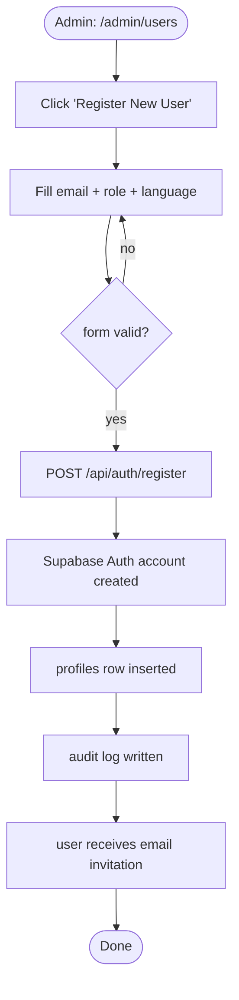
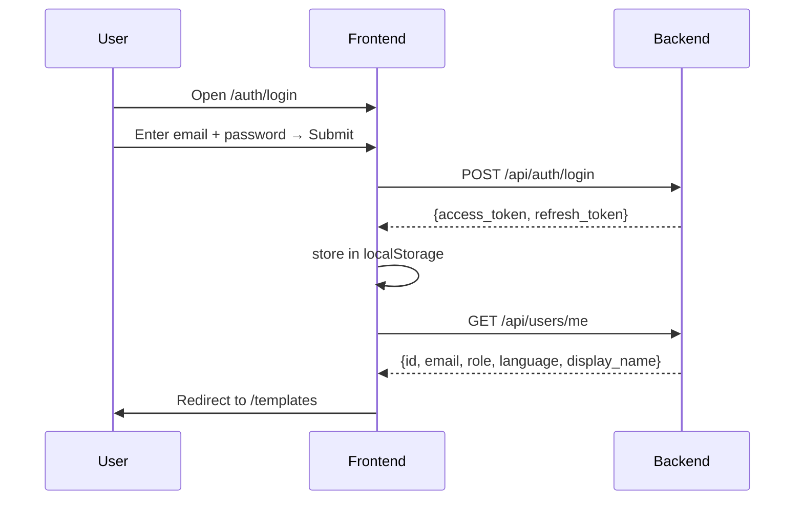

# F01 — Authentication & User Management

**Roles**: Admin · Designer · Operator · Viewer  
**Related**: [F08 Security](f08-security.md) · [User Flows](user-flows.md)

---

## Wireflow — Admin creates a user



---

## Wireflow — User login



---

## Flows

### 1.1 Admin creates a new user

```
Admin opens user management panel
→ Clicks "Register New User"
→ Fills email, assigns role (Admin / Designer / Operator / Viewer),
  sets language preference (Arabic / English)
→ Clicks Save
→ System creates Supabase Auth account and inserts profile row
→ New user receives email invitation / credentials
→ Action written to audit log
```

### 1.2 User logs in

```
User opens FormCraft at /auth/login
→ Enters email + password
→ System calls POST /api/auth/login
→ Supabase verifies credentials; returns JWT access_token + refresh_token
→ Frontend stores tokens in localStorage
→ AuthService.loadProfile() calls GET /api/users/me
→ currentUser$ emits (id, email, role, language, display_name)
→ Router redirects to /templates
```

### 1.3 Token refresh (transparent to user)

```
AuthInterceptor detects 401 on any request
→ Calls POST /api/auth/refresh with stored refresh_token
→ Stores new access_token + refresh_token
→ Retries original request transparently
```

### 1.4 User logs out

```
User clicks logout in profile menu
→ Frontend calls POST /api/auth/logout
→ Server invalidates session
→ clearSession() removes tokens from localStorage, resets auth state
→ Router redirects to /auth/login
```

### 1.5 Admin changes a user's role

```
Admin opens user management panel → finds user
→ Changes role via dropdown
→ System updates profile.role in DB
→ Audit log records before/after role values
→ Next time that user calls a protected route their new role is enforced
```

---

## Route guard rules

| Route | Guard | Required roles |
|-------|-------|---------------|
| `/templates` | AuthGuard | Any authenticated |
| `/admin/feedback` | AuthGuard + RoleGuard | admin |
| `/admin/users` | AuthGuard + RoleGuard | admin |
| `/designer/*` | AuthGuard + RoleGuard | admin, designer |
| `/my-feedback` | AuthGuard | Any authenticated |
