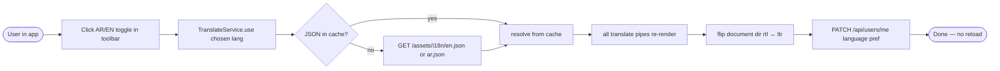

# F02 — Internationalization & RTL Support

**Roles**: All authenticated users  
**Related**: [User Flows](user-flows.md)

---

## Wireflow — Language switch



---

## Flows

### 2.1 First visit — default language

```
User opens app (no stored preference)
→ App loads with Arabic (ar) as default language
→ document dir="rtl" applied globally
→ Angular Material components mirror to RTL layout
→ All UI strings resolved from /assets/i18n/ar.json
```

### 2.2 Switching language

```
User clicks language toggle in toolbar (AR ↔ EN)
→ TranslateService.use('en') called
→ /assets/i18n/en.json loaded (HTTP or from cache)
→ All ngx-translate pipes re-render immediately — no page reload
→ document dir flips between rtl / ltr
→ Language preference saved to user profile via PATCH /api/users/me
```

### 2.3 Mixed Arabic/English content

```
User types or views text containing both Arabic and English
→ Unicode BiDi algorithm applied per text segment
→ Arabic segments flow RTL, English segments flow LTR within the same line
→ Angular Material inputs set dir="auto" per field
```

---

## Constraints

| Rule | Detail |
|------|--------|
| Numerals | Western Arabic (0–9) always used; no Eastern Arabic digits |
| Missing key | Key string shown as fallback — no crash |
| Overflow | `text-overflow: ellipsis` in fixed containers; tooltip shows full text |
| PDF Arabic | `arabic-reshaper` + `python-bidi` + Noto Naskh Arabic font embedded |
