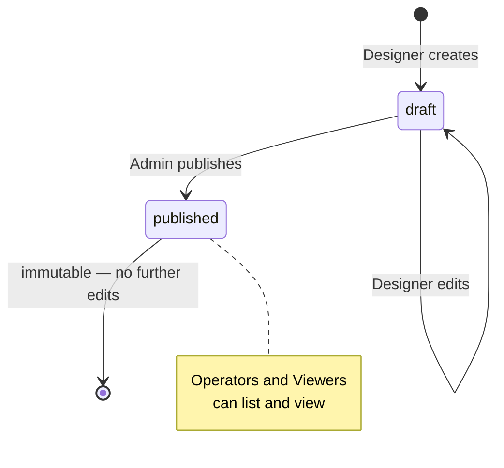
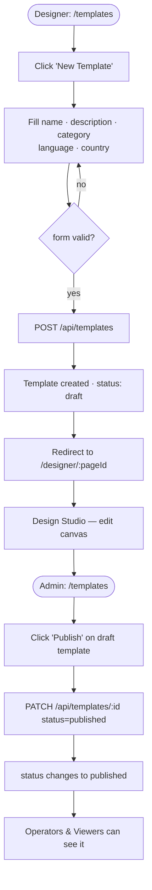

# F03 — Template Domain Model

**Roles**: Designer (create/edit) · Admin (publish) · Operator/Viewer (read published)  
**Related**: [F04 Design Studio](f04-design-studio.md) · [F06 PDF Engine](f06-pdf-engine.md)

---

## Template lifecycle



---

## Wireflow — Create and publish a template



---

## Flows

### 3.1 Designer creates a template

```
Designer clicks "New Template" on /templates
→ Fill: name, description, category, language (AR/EN), country (EG/SA/AE)
→ System creates template in "draft" status with one default A4 page
→ Designer redirected to Design Studio
```

### 3.2 Designer manages pages

```
In Design Studio, click "Add Page" in page navigator
→ New blank page appended; configure width/height (mm), optional background image
→ Drag page thumbnail to reorder
→ Right-click thumbnail → Delete Page (blocked if only 1 page remains)
```

### 3.3 Designer manages elements

```
Drag element type from palette onto canvas
→ Element created at drop position (default 50×10 mm)
→ Select element → drag to reposition; drag handles to resize (min 2×2 mm)
→ Right panel: edit key, label_ar, label_en, validation, formatting, required, direction
→ Delete key or toolbar button → element removed
→ Ctrl+Z / Ctrl+Y → undo / redo (up to 50 steps)
```

### 3.4 Admin publishes a template

```
Admin opens template → clicks "Publish"
→ System changes status draft → published
→ Published templates are immutable; no further edits allowed
→ Operators and Viewers can now list and view this template
```

### 3.5 Viewing templates (Operator / Viewer)

```
User opens /templates
→ List shows only published templates (RLS enforced)
→ Can filter by category, language, country; search by name; paginate
→ Clicking a template opens a read-only preview (no canvas editing)
```
