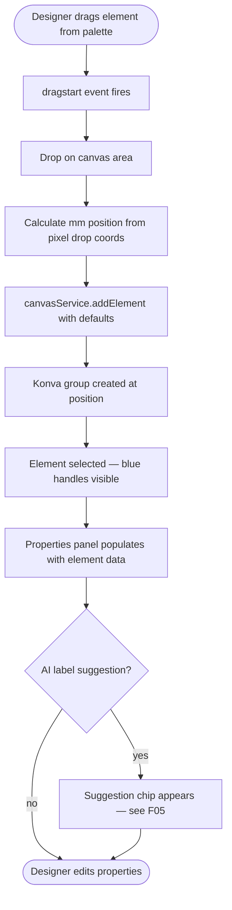
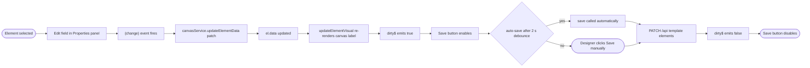
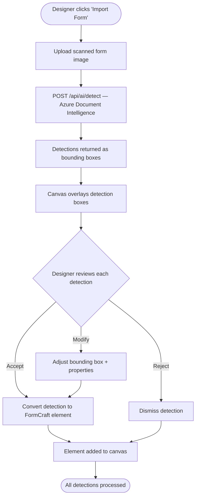

# F04 — Design Studio (Canvas Editor)

**Roles**: Designer (create/edit) · Admin (limited)  
**Related**: [F03 Templates](f03-templates.md) · [F05 AI Suggest](f05-ai-suggestions.md) · [F10 Tafqeet](f10-tafqeet.md) · [F06 PDF](f06-pdf-engine.md)

---

## Studio layout wireframe

```
┌────────────────────────────────────────────────────────────┐
│  Toolbar: [Undo] [Redo] [Grid] [Snap] [Zoom] [Import] [Save PDF] [Save ✓] │
├──────────────┬─────────────────────────────┬───────────────┤
│              │                             │               │
│  Element     │        Canvas               │  Properties   │
│  Palette     │     (Konva.js stage)        │  Panel        │
│              │                             │               │
│  Text        │  ┌─────────────────────┐    │  key: text_1  │
│  Number      │  │                     │    │  label_ar: … │
│  Date        │  │  [Selected element] │    │  label_en: … │
│  Currency    │  │   ┌───────────┐     │    │  x: 20 mm    │
│  Checkbox    │  │   │ ▣ TEXT    │     │    │  y: 30 mm    │
│  Radio       │  │   └───────────┘     │    │  w: 50 mm    │
│  Dropdown    │  │                     │    │  h: 10 mm    │
│  Image       │  └─────────────────────┘    │  required ○  │
│  QR          │                             │  direction ▼ │
│  Barcode     │                             │  [Delete]    │
│  Tafqeet     │                             │               │
├──────────────┴─────────────────────────────┴───────────────┤
│  Pages: [Page 1 ▼] [Page 2] [+ Add Page]                   │
└────────────────────────────────────────────────────────────┘
```

---

## Wireflow — Add element via drag-and-drop



---

## Wireflow — Property edit → save



---

## Wireflow — OCR form import



---

## Flows

### 4.1 Opening the canvas

```
Designer opens a draft template from /templates
→ Design Studio loads with Konva.js canvas
→ Canvas renders the active page at actual mm dimensions with light grid overlay
→ Left: element palette; Right: properties panel; Bottom: page thumbnails
```

### 4.2 Placing an element via drag-and-drop

```
Designer drags element type (text, number, date, currency, checkbox, radio,
dropdown, image, QR, barcode, tafqeet) from left palette onto canvas
→ Element snaps to grid (configurable: 1/2/5/10 mm)
→ Element selected; properties panel shows its fields
→ AI Suggestion chip may appear below the label field (see F05)
```

### 4.3 Selecting, moving, resizing

```
Click element → select (blue handles appear)
Shift+Click or draw marquee → multi-select
Drag element body → move; position updates in properties panel
Drag corner/edge handle → resize (min 2×2 mm enforced)
```

### 4.4 Editing element properties

```
With element selected, right panel shows:
  - type (read-only after creation)
  - key (unique identifier for data binding)
  - label_ar, label_en (bilingual labels)
  - x, y, width, height (mm, editable as numbers)
  - validation (JSONB: min, max, pattern, etc.)
  - formatting (JSONB: font, size, alignment, etc.)
  - required toggle
  - direction (auto / rtl / ltr)
→ (change) event on each field → canvasService.updateElementData → dirty$ = true
→ Save button enables; auto-save fires after 2 s of inactivity
```

### 4.5 Layers panel

```
Designer opens Layers panel (toggle button)
→ Sees list of all elements in z-order (top = front)
→ Drag rows to reorder z-order
→ Eye icon → toggle element visibility
→ Lock icon → prevent accidental moves/resizes
```

### 4.6 Undo / Redo

```
Ctrl+Z → undo last operation (add/move/resize/delete/property change)
Ctrl+Y → redo
Max 50 undo steps stored; older steps dropped silently
```

---

## Keyboard shortcuts

| Action | Shortcut |
|--------|----------|
| Undo | Ctrl+Z |
| Redo | Ctrl+Y |
| Delete selected | Delete / Backspace |
| Select all | Ctrl+A |
| Copy | Ctrl+C |
| Paste | Ctrl+V |
| Save | Ctrl+S |
| Zoom in / out | Ctrl+= / Ctrl+- |
