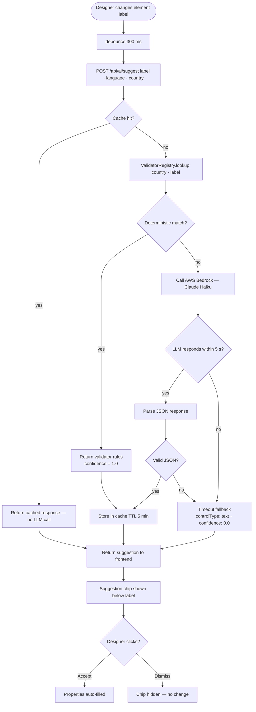

# F05 — AI Smart Control Suggestion

**Roles**: Designer (receives suggestions)  
**Related**: [F04 Design Studio](f04-design-studio.md) · [F07 Validation](f07-validation.md) · [F09 Performance](f09-performance.md)

---

## Suggestion decision tree



---

## Flows

### 5.1 Single-field suggestion (automatic)

```
Designer types or changes element label in properties panel
→ Frontend debounces 300 ms
→ Calls POST /api/ai/suggest with { label, language, country }
→ System checks deterministic validators first (see F07):
    Match found → return validator rules, confidence 1.0
    No match → call AWS Bedrock (Claude Haiku)
→ AI returns { controlType, confidence, validation, formatting }
→ Suggestion chip appears below label field showing:
    "Suggested: [type] (confidence: xx%)"
Designer clicks Accept → properties auto-filled
Designer clicks Dismiss → chip disappears; no change
```

### 5.2 Batch import suggestion

```
Designer clicks "Import Schema" → uploads JSON array of field labels
→ System sends all labels to suggestion endpoint in batch
→ Returns per-label suggestions
→ Summary dialog shows each label + suggested type + confidence
→ Designer accepts/rejects individual rows or "Accept All"
→ Accepted rows become canvas elements with suggested properties
```

### 5.3 Fallback behaviour

```
LLM timeout (> 5 s) OR Bedrock unavailable
→ Return { controlType: "text", confidence: 0.0 }
→ Warning toast shown ("AI suggestion unavailable — default applied")
→ Designer can still manually set type

Invalid JSON from LLM → Pydantic catches → same fallback applied
```
