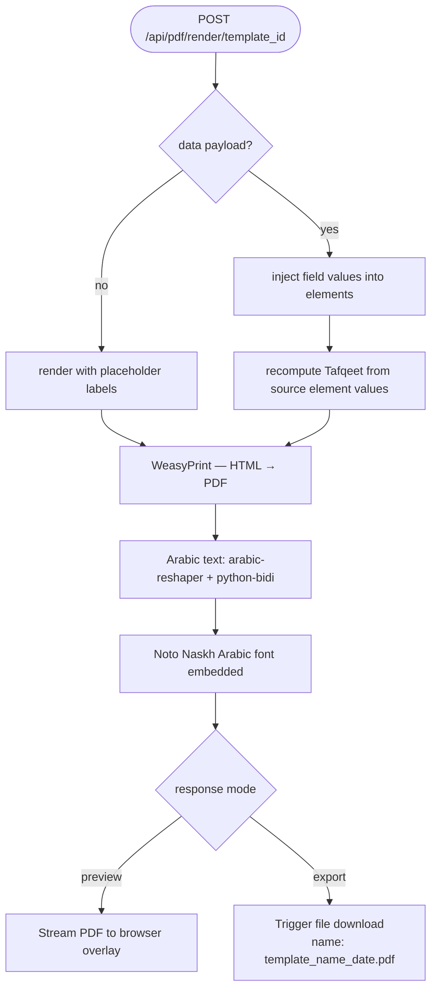

# F06 — PDF Rendering Engine

**Roles**: Designer (preview/export) · Operator (export)  
**Related**: [F03 Templates](f03-templates.md) · [F07 Validation](f07-validation.md) · [F10 Tafqeet](f10-tafqeet.md)

---

## PDF render pipeline



---

## Flows

### 6.1 Preview PDF in browser

```
User opens template → clicks "Preview PDF"
→ POST /api/pdf/render/{template_id} called (no data payload)
→ Backend generates PDF with WeasyPrint; element positions match canvas mm exactly
→ Arabic text shaped with arabic-reshaper + python-bidi; Noto Naskh Arabic font embedded
→ PDF streamed to frontend; embedded PDF viewer opens in overlay dialog
```

### 6.2 Export PDF (download)

```
User clicks "Export PDF"
→ Same as preview but browser triggers file download
→ Filename: {template_name}_{date}.pdf
```

### 6.3 Export PDF with pre-filled data

```
Caller provides data dictionary: { "field_key": "value", ... }
→ POST /api/pdf/render/{template_id} with body { data: {...} }
→ Each element rendered with its filled value instead of placeholder label
→ Tafqeet elements recomputed from source element's filled value
→ Empty/missing data keys → element renders as blank placeholder
```

---

## Per-element rendering rules

| Element type | PDF rendering |
|---|---|
| text / number / currency | Text value, font/size from formatting JSONB |
| date | Formatted date string (locale-aware) |
| checkbox | ☐ unfilled · ☑ filled |
| radio | ○ unfilled · ● filled |
| dropdown | Text value + dropdown indicator |
| image | Embedded image; "Image Not Found" if asset missing |
| QR | Generated QR code image from value |
| barcode | Code 128 barcode from value |
| tafqeet | Computed words from source element's numeric value |
