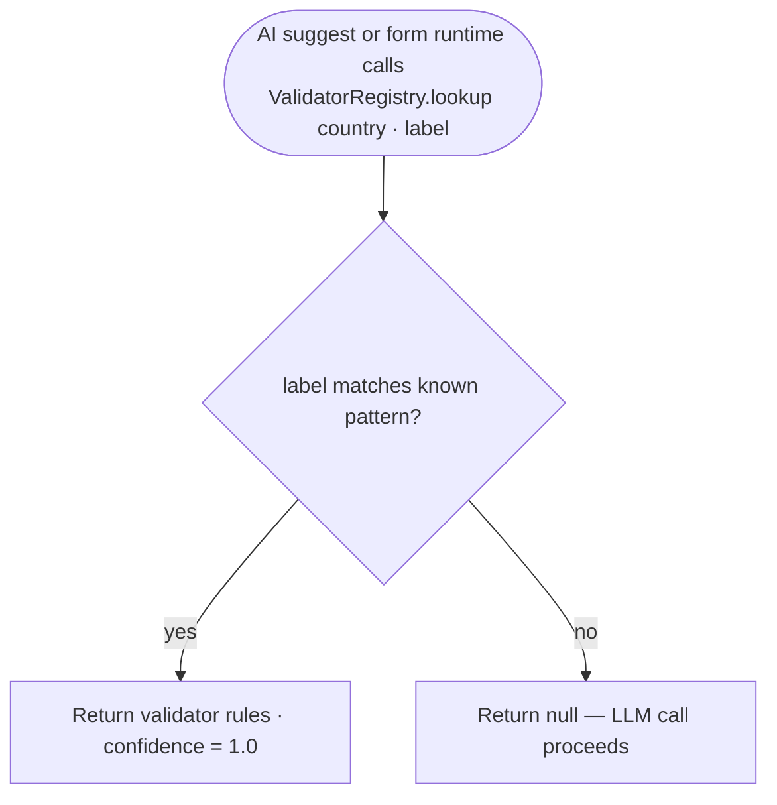

# F07 — Arabic-Specific Validation Library

**Roles**: System (used by AI suggestion pipeline and form validation)  
**Related**: [F05 AI Suggestions](f05-ai-suggestions.md) · [F06 PDF Engine](f06-pdf-engine.md)

---

## Lookup flow



---

## Flows

### 7.1 Field validation lookup

```
AI suggestion or form runtime calls ValidatorRegistry.lookup(country, label)
→ Registry matches label pattern (Arabic/English keywords) to known field type
→ Returns validator for that (country, field_type) pair, or null if no match

Supported countries: EG · SA · AE
```

### 7.2 Integration with AI suggestion

```
POST /api/ai/suggest called with { label, country }
→ ValidatorRegistry.lookup(country, label) runs first
→ If deterministic match found:
    Response uses validator rules; confidence = 1.0; LLM not called
→ If no match:
    LLM call proceeds; validator registry not involved
```

---

## Supported validators

| Country | Field type | Format rule |
|---------|-----------|-------------|
| EG | National ID | 14 digits |
| EG | IBAN | EG + 27 characters |
| EG | Phone | +20 prefix + 10 digits |
| SA | National ID / Iqama | 10 digits, starts with 1 or 2 |
| SA | IBAN | SA + 22 alphanumeric |
| SA | VAT | 15 digits, starts and ends with 3 |
| AE | IBAN | AE + 21 characters |
| AE | TRN | 15 digits |
