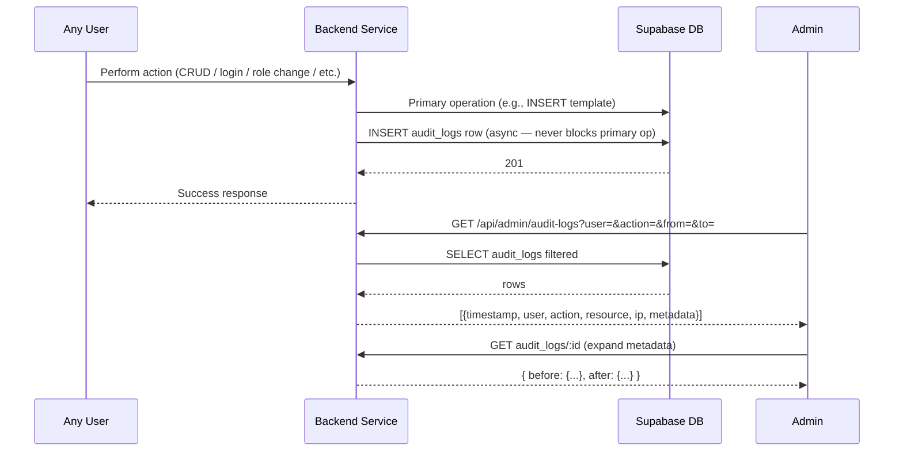
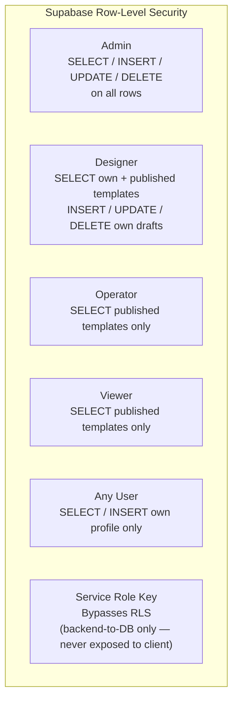

# F08 — Security & Audit Logging

**Roles**: Admin (view logs) · All users (actions logged automatically)  
**Related**: [F01 Auth](f01-auth.md)

---

## Audit event flow



---

## RLS access matrix



---

## Flows

### 8.1 Automatic audit logging

```
Any user performs a template CRUD, AI suggestion, authentication, or role-change action
→ Backend middleware / service layer creates AuditLog row:
    user_id, action (CREATE / UPDATE / DELETE / LOGIN / LOGOUT / ROLE_CHANGE / etc.),
    resource_type, resource_id, metadata JSONB (before/after snapshots), ip_address, created_at
→ Audit write failure does NOT block the primary operation
```

### 8.2 Admin views audit logs

```
Admin navigates to GET /api/admin/audit-logs
→ Filter by user, action type, date range
→ Each row shows: timestamp, user, action, resource, IP address
→ Expand row → see full before/after JSON metadata
```

### 8.3 RLS enforcement (data access)

```
Every DB query passes through Supabase RLS:
  Admin       → SELECT / INSERT / UPDATE / DELETE on all rows
  Designer    → SELECT own templates + published; INSERT/UPDATE/DELETE own drafts
  Operator    → SELECT published templates only
  Viewer      → SELECT published templates only
  Any user    → SELECT / INSERT own profile only
Bypassed by service-role key (backend-to-DB calls only; never exposed to client)
```

---

## Logged action types

| Action | Trigger |
|--------|---------|
| `LOGIN` | Successful user login |
| `LOGOUT` | User logout |
| `ROLE_CHANGE` | Admin changes a user's role |
| `CREATE` | Template / element / label created |
| `UPDATE` | Template / element / label updated |
| `DELETE` | Template / element / label deleted |
| `PUBLISH` | Template status changed to published |
| `AI_SUGGEST` | AI suggestion called |
| `AI_TIMEOUT` | AI suggestion timed out |
| `PDF_RENDER` | PDF generated |
