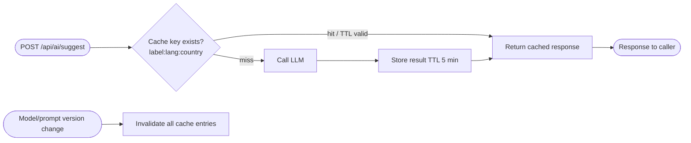

# F09 — Performance & Production Hardening

**Roles**: System / DevOps  
**Related**: [F05 AI Suggestions](f05-ai-suggestions.md) · [F06 PDF Engine](f06-pdf-engine.md)

---

## AI caching layer



---

## Flows

### 9.1 AI suggestion caching

```
Designer triggers suggestion for label "رقم الهوية الوطنية"
→ Cache key: "رقم الهوية الوطنية:ar:EG"
→ Cache hit (TTL 5 min) → return cached response immediately; no LLM call
→ Cache miss → call LLM; store result in cache
→ Cache invalidated when system prompt or LLM model version changes
```

### 9.2 LLM timeout guard

```
Bedrock call initiated
→ 5-second hard timeout enforced
→ Timeout fires → return { controlType: "text", confidence: 0.0 }
→ Warning toast shown in UI; audit log records the timeout event
```

### 9.3 Health check

```
Any monitoring tool calls GET /api/health
→ Returns { status, version, checks: { db, storage, auth } }
→ Each check: "ok" or "degraded" with message
→ HTTP 200 = healthy; HTTP 503 = one or more checks degraded
```

### 9.4 Deployment (Bunny Magic Containers)

```
Code pushed to main branch → CI builds Docker images
→ Frontend image deployed to Bunny CDN / container
→ Backend image deployed to Bunny container (FastAPI + uvicorn)
→ Environment variables injected at runtime (SUPABASE_URL, SERVICE_KEY, etc.)
→ HTTP traffic → HTTPS redirect + HSTS headers
→ Rollback: redeploy previous image tag
```

---

## Key performance targets

| Metric | Target |
|--------|--------|
| AI suggestion (cache hit) | < 50 ms |
| AI suggestion (LLM call) | < 5 s (hard timeout) |
| PDF render (A4, < 20 elements) | < 3 s |
| Template list page load | < 500 ms |
| Feedback submission | < 1 s |
