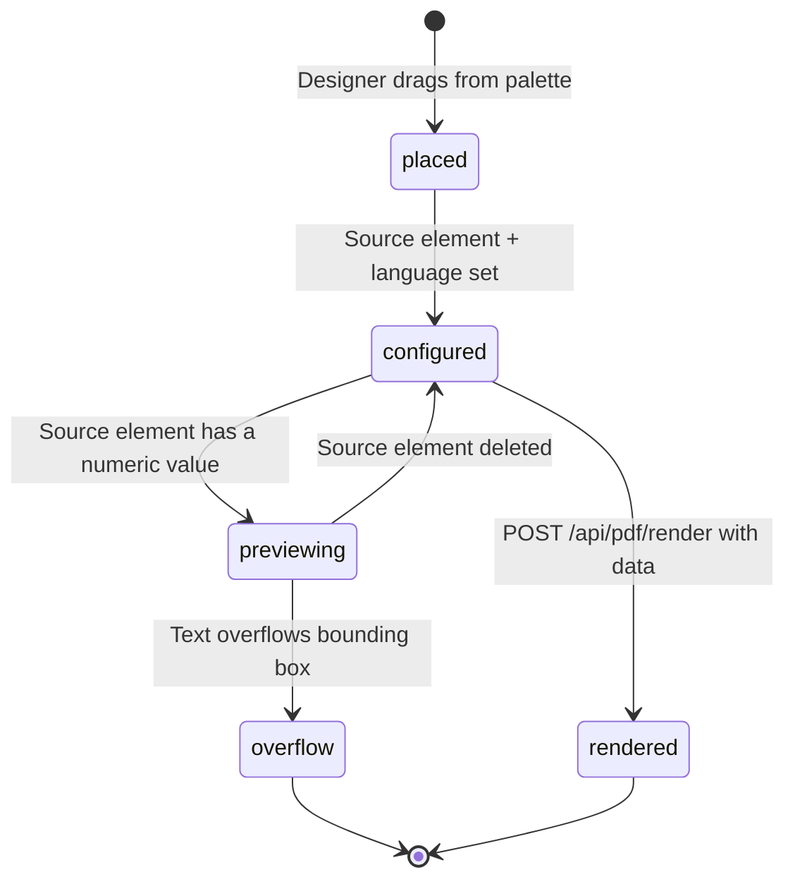
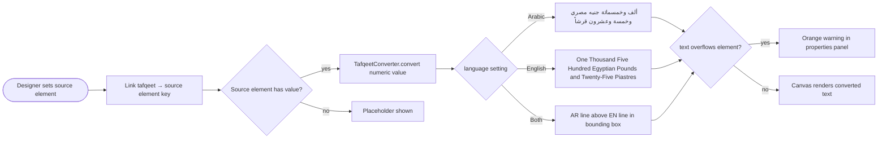

# F10 — Tafqeet Control (Amount-to-Words)

**Roles**: Designer (configure) · Operator (fill forms) · PDF engine (render)  
**Related**: [F04 Design Studio](f04-design-studio.md) · [F06 PDF Engine](f06-pdf-engine.md)

---

## Tafqeet element lifecycle



---

## Live preview flow



---

## Flows

### 10.1 Designer adds a Tafqeet element

```
Designer drags "Tafqeet" (تفقيط) from element palette onto canvas
→ Element appears as read-only text box with lock icon and "تفقيط" label
→ In properties panel:
    - Source element: dropdown lists all number/currency elements on same page
    - Output language: Arabic / English / Both
    - Show currency name: toggle
    - Prefix / Suffix: optional text (e.g., "فقط" / "لا غير")
→ Preview updates in canvas as properties are set
```

### 10.2 Live preview in canvas

```
Linked source element has value (e.g., 1500.25)
→ Tafqeet element immediately shows:
    AR: "ألف وخمسمائة جنيه مصري وخمسة وعشرون قرشاً"
    EN: "One Thousand Five Hundred Egyptian Pounds and Twenty-Five Piastres"
    Both: Arabic line above English line within bounding box
→ If preview overflows element bounds → orange warning in properties panel
```

### 10.3 PDF rendering with Tafqeet

```
POST /api/pdf/render/{template_id} with data { "amount_field": 2500 }
→ Backend recomputes Tafqeet from data["amount_field"]
→ Outputs words text; renders at exact mm position in PDF
→ Font embedded (Noto Naskh Arabic for AR output)
```

---

## Edge cases

| Input | Output |
|-------|--------|
| 0 | صفر / Zero |
| Negative number | — (blank; logged to audit) |
| > 999,999,999,999 | — (blank; logged to audit) |
| Conversion exception | — (blank; logged to audit) |
| Source element deleted | Element shows placeholder; sourceElementKey cleared |
