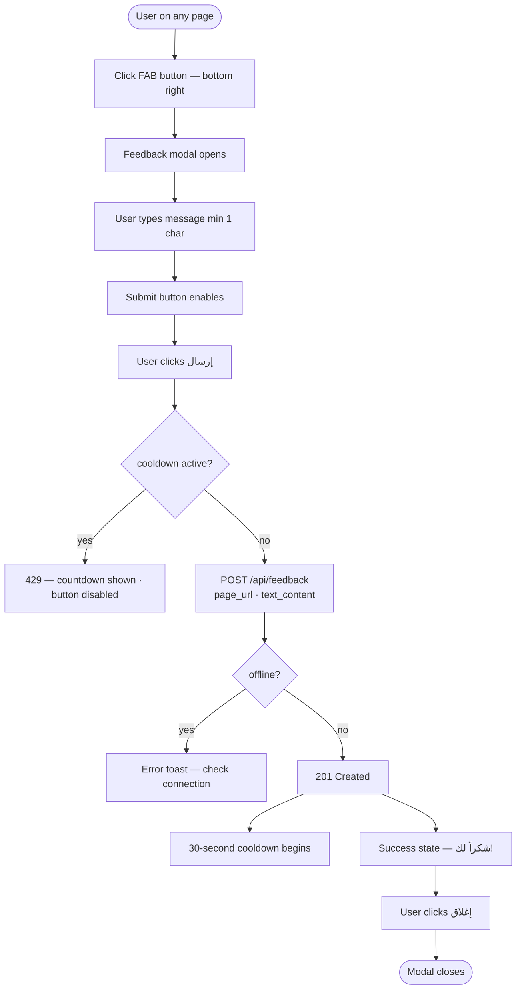
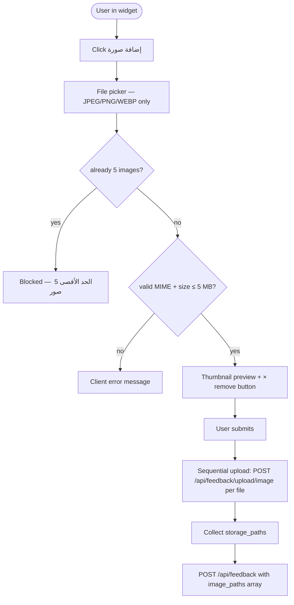
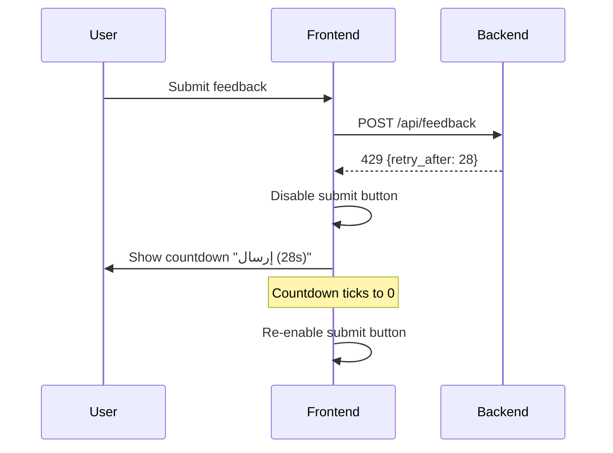

# F11 — Customer Feedback Widget

**Roles**: All authenticated users (submit) · Admin (view dashboard)  
**Related**: [F12 Search & Labels](f12-feedback-labels.md) · [F13 Rich Media](f13-feedback-media.md) · [F14 Threading](f14-feedback-threading.md)

---

## Widget wireframe

```
┌──────────────────────────────────────────┐
│  إرسال ملاحظات                        ✕  │
├──────────────────────────────────────────┤
│  ┌────────────────────────────────────┐  │
│  │ صف ملاحظاتك أو المشكلة...         │  │
│  │                                    │  │
│  │                            0/2000  │  │
│  └────────────────────────────────────┘  │
│                                          │
│  [🖼 إضافة صورة]  [🎤 صوت]  [📹 فيديو]  │
│                                          │
│  ────────────────────────────────────    │
│  [إلغاء]                   [إرسال →]    │
└──────────────────────────────────────────┘

                         ↑ FAB (bottom-right, persists on all pages)
```

---

## Wireflow — Text submission



---

## Wireflow — Submission with images



---

## Wireflow — Cooldown enforcement



---

## Flows

### 11.1 User opens the widget

```
On any page, user clicks the persistent FAB button (bottom-right, pink)
→ Feedback modal opens over current page
→ Fields available: text area (max 2000 chars), image attach, audio, video
→ Character counter updates as user types
```

### 11.2 Text-only submission

```
User types feedback message (min 1 char)
→ Submit button enables
→ User clicks "إرسال" (Send)
→ POST /api/feedback with { page_url, text_content }
→ Server records submission; responds 201
→ 30-second cooldown begins (server-enforced; UI shows countdown)
→ Success state: ✓ "شكراً لك! سنراجع ملاحظاتك قريباً."
→ User clicks "إغلاق" to dismiss
```

### 11.3 Submission with images

```
User clicks "إضافة صورة" → file picker opens (JPEG/PNG/WEBP only)
→ Up to 5 images; thumbnail previews shown in widget
→ Each file validated client-side: size ≤ 5 MB, MIME allowed
→ On submit: each image uploaded via POST /api/feedback/upload/image → returns storage_path
→ Main feedback POST includes image_paths array
→ 6th image attempt → blocked with "الحد الأقصى 5 صور"
```

### 11.4 Submission with audio

```
Option A — Record:
  User clicks "إضافة صوت" (mic icon, visible only if MediaRecorder supported)
  → Browser requests microphone permission
  → Recording starts; progress bar counts up to 120 s
  → User clicks Stop (or 120 s reached → auto-stop)
  → Playback preview shown; user can re-record or accept
  → On submit: audio blob uploaded; storage_path included in POST

Option B — Upload file:
  User clicks "رفع ملف" → file picker (MP3/M4A/WAV/WebM, max 10 MB)
  → Preview player shown
  → On submit: file uploaded; storage_path included in POST

If browser lacks MediaRecorder → record button hidden; upload button always shown
```

### 11.5 Admin views feedback dashboard

```
Admin navigates to /admin/feedback
→ Table lists all submissions: date, user display name, page URL,
  text preview, media attachments, labels, status badge
→ Clicking a row expands inline thread panel (see F14)
→ Status badges: جديد (new) · تمت المراجعة (reviewed) · تم الحل (resolved)
```
