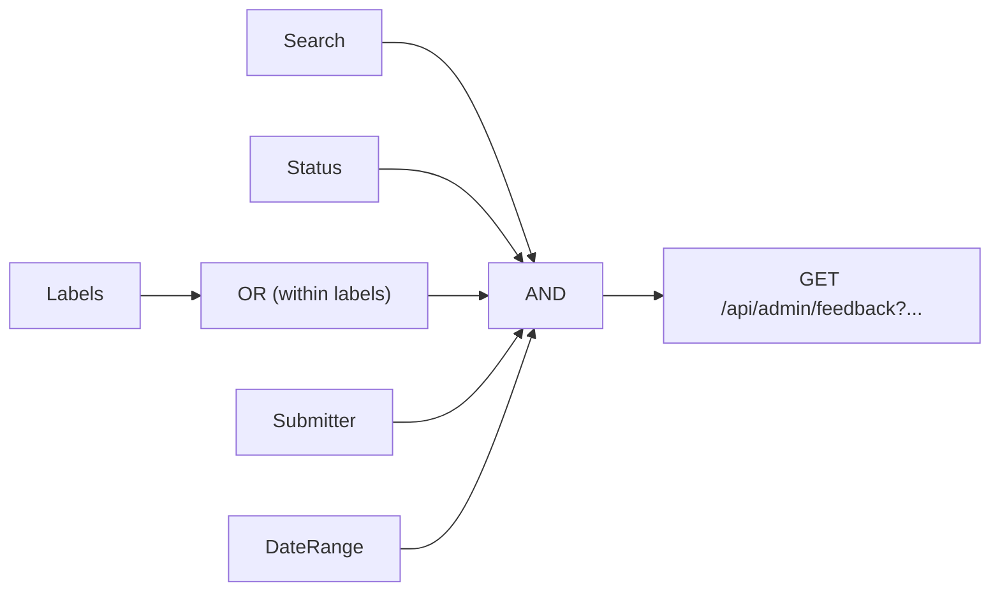
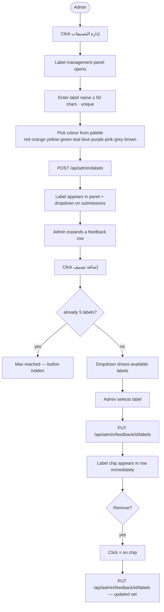

# F12 — Feedback Dashboard Search & Labels

**Roles**: Admin  
**Related**: [F11 Feedback Widget](f11-feedback-widget.md) · [F14 Threading](f14-feedback-threading.md)

---

## Dashboard filter wireframe

```
┌─────────────────────────────────────────────────────────────┐
│  ملاحظات المستخدمين                         [إدارة التصنيفات] │
├─────────────────────────────────────────────────────────────┤
│  🔍 [البحث في الملاحظات...                              ]    │
│                                                             │
│  [الكل ✓] [جديد] [تمت المراجعة] [تم الحل]                  │
│                                                             │
│  تصنيف:  [● Bug ✓] [● Feature] [● Urgent]                  │
│                                                             │
│  مرسل:   [جميع المرسلين  ▼]                                │
│  من:     [────────]   إلى: [────────]                       │
│                                                 [مسح التصفية] │
├────────┬──────────┬──────────┬─────────────┬───────┬────────┤
│ التاريخ │ المستخدم │ الصفحة   │ الرسالة      │ الحالة │ تصنيفات│
├────────┴──────────┴──────────┴─────────────┴───────┴────────┤
│  ▸ Row expands → Thread panel (see F14)                      │
└─────────────────────────────────────────────────────────────┘
```

---

## Filter combination logic



*Multiple label selections use OR; all other filters combine with AND.*

---

## Wireflow — Create and assign a label



---

## Flows

### 12.1 Searching and filtering

```
Admin types in search box (debounced 300–500 ms)
→ GET /api/admin/feedback?search={text} called
→ Table updates to show only submissions containing search text

Admin selects status filter (New / Reviewed / Resolved / All)
→ Table filtered by status

Admin selects submitter from dropdown
→ Table filtered to that user's submissions only

Admin sets "From date" and/or "To date" pickers
→ Table filtered by submission date range

All active filters combine with AND logic
```

### 12.2 Creating a label

```
Admin clicks "إدارة التصنيفات" (Manage Labels)
→ Label management panel opens
→ Admin enters label name (max 50 chars, must be unique)
→ Optionally picks colour from palette:
    red · orange · yellow · green · teal · blue · purple · pink · grey · brown
→ Clicks Save → POST /api/admin/labels
→ New label appears in panel and in "Add Label" dropdown on submissions
```

### 12.3 Assigning labels to a submission

```
Admin expands a feedback row
→ Thread panel shows "التصنيفات: إضافة تصنيف" button
→ Admin clicks "إضافة تصنيف" → dropdown shows available labels
→ Admin selects a label → label chip appears on submission (max 5)
→ PUT /api/admin/feedback/{id}/labels called
→ Label chip visible in table row immediately
→ Admin clicks × on a chip → label removed from that submission
```

### 12.4 Filtering by label

```
Admin opens label filter (in filter bar)
→ Selects one or more labels
→ Table shows submissions carrying ANY selected label (OR logic)
→ Combines with other active filters (AND logic overall)
```

### 12.5 Editing or deleting a label

```
Edit:
  Admin opens label management panel → clicks edit on label
  → Changes name or colour → Save
  → All submissions bearing that label update immediately

Delete:
  Admin clicks delete on label → confirmation prompt
  → Confirmed → label removed from all submissions and label list
```
