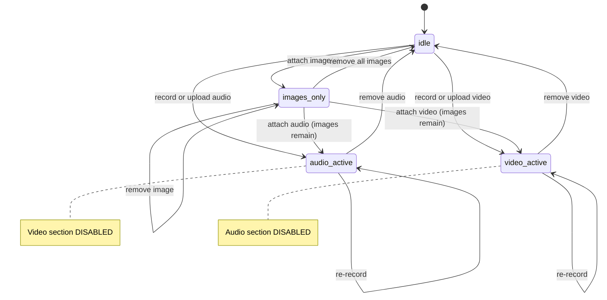
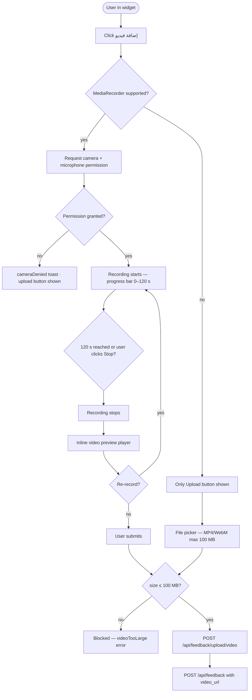

# F13 — Feedback Rich Media

**Roles**: All authenticated users (attach) · Admin (view in dashboard)  
**Related**: [F11 Feedback Widget](f11-feedback-widget.md) · [F14 Threading](f14-feedback-threading.md)

---

## Media attachment mutual exclusion



---

## Wireflow — Video record and submit



---

## Flows

### 13.1 Attaching multiple images

```
User opens feedback widget → clicks "إضافة صورة"
→ File picker: JPEG/PNG/WEBP only
→ Select 1–5 images (single or multiple selection)
→ Each thumbnail previews in widget with × remove button
→ Each file validated: ≤ 5 MB, allowed MIME
→ 6th selection attempt → blocked: "تم الوصول إلى الحد الأقصى (5 صور)"
→ User can remove any image independently before submitting
→ On submit: each image uploaded then submitted with feedback
```

### 13.2 Recording video in browser

```
User clicks "إضافة فيديو" (visible only if browser supports MediaRecorder video)
→ Camera + microphone permission requested
→ Recording starts; progress bar counts up to 120 s
→ Auto-stops at 120 s cap
→ Inline video player shows preview
→ User can click "إعادة التسجيل" to discard and start new recording
→ On submit: video blob uploaded (≤ 100 MB); POST includes video_url
```

### 13.3 Uploading a pre-recorded video

```
User clicks "رفع فيديو" → file picker (MP4/WebM, max 100 MB)
→ File size validation before upload: > 100 MB → rejected with error message
→ Video player preview shown in widget
→ On submit: file uploaded then submitted
```

### 13.4 Audio / Video mutual exclusion

```
User attaches audio (recorded or uploaded)
→ Video section becomes disabled with message: "الصوت نشط — لا يمكن إرفاق فيديو"

User attaches video
→ Audio section becomes disabled with message: "الفيديو نشط — لا يمكن إرفاق صوت"

Only one media type (audio OR video) per submission
```

### 13.5 Admin views rich media in dashboard

```
Admin expands a feedback row with media
→ Image thumbnails displayed inline; click → full-size lightbox
→ Audio submissions: inline audio player with play/pause
→ Video submissions: inline video player (signed URL, 1-hour expiry auto-refreshed)
```

---

## Media constraints

| Type | Max size | Allowed formats | Max count |
|------|:--------:|-----------------|:---------:|
| Image | 5 MB | JPEG · PNG · WEBP | 5 |
| Audio | 10 MB | MP3 · M4A · WAV · WebM | 1 |
| Video | 100 MB | MP4 · WebM · MOV | 1 |
