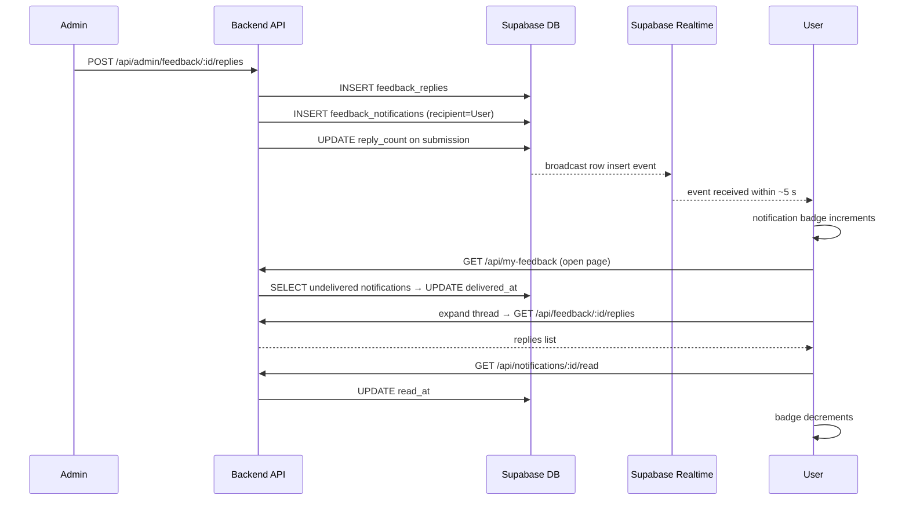
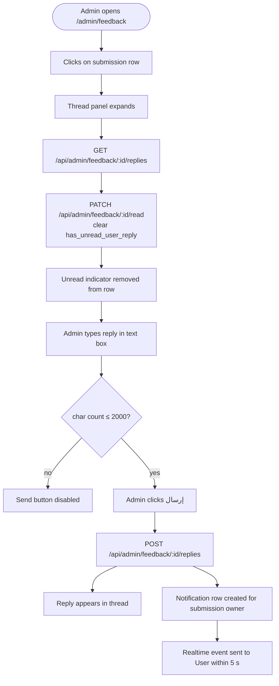
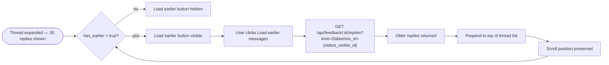

# F14 — Feedback Threading & Replies

**Roles**: Admin (reply, view threads) · All authenticated users (view own, reply)  
**Related**: [F11 Feedback Widget](f11-feedback-widget.md) · [F12 Search & Labels](f12-feedback-labels.md)

---

## Thread panel wireframe (admin view)

```
┌──────────────────────────────────────────────────────────┐
│  [↑ Load earlier messages]                               │
│                                                          │
│  ┌──────────────────────────────────────────────────┐    │
│  │  Yasser Admin · مشرف            2026-05-11 10:22 │    │
│  │  شكراً على ملاحظتك، سنتابع هذا الأمر فوراً.    │    │
│  └──────────────────────────────────────────────────┘    │
│                                                          │
│     ┌──────────────────────────────────────────────┐     │
│     │  Ahmed User · مستخدم        2026-05-11 11:05 │     │
│     │  شكراً، هل يمكن توقع وقت للإصلاح؟           │     │
│     └──────────────────────────────────────────────┘     │
│                                                          │
│  ┌────────────────────────────────────┐  [إرسال →]  │    │
│  │  اكتب ردًا...               0/2000 │              │    │
│  └────────────────────────────────────┘              │    │
│                                                          │
│  الحالة:  [جديد ▼]                                      │
└──────────────────────────────────────────────────────────┘
```

---

## Notification flow (real-time)



---

## Wireflow — Admin reply + unread indicator lifecycle



---

## Wireflow — Paginated thread load



---

## Flows

### 14.1 Admin replies to a feedback submission

```
Admin opens /admin/feedback → clicks on a submission row
→ Thread panel expands inline below the row
→ Shows original submission text (and media if any)
→ Shows all existing replies in chronological order
→ Admin types reply in text box (max 2000 chars, counter shown)
→ Clicks "إرسال"
→ POST /api/admin/feedback/{id}/replies with { text_content }
→ Reply appears in thread immediately with author + timestamp
→ User receives in-app notification within 5 seconds (Supabase Realtime)
```

### 14.2 Admin changes submission status from thread panel

```
Thread panel shows "الحالة:" dropdown at bottom
→ Admin selects: جديد / تمت المراجعة / تم الحل
→ PATCH /api/admin/feedback/{id}/status called
→ Status badge in table row updates immediately (no reload)
```

### 14.3 User views "My Feedback" page

```
Authenticated user navigates to /my-feedback
→ GET /api/my-feedback called
→ Page lists all user's own submissions ordered by most recent
→ Each card shows: page URL, date, status badge, reply count badge
→ User clicks a card to expand it
→ GET /api/feedback/{id}/replies called → replies loaded
→ Replies in chronological order:
    Admin replies: highlighted card (blue background), "مشرف" badge
    User replies: plain card, right-aligned
→ Most recent 20 replies shown; "Load earlier messages" for older ones
```

### 14.4 User replies to admin

```
User is on /my-feedback, thread expanded
→ Types message in reply box (max 2000 chars)
→ Clicks "إرسال"
→ POST /api/feedback/{id}/replies with { text_content }
→ Reply appears at bottom of thread
→ Admin dashboard shows unread indicator on that submission
→ Indicator auto-cleared when admin expands the thread
```

### 14.5 In-app notification flow

```
Event: Admin posts reply to submission owned by User A
→ Backend creates FeedbackNotification row:
    recipient_user_id = User A, feedback_id, reply_id, created_at
→ Supabase Realtime broadcasts row insert to User A's live channel
→ Frontend receives event within ~5 seconds
→ Notification badge in nav header increments
→ User A opens /my-feedback → notification marked delivered
→ User A expands thread → read_at set → badge decrements

Event: User A posts reply
→ Admin dashboard submission row shows unread indicator (has_unread_user_reply = true)
→ Indicator cleared when admin expands that thread
```

### 14.6 Notification persistence (offline user)

```
User A is offline when admin posts reply
→ Notification row persists in DB (delivered_at = null)
→ On next login, GET /api/notifications returns undelivered notifications
→ Badge shows correct unread count
→ User sees reply on /my-feedback when they open it
```

### 14.7 Pagination of long threads

```
Thread has > 20 replies
→ Most recent 20 loaded on expand
→ "Load earlier messages" button appears at top of thread list
→ User clicks → GET /api/feedback/{id}/replies?limit=20&before_id={oldest_visible_id}
→ Older replies prepended above current list
→ Scroll position remains anchored to current view
→ Button hidden when no more replies remain (has_earlier = false)
```
