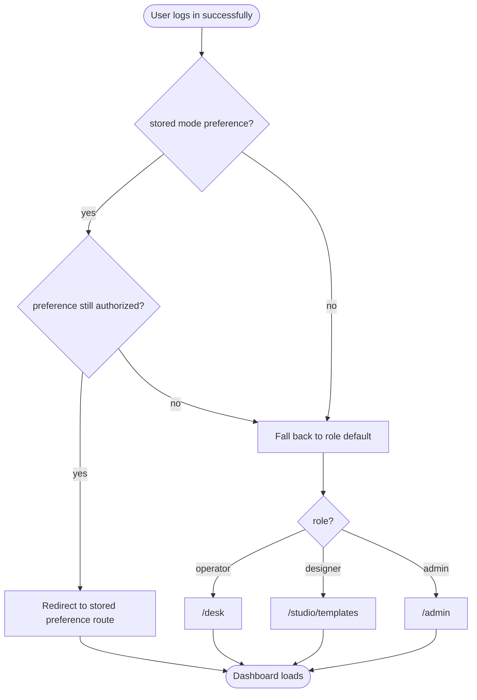
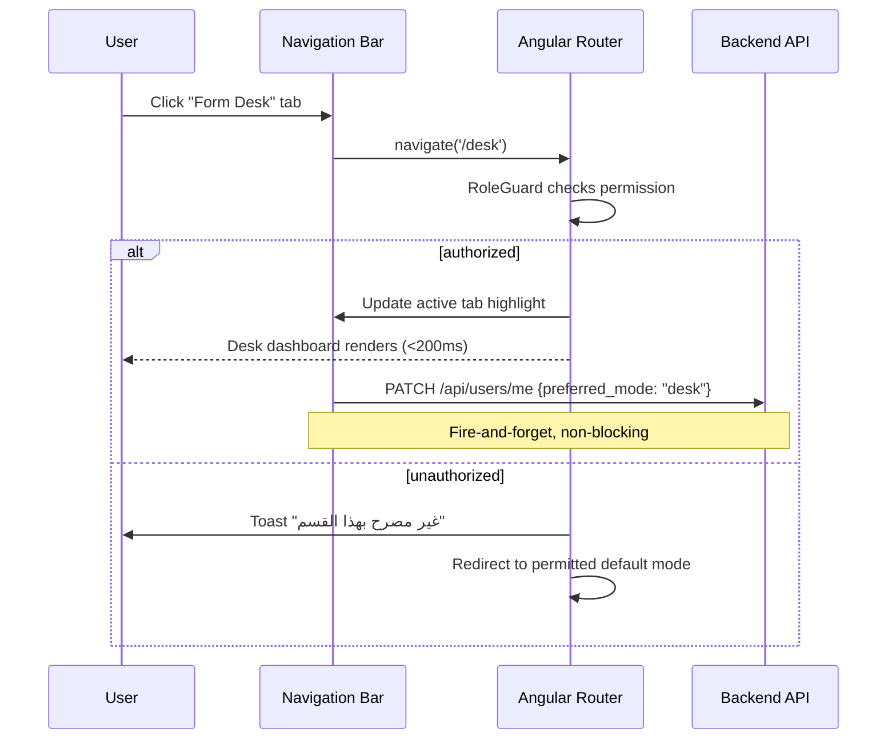
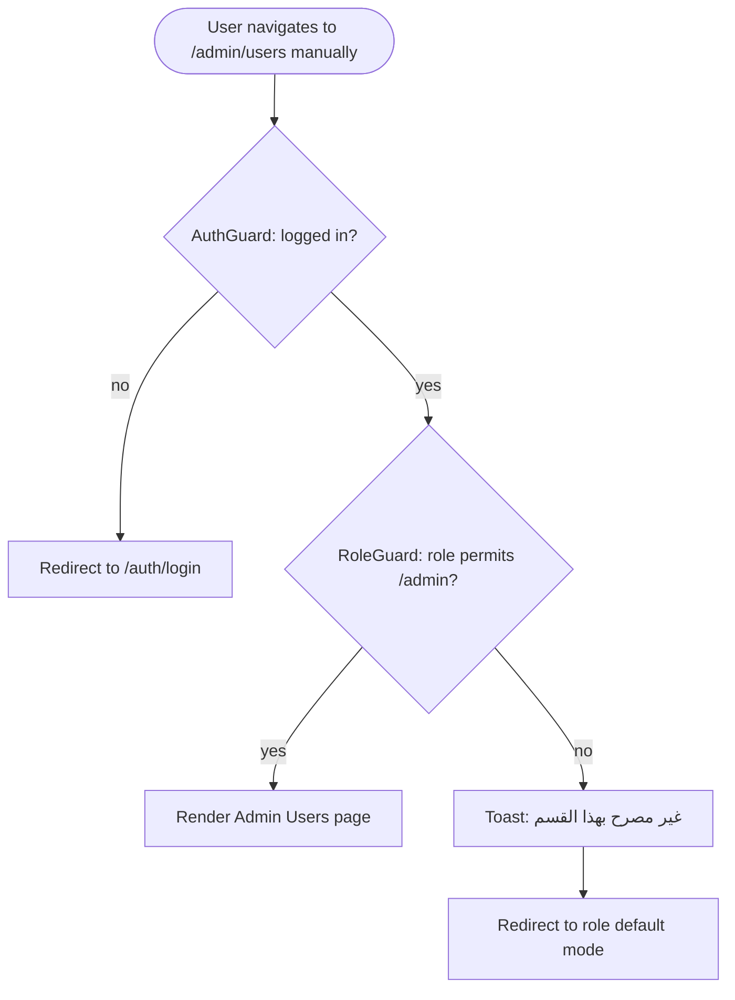

# F15 — Mode Switching UX

**Roles**: Admin (all modes) · Designer (Studio + Desk) · Operator (Desk only)  
**Related**: [F01 Auth](f01-auth.md) · [F02 i18n](f02-i18n.md) · [F16 Operator Dashboard](f16-operator-dashboard.md)

---

## Navigation bar wireframe

```
┌──────────────────────────────────────────────────────────┐
│  FormCraft  │ 🎨 استوديو التصميم │ 📋 مكتب النماذج │ ⚙ لوحة الإدارة │  AR/EN │ 👤 │
│             │   Design Studio     │   Form Desk      │  Admin Console  │       │    │
│             │   ■ active          │                  │                 │       │    │
└──────────────────────────────────────────────────────────┘
```

---

## Wireflow — Login → role-based redirect



---

## Wireflow — Mode switching interaction



---

## Wireflow — Route guard enforcement



---

## Tab visibility per role

| Role | Studio | Desk | Admin |
|------|:------:|:----:|:-----:|
| Operator | — | ✅ | — |
| Designer | ✅ | ✅ | — |
| Branch Manager | — | ✅ | — |
| Admin | ✅ | ✅ | ✅ |
| Platform Admin | ✅ | ✅ | ✅ |

---

## Flows

### 15.1 Role-based default mode on login

```
User logs in → authentication succeeds
→ Backend returns user profile with role + preferred_mode
→ Frontend checks: is preferred_mode set AND authorized for role?
  → Yes: redirect to preferred_mode's root route
  → No: redirect to role default (operator→/desk, designer→/studio/templates, admin→/admin)
→ Mode tab corresponding to current route is highlighted
→ Navigation completes in < 200ms (SPA navigation, no reload)
```

### 15.2 Switching modes via nav bar

```
User clicks a mode tab (e.g., "Form Desk")
→ Angular Router navigates to mode root route (/desk)
→ RoleGuard fires synchronously before component renders
→ Active tab updates visually (highlighted with primary color)
→ Browser URL and history updated (back/forward works)
→ Non-blocking PATCH /api/users/me saves preferred_mode
```

### 15.3 Unauthorized route access

```
User manually types /admin/users in browser (role = operator)
→ AuthGuard passes (user is logged in)
→ RoleGuard fires: operator not in [admin] → deny
→ Toast notification: "غير مصرح بهذا القسم" / "Unauthorized section"
→ Redirect to /desk (operator's default mode)
→ Zero flash of unauthorized content (guard runs before render)
```

### 15.4 Mode preference persistence

```
User (designer) switches from Studio to Desk
→ PATCH /api/users/me { preferred_mode: "desk" } fires (non-blocking)
→ User logs out → logs back in next day
→ Frontend reads preferred_mode = "desk" from profile
→ Redirects to /desk instead of default /studio/templates
→ If role downgraded (no longer has Desk access): fallback to new role default
```

### 15.5 Bilingual navigation

```
User toggles language from Arabic to English
→ TranslateService loads en.json
→ Nav bar re-renders: "استوديو التصميم" → "Design Studio", etc.
→ Tab order flips from RTL to LTR
→ Active tab highlight and icons remain correct
→ No navigation change — user stays on current route
```

### 15.6 Role change while logged in (edge case)

```
Admin downgrades user's role from designer to operator (via user management)
→ User's next API call returns 403
→ Frontend intercepts 403 → refreshes user profile (GET /api/users/me)
→ Profile returns updated role = operator
→ Nav bar re-renders: Studio tab disappears
→ If user was on /studio, redirect to /desk with toast
```
