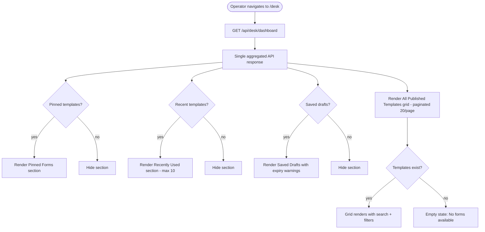
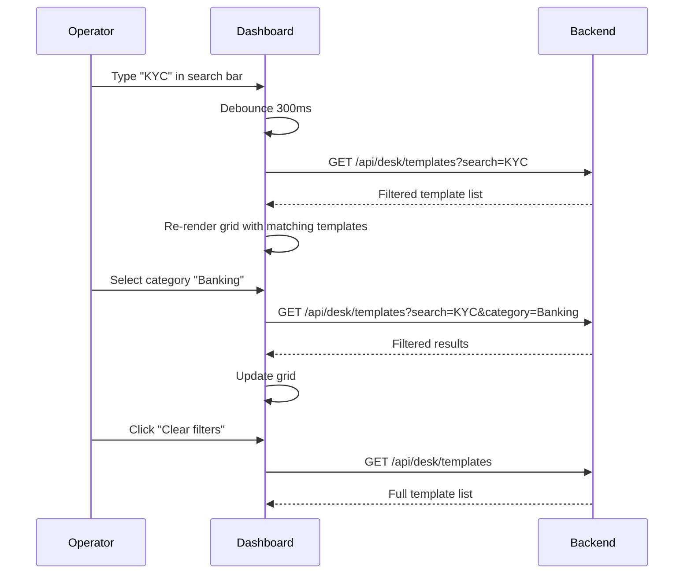

# F16 — Operator Dashboard (Form Desk)

**Roles**: Operator (primary) · Admin / Branch Manager (view)  
**Related**: [F15 Mode Switching](f15-mode-switching.md) · [F17 Form Filler](f17-form-filler.md) · [F03 Templates](f03-templates.md)

---

## Dashboard layout wireframe

```
┌──────────────────────────────────────────────────────────┐
│  Form Desk                                    [🔍 Search] │
│                                                          │
│  ★ Pinned Forms (3)                                      │
│  ┌──────┐  ┌──────┐  ┌──────┐                           │
│  │ KYC  │  │ Cheq │  │ Loan │                           │
│  │  ★   │  │  ★   │  │  ★   │                           │
│  └──────┘  └──────┘  └──────┘                           │
│                                                          │
│  🕐 Recently Used (5)                                    │
│  ┌──────┐  ┌──────┐  ┌──────┐  ┌──────┐  ┌──────┐     │
│  │ KYC  │  │ Wire │  │ Cash │  │ Loan │  │ FX   │     │
│  │ 10m  │  │ 1h   │  │ 2h   │  │ yday │  │ 2d   │     │
│  └──────┘  └──────┘  └──────┘  └──────┘  └──────┘     │
│                                                          │
│  📝 Saved Drafts (2)                                     │
│  ┌────────────────────────────────────┐                  │
│  │ KYC Form - 60% complete - 2h ago  │ [Resume] [Delete]│
│  │ Wire Transfer - 30% - ⚠ Expires tmrw │ [Resume] [Del]│
│  └────────────────────────────────────┘                  │
│                                                          │
│  📋 All Published Templates (page 1 of 3)               │
│  ┌──────┐  ┌──────┐  ┌──────┐  ┌──────┐               │
│  │ ...  │  │ ...  │  │ ...  │  │ ...  │               │
│  └──────┘  └──────┘  └──────┘  └──────┘               │
└──────────────────────────────────────────────────────────┘
```

---

## Wireflow — Dashboard load



---

## Wireflow — Search and filter



---

## Flows

### 16.1 Operator opens dashboard

```
Operator navigates to /desk
→ Single GET /api/desk/dashboard returns aggregated data:
    pinned_templates[], recent_templates[], drafts[], published_count
→ Sections render conditionally:
    Pinned Forms: shown if ≥1 pinned (max 20)
    Recently Used: shown if ≥1 recent (max 10, ordered by last_used desc)
    Saved Drafts: shown if ≥1 draft (with completion %, expiry warnings)
    All Templates: always shown with pagination (20/page)
→ Dashboard loads within 1 second
```

### 16.2 Operator searches for a template

```
Operator types template name in search bar
→ 300ms debounce before API call
→ GET /api/desk/templates?search={query} filters by name + description
→ Grid updates with matching templates
→ Operator can also filter by: category, country, language dropdowns
→ "Clear filters" button resets all filters
→ Empty result: message "No matching templates" with clear action
```

### 16.3 Operator pins/unpins a template

```
Operator clicks star icon on template card
→ POST /api/desk/pins { template_id }
→ Template appears in Pinned Forms section (max 20)
→ Pin state persisted server-side (cross-device)
→ Clicking star again: DELETE /api/desk/pins/:template_id
→ Template removed from Pinned Forms
→ At 20 pins: toast "Maximum 20 pinned templates reached"
```

### 16.4 Operator resumes a draft

```
Operator sees draft card: "KYC Form - 60% complete - 2 hours ago"
→ Clicks "Resume"
→ Navigates to /desk/fill/:templateId?draft=:draftId
→ Form Filler loads with previously saved field values restored
→ Draft card shows ⚠ warning if expiring within 24 hours
```

### 16.5 Operator deletes a draft

```
Operator clicks "Delete" on draft card
→ Confirmation dialog: "Delete this draft? This cannot be undone."
→ On confirm: DELETE /api/desk/drafts/:draftId
→ Draft removed from list
→ Success toast appears
```

### 16.6 Template version notification

```
Designer publishes v2 of "KYC Form"
→ Operator who used v1 sees notification card on dashboard:
    "KYC Form updated to v2"
→ Clicking notification → navigates to /desk/fill/:templateId (v2)
→ Dismissing notification → POST /api/desk/notifications/:id/dismiss
→ Notification does not reappear
```

---

## Edge cases

| Scenario | Expected behavior |
|----------|-------------------|
| Zero published templates in org | Empty state: "No forms available — contact your admin" |
| Pinned template gets unpublished | Card shows "Template unavailable" (dimmed), click disabled |
| Network drops during dashboard load | Connection error with retry button |
| Mobile screen (< 768px) | Grid → single-column list; sections stack vertically |
| Draft older than expiry period (7 days default) | Draft marked expired, cannot resume, delete only |
