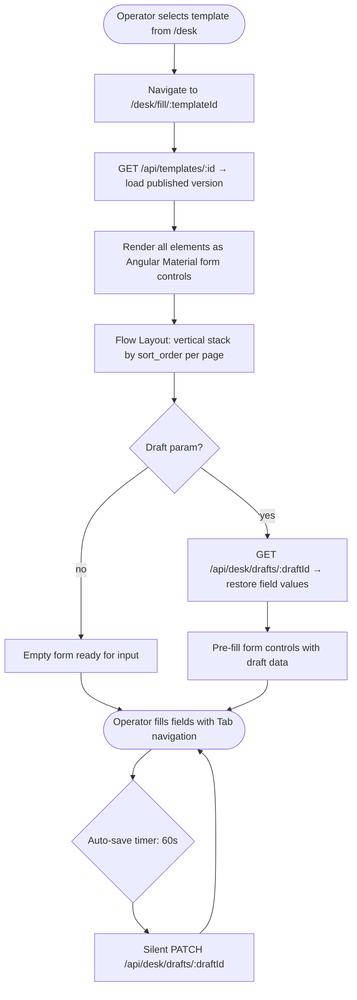
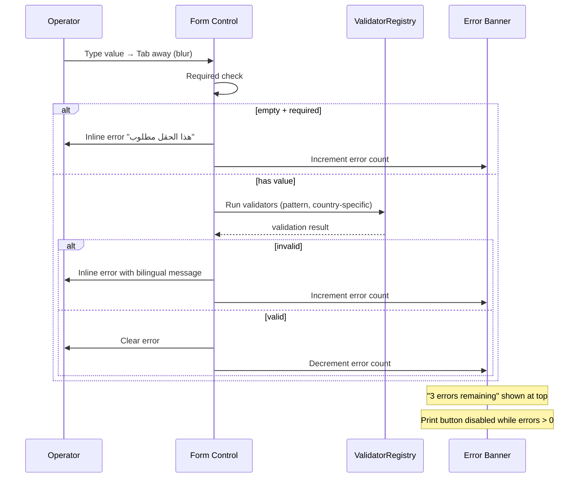
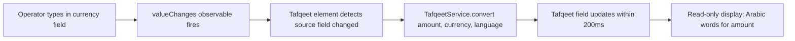
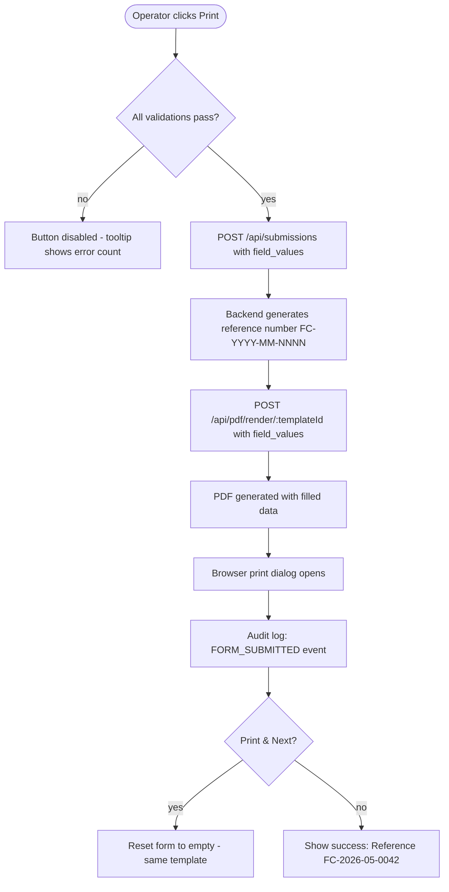

# F17 — Form Filler

**Roles**: Operator (fill + print) · Admin (fill + print)  
**Related**: [F16 Operator Dashboard](f16-operator-dashboard.md) · [F06 PDF Engine](f06-pdf-engine.md) · [F07 Validation](f07-validation.md) · [F10 Tafqeet](f10-tafqeet.md)

---

## Form Filler layout wireframe

```
┌──────────────────────────────────────────────────────────┐
│  ← Back to Desk │ KYC Form v2 │ ⚠ 3 errors remaining    │
│  [Save Draft Ctrl+S] [Preview] [Print] [Print & Next] [Clear] [Cancel] │
├──────────────────────────────────────────────────────────┤
│                                                          │
│  ── Page 1: بيانات العميل ──────────────────────        │
│                                                          │
│  الاسم الكامل *              [_________________]        │
│  الرقم القومي *              [______________] ✗         │
│                               رقم قومي غير صالح          │
│  تاريخ الميلاد               [____/____/______]          │
│                                                          │
│  المبلغ *                    [________1,500.25]          │
│  المبلغ بالحروف (تafqeet)    ألف وخمسمائة جنيه مصري      │
│                               وخمسة وعشرون قرشاً         │
│                                                          │
│  ── Page 2: التوقيعات ──────────────────────            │
│                                                          │
│  توقيع العميل *              ┌──────────────┐            │
│                               │  ✍ (canvas)  │            │
│                               └──────────────┘            │
└──────────────────────────────────────────────────────────┘
```

---

## Wireflow — Form filling lifecycle



---

## Wireflow — Validation flow



---

## Wireflow — Tafqeet auto-computation



---

## Wireflow — Print and submission



---

## Flows

### 17.1 Operator opens a form to fill

```
Operator clicks template card on /desk (or Resume on draft)
→ Navigate to /desk/fill/:templateId (or ?draft=:draftId)
→ GET published template → render all elements as form controls
→ Flow Layout: fields stacked vertically, grouped by page with dividers
→ Tab key moves focus in sort_order sequence across pages
→ RTL fields render right-aligned; LTR fields left-aligned
→ Form loads within 1 second for up to 50 elements
```

### 17.2 Live field validation

```
Operator fills a field and tabs away (blur event)
→ Required check: empty + required → inline error "هذا الحقل مطلوب"
→ Pattern check: value vs regex → inline error with validation message
→ Country validator: element key matches registered validator (e.g., national_id for EG)
    → Validator fires → returns bilingual error if invalid
→ Error banner at top: "3 errors remaining" (updates live)
→ Print button disabled while any errors exist
→ All errors cleared → banner disappears, Print enables
```

### 17.3 Tafqeet auto-computation

```
Template has tafqeet element linked to currency source field
→ Operator types "1500.25" in currency field
→ Tafqeet element detects valueChanges on source
→ TafqeetService converts: 1500.25 EGP → "ألف وخمسمائة جنيه مصري وخمسة وعشرون قرشاً"
→ Tafqeet field displays result (read-only) within 200ms
→ Source cleared → tafqeet clears
```

### 17.4 Save draft (manual and auto)

```
Manual: Operator presses Ctrl+S or clicks "Save Draft"
→ POST /api/desk/drafts { template_id, template_version, field_values, completion_percent }
→ Success toast: "Draft saved"

Auto: Every 60 seconds while form is open
→ Silent PATCH /api/desk/drafts/:draftId with current field_values
→ No toast, no interruption to typing

Resume: Operator navigates to /desk/fill/:templateId?draft=:draftId
→ GET /api/desk/drafts/:draftId → pre-fill form controls
→ If template version changed: warning "Template updated since draft was saved"
→ Drafts expire after org-configurable period (default 7 days)
```

### 17.5 Print and create submission

```
All validations pass → Print button enabled
→ Operator clicks "Print"
→ POST /api/submissions { template_id, template_version, field_values }
→ Backend generates reference number: FC-{YYYY}-{MM}-{org_sequence}
→ PDF rendered with filled values via PDF engine
→ Browser print dialog opens
→ Audit log: FORM_SUBMITTED { operator_id, template_id, reference_number, IP }
→ Success message with reference number displayed
```

### 17.6 Print & Next workflow

```
Operator clicks "Print & Next" (bank teller filling same form repeatedly)
→ Same as Print flow (submission created, PDF printed)
→ After print dialog closes: form resets to empty
→ Same template stays loaded — ready for next entry
→ Reference number of previous submission shown briefly in toast
```

### 17.7 Cancel and unsaved changes

```
Operator clicks "Cancel"
→ If unsaved changes exist: confirmation dialog "You have unsaved changes. Leave?"
→ On confirm: navigate back to /desk without saving
→ On cancel: stay on form
→ Browser beforeunload also triggers if navigating away with changes
```

---

## Edge cases

| Scenario | Expected behavior |
|----------|-------------------|
| Template has zero fillable fields | Message: "No fillable fields" — Print enabled immediately |
| Network drops during draft save | Toast: "Save failed — will retry on reconnection" |
| Two operators fill same template | Independent sessions — each creates own submission |
| Form has 50+ fields | Scrollable Flow Layout; sticky error banner at top |
| Draft version mismatch | Warning dialog with options: continue with old data or discard |
