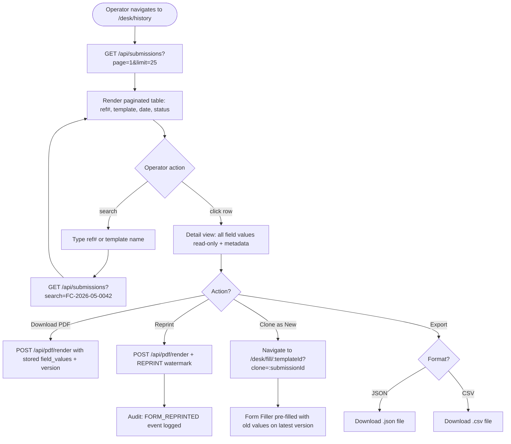
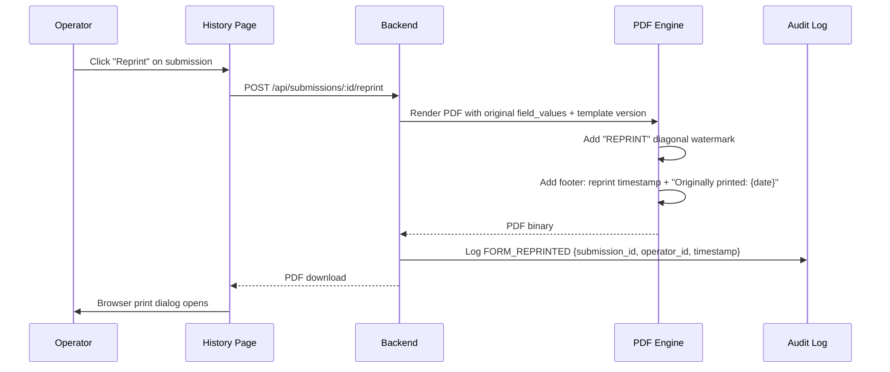

# F18 — Submission History & Reprint

**Roles**: Operator (own submissions) · Admin / Branch Manager (org-wide)  
**Related**: [F17 Form Filler](f17-form-filler.md) · [F06 PDF Engine](f06-pdf-engine.md) · [F08 Security](f08-security.md)

---

## Submission history wireframe

```
┌──────────────────────────────────────────────────────────┐
│  Submission History                                       │
│  [🔍 Search by ref # or template name]                   │
│  [Date: From _____ To _____] [Template: ▼ All] [Status: ▼ All] │
├──────────────────────────────────────────────────────────┤
│  Ref #            │ Template     │ Date       │ Status   │
│  FC-2026-05-0042  │ KYC Form v2  │ May 20     │ Printed  │
│  FC-2026-05-0041  │ Wire Xfer v1 │ May 20     │ Printed  │
│  FC-2026-05-0040  │ Cheque v3    │ May 19     │ Reprinted│
│  ...              │ ...          │ ...        │ ...      │
├──────────────────────────────────────────────────────────┤
│  Showing 1-25 of 142  │ [← Prev] [1] [2] [3] ... [Next →] │
└──────────────────────────────────────────────────────────┘
```

---

## Wireflow — Submission lookup and reprint



---

## Wireflow — Reprint PDF generation



---

## Flows

### 18.1 Operator views submission history

```
Operator navigates to /desk/history
→ GET /api/submissions (paginated, 25/page, newest first)
→ Table shows: reference_number, template_name, date, status, key_field_summary
→ Key field summary: first 3 non-empty field values for quick identification
→ Pagination controls at bottom (25/50/100 per page options)
→ Loads within 1 second for up to 1000 submissions
```

### 18.2 Search and filter submissions

```
Operator types "FC-2026-05-0042" in search bar
→ Exact match on reference_number → single result shown
→ Or types "KYC" → partial match on template_name
→ Date range filter: From/To date pickers
→ Template filter: dropdown of all templates operator has used
→ Status filter: Submitted / Printed / Reprinted
→ Filters combine with AND logic
→ Results update within 500ms
```

### 18.3 View submission details

```
Operator clicks a submission row
→ Detail panel opens showing:
    Reference number, template name + version, operator, date
    All field_values rendered in read-only form layout
→ Action buttons: Download PDF, Reprint, Clone as New, Export
```

### 18.4 Reprint a submission

```
Operator clicks "Reprint"
→ POST /api/submissions/:id/reprint
→ PDF generated with original field_values and original template version
→ "REPRINT" watermark stamped diagonally across each page
→ Footer: reprint timestamp + "Originally printed: {original_date}"
→ Browser print dialog opens
→ Audit log: FORM_REPRINTED { submission_id, operator_id, IP, timestamp }
→ Submission status updates to "reprinted"
→ Completes within 3 seconds
```

### 18.5 Clone as new submission

```
Operator clicks "Clone as New"
→ Navigate to /desk/fill/:templateId?clone=:submissionId
→ Form Filler loads LATEST published version of template
→ Field values mapped from old submission by element key
→ Missing keys (new fields): left empty for operator to fill
→ Extra keys (removed fields): silently ignored
→ Operator modifies as needed → Print → new submission with new reference number
```

### 18.6 Export submission data

```
Operator clicks "Export" → selects JSON or CSV
→ JSON: download file with { reference_number, template, version, field_values, metadata }
→ CSV: headers = element keys, single row = values
→ Export completes within 2 seconds
```

---

## Edge cases

| Scenario | Expected behavior |
|----------|-------------------|
| Template deleted since submission | Submission still viewable; PDF uses stored field_values; warning shown |
| Operator searches for another operator's submission | API filters by operator_id — not visible (admin sees all) |
| Reprint of very old submission (template v1, now v5) | Uses original v1 template layout for PDF; current renderer |
| Clone where required field was removed in new version | New required field shows empty; operator must fill before print |
| Submission with signature element | Detail view shows signature image inline; PDF embeds it |
