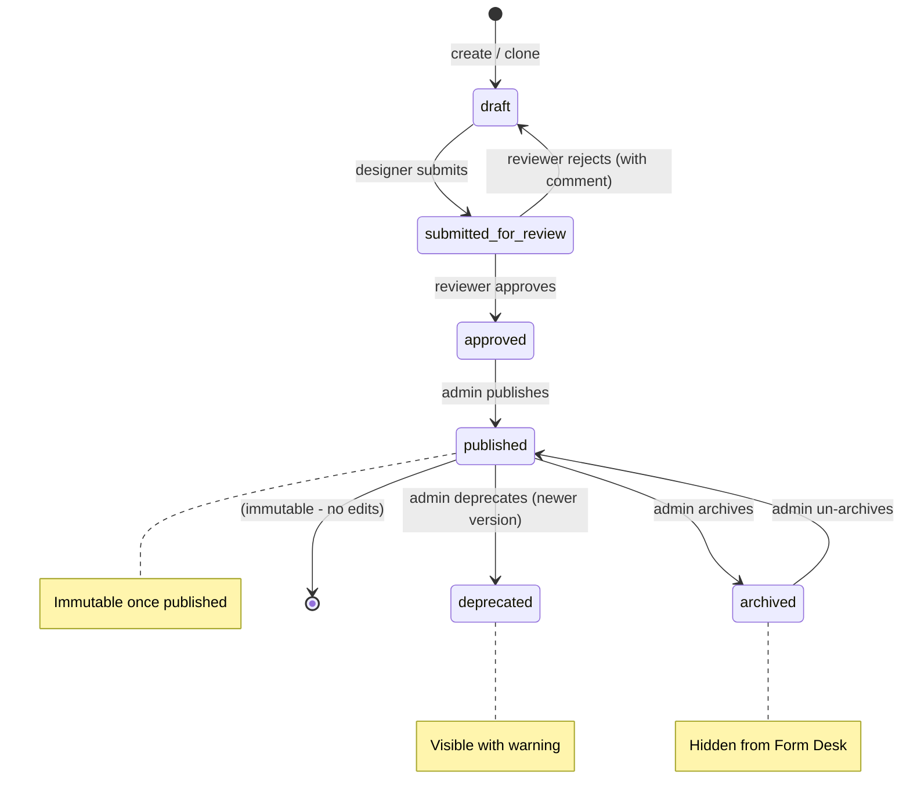
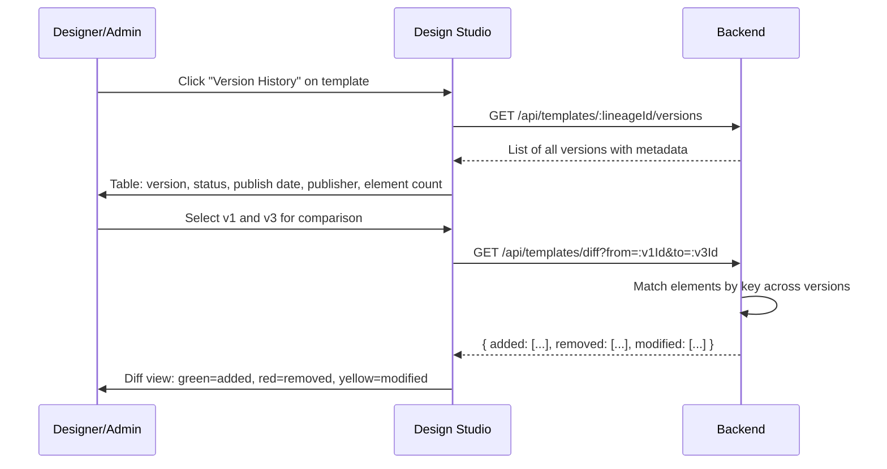

# F19 — Template Versioning & Cloning

**Roles**: Designer (create versions, clone) · Admin (approve, publish, archive) · Reviewer (approve/reject)  
**Related**: [F03 Templates](f03-templates.md) · [F04 Design Studio](f04-design-studio.md) · [F08 Security](f08-security.md)

---

## Template lifecycle state machine



---

## Wireflow — Version creation and publish

```mermaid
flowchart TD
    A([Designer views published template v1]) --> B[Click "Create New Version"]
    B --> C[Backend copies all pages + elements → new draft v2]
    C --> D[v2.parent_version_id = v1.id]
    D --> E[v2.lineage_id = v1.lineage_id]
    E --> F[Designer edits v2 in Design Studio]
    F --> G[Click "Submit for Review"]
    G --> H[Status → submitted_for_review]
    H --> I{Reviewer decision}
    I -- approve --> J[Status → approved]
    J --> K[Admin clicks "Publish"]
    K --> L[Status → published, version incremented]
    L --> M[Form Desk now shows v2 as default]
    L --> N[v1 auto-deprecated with "newer version" warning]
    I -- reject --> O[Status → draft + rejection comment]
    O --> P[Designer sees comment, edits, resubmits]
    P --> G
```

---

## Wireflow — Version history and diff



---

## Flows

### 19.1 Designer creates a new version from published

```
Designer opens published template v1 → clicks "Create New Version"
→ Backend copies all pages, elements, properties into new draft
→ New version: v2, status=draft, parent_version_id=v1.id, lineage_id=v1.lineage_id
→ Version copy completes within 2 seconds (up to 100 elements)
→ Design Studio opens with v2 in edit mode
→ v1 remains published and active in Form Desk until v2 publishes
```

### 19.2 Review and approval workflow

```
Designer completes edits → clicks "Submit for Review"
→ Status → submitted_for_review; template becomes read-only for designer
→ Reviewer opens template → sees all changes
→ Option A: Approve → status → approved
    → Admin clicks "Publish" → status → published, version number set
    → Audit: TEMPLATE_PUBLISHED event
→ Option B: Reject with comment → status → draft
    → Designer sees rejection comment (notification + on template detail)
    → Edits and resubmits
    → Audit: TEMPLATE_REJECTED event with comment
```

### 19.3 Template state transitions

```
State transitions enforced server-side (422 on invalid):
  draft → submitted_for_review (designer action)
  submitted_for_review → approved (reviewer)
  submitted_for_review → draft (reject - reviewer)
  approved → published (admin)
  published → archived (admin)
  published → deprecated (admin)
  archived → published (un-archive - admin)

Published = immutable. Any edit attempt returns 403:
  "Published templates are immutable — create a new version"

All transitions logged in audit trail:
  TEMPLATE_SUBMITTED, TEMPLATE_APPROVED, TEMPLATE_REJECTED,
  TEMPLATE_PUBLISHED, TEMPLATE_ARCHIVED, TEMPLATE_DEPRECATED
```

### 19.4 Version history view

```
User opens "Version History" for a template
→ GET /api/templates/:lineageId/versions
→ Table shows all versions in lineage:
    Version #, status, publish date, publisher name, element count
→ Each version clickable → opens read-only Design Studio view
→ Submission references linked: "v2 used by 142 submissions"
→ Responds within 500ms for up to 50 versions
```

### 19.5 Version diff view

```
User selects two versions (v1 and v3) → clicks "Compare"
→ GET /api/templates/diff?from=:v1Id&to=:v3Id
→ Elements matched by key across versions
→ Diff displays:
    Added elements (green): elements in v3 not in v1
    Removed elements (red): elements in v1 not in v3
    Modified elements (yellow): same key, different properties
      Shows before/after: "x_mm: 20 → 35", "label_ar: changed"
→ Page-level changes: added/removed pages, dimension changes
→ Diff computes within 1 second for 200 elements per version
```

### 19.6 Template cloning

```
Designer clicks "Clone" on any template (any status, any version)
→ New template created: new ID, new lineage_id, version=1, status=draft
→ All pages, elements, properties copied (independent — no lineage link)
→ Original template unaffected by any clone edits
→ Use case: "KYC Individual" cloned to "KYC Corporate"
→ Audit: TEMPLATE_CLONED event
```

### 19.7 Archive and deprecation

```
Archive: Admin archives published template
→ Status → archived; template hidden from Form Desk
→ Existing submissions unaffected (field_values + version preserved)
→ In-progress drafts: warning shown but can still be completed
→ Un-archive: restores to published state

Deprecate: Newer version published
→ Old version status → deprecated
→ Form Desk shows warning: "A newer version is available" with link
→ Operators can still use deprecated version (not blocked)
```

---

## Edge cases

| Scenario | Expected behavior |
|----------|-------------------|
| Two designers create v2 simultaneously | Each gets independent draft; first to publish becomes v2, other becomes v3 |
| Published template with background images cloned | Clone references same Storage URLs; warning shown about shared assets |
| Rejected template resubmitted without changes | Allowed — reviewer may have rejected by mistake |
| Archived template referenced by draft | Draft can complete; warning "Template archived" shown |
| Version diff with 200+ elements | Computes within 1 second; pagination if diff results are large |
