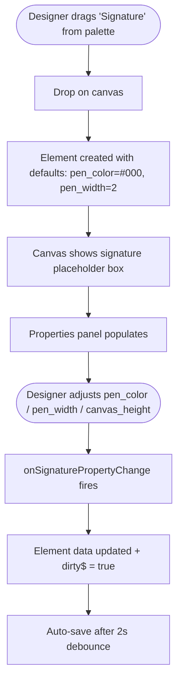
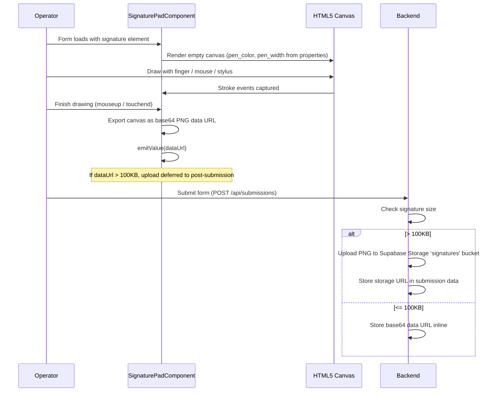
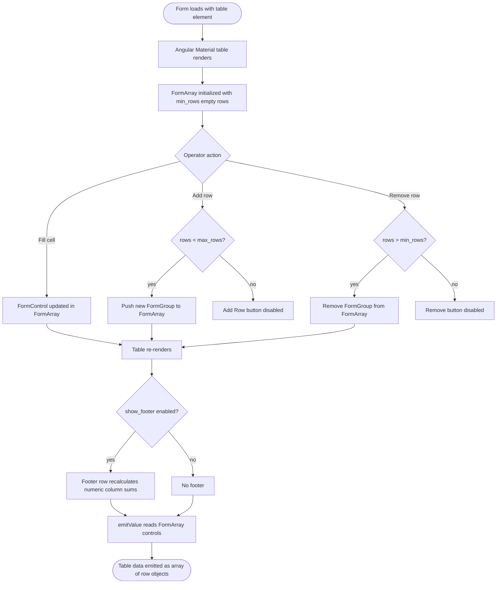
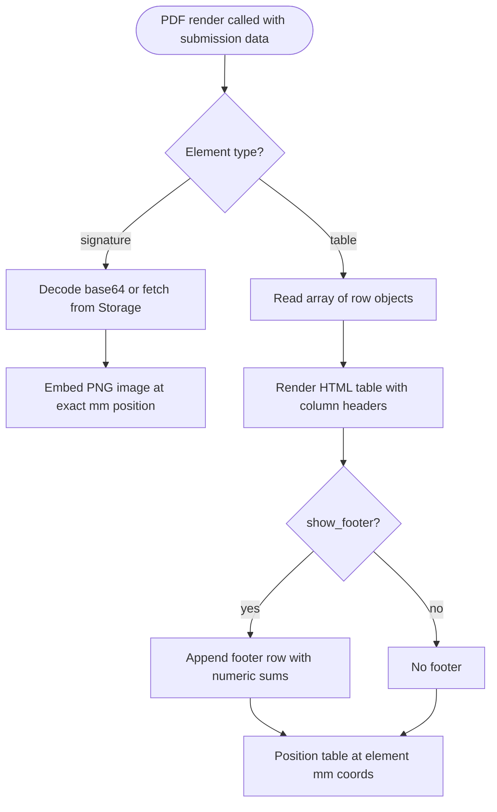

# F20 — New Element Types (Signature + Table)

**Roles**: Designer (configure) · Operator (fill)  
**Related**: [F04 Design Studio](f04-design-studio.md) · [F06 PDF Engine](f06-pdf-engine.md) · [F03 Templates](f03-templates.md)

---

## Updated palette wireframe

```
┌──────────────┐
│  Element     │
│  Palette     │
│              │
│  Text        │
│  Number      │
│  Date        │
│  Currency    │
│  Checkbox    │
│  Radio       │
│  Dropdown    │
│  Image       │
│  QR          │
│  Barcode     │
│  Tafqeet     │
│  ──────────  │
│  ✍ Signature │  ← NEW
│  ▦ Table     │  ← NEW
└──────────────┘
```

---

## Signature properties panel wireframe

```
┌───────────────────────────┐
│  Properties: Signature    │
│                           │
│  key: signature_1         │
│  label_ar: ___________    │
│  label_en: ___________    │
│  x: 20 mm   y: 120 mm    │
│  w: 60 mm   h: 30 mm     │
│                           │
│  Pen Color: [#000000] 🎨  │
│  Pen Width: [2] px        │
│  Canvas Height: [150] px  │
│                           │
│  required ○               │
│  [Delete]                 │
└───────────────────────────┘
```

---

## Wireflow — Designer adds a signature element



---

## Wireflow — Operator draws a signature



---

## Table properties panel wireframe

```
┌───────────────────────────────┐
│  Properties: Table            │
│                               │
│  key: table_1                 │
│  label_ar: ___________        │
│  label_en: ___________        │
│                               │
│  Columns:                     │
│  ┌──────────────────────────┐ │
│  │ key    │ label_ar │ type │ │
│  │ name   │ الاسم    │ text │ │
│  │ qty    │ الكمية   │ num  │ │
│  │ date   │ التاريخ  │ date │ │
│  │ [+ Add Column]           │ │
│  └──────────────────────────┘ │
│                               │
│  Min Rows: [1]                │
│  Max Rows: [20]               │
│  Show Footer: ☑ (sums)       │
│                               │
│  [Delete]                     │
└───────────────────────────────┘
```

---

## Wireflow — Operator fills a table element



---

## Wireflow — PDF renders signature and table



---

## Flows

### 20.1 Designer adds a signature element

```
Designer drags "Signature" from palette onto canvas
→ Element created with default properties: pen_color=#000000, pen_width=2
→ Canvas shows a dashed-border placeholder box
→ Properties panel: pen_color picker, pen_width slider, canvas_height input
→ onSignaturePropertyChange handler updates element.properties
→ Auto-save triggers after 2s debounce
```

### 20.2 Operator fills a signature

```
Operator opens a form containing a signature element
→ SignaturePadComponent renders HTML5 canvas with configured pen_color and pen_width
→ Operator draws using finger / mouse / stylus
→ On completion, canvas exported as base64 PNG data URL
→ emitValue() sends data URL to parent form
→ On submission: if data URL > 100KB → uploaded to 'signatures' Supabase Storage bucket
→ Submission stores either inline base64 or storage URL
```

### 20.3 Designer configures a table element

```
Designer drags "Table" from palette onto canvas
→ Properties panel shows columns editor
→ Designer adds columns: key, label_ar, label_en, type (text/number/date/dropdown), required flag
→ Sets min_rows (default 1), max_rows (default 20), show_footer toggle
→ Column definitions stored in element.properties (not formatting)
→ onTablePropertyChange handler updates element data
```

### 20.4 Operator fills a table

```
Operator opens form with table element
→ Angular Material table renders with configured columns
→ FormArray initialized with min_rows empty rows
→ Operator fills cells → FormControl values updated
→ "Add Row" button adds a new row (disabled at max_rows)
→ "Remove Row" button removes selected row (disabled at min_rows)
→ Footer row auto-calculates sums for numeric columns (when show_footer=true)
→ emitValue() reads current FormArray control values (not stale rows cache)
→ Data submitted as array of row objects: [{col_key: value, ...}, ...]
```

---

## Edge cases

| Scenario | Expected behavior |
|----------|-------------------|
| Signature canvas untouched on required field | Validation error: "Signature required" |
| Signature data URL exactly 100KB | Stored inline (threshold is strictly greater than) |
| Table has 0 min_rows | Table renders with no rows; operator must add manually |
| Operator tries to exceed max_rows | "Add Row" button disabled; toast notification |
| Numeric column has empty cells | Footer sum ignores empty cells (treats as 0) |
| Table column type is dropdown | Cell renders as select with options from column config |
| PDF render with empty signature | Renders blank placeholder box |
| PDF render with empty table | Renders table headers only, no data rows |

---

## Migration

```
migrations/023_new_element_types.sql
→ ALTER element type CHECK constraint: adds 'signature' and 'table'
→ Creates 'signatures' Supabase Storage bucket
```
