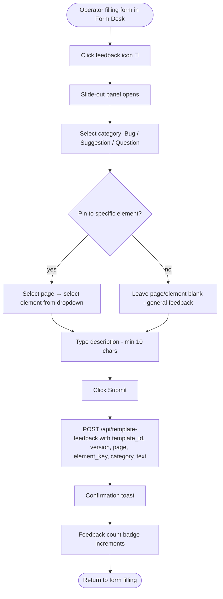
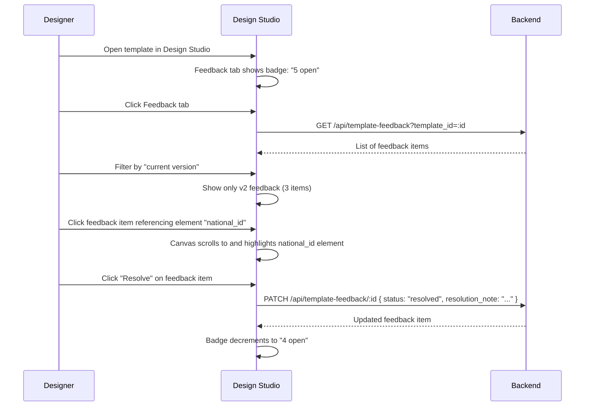

# F20 — Template Feedback

**Roles**: Operator (submit feedback) · Designer (view + resolve in Studio) · Admin (overview + export)  
**Related**: [F17 Form Filler](f17-form-filler.md) · [F04 Design Studio](f04-design-studio.md) · [F19 Template Versioning](f19-template-versioning.md)

---

## Feedback submission wireframe (operator in Form Desk)

```
┌──────────────────────────────────────────────────────────┐
│  Form Filler: KYC Form v2                    [💬 Feedback]│
├──────────────────────────────────────────────────────────┤
│                                           ┌─────────────┐│
│  [form fields...]                         │ Submit       ││
│                                           │ Feedback     ││
│                                           │              ││
│                                           │ Category:    ││
│                                           │ [Bug ▼]      ││
│                                           │              ││
│                                           │ Page:        ││
│                                           │ [Page 2 ▼]   ││
│                                           │              ││
│                                           │ Element:     ││
│                                           │ [national_id]││
│                                           │              ││
│                                           │ Description: ││
│                                           │ ┌──────────┐ ││
│                                           │ │Label is  │ ││
│                                           │ │confusing │ ││
│                                           │ └──────────┘ ││
│                                           │ 42/2000      ││
│                                           │              ││
│                                           │ [Submit]     ││
│                                           └─────────────┘│
└──────────────────────────────────────────────────────────┘
```

---

## Wireflow — Operator submits feedback



---

## Wireflow — Designer resolves feedback



---

## Flows

### 20.1 Operator submits feedback on a template

```
Operator is filling form in Form Desk → clicks feedback icon
→ Slide-out panel with: category selector (bug/suggestion/question),
    optional page + element selectors, description text field (min 10 chars)
→ If element selected: feedback linked to template_id, version, page_number, element_key
→ If no element: general feedback (page/element = null)
→ POST /api/template-feedback creates record
→ Confirmation toast; feedback count badge updates
→ Duplicate detection: same text + same element within 1 minute → rejected
→ Completes within 500ms
```

### 20.2 Designer views feedback in Design Studio

```
Designer opens template in Design Studio
→ Feedback tab shows badge with open count
→ Click tab → panel shows all feedback for this template (all versions)
→ Sort: newest first
→ Each item shows: category icon, text preview, version badge, status, submitter
→ Filters: version (current/all), category, status (open/resolved), page
→ Click feedback with element reference → canvas scrolls to and highlights element
→ Loads within 1 second for up to 100 items
```

### 20.3 Designer resolves feedback

```
Designer clicks "Resolve" on a feedback item
→ Optional: enter resolution note
→ PATCH /api/template-feedback/:id { status: "resolved", resolution_note }
→ Status changes; resolver name + timestamp recorded
→ Badge decrements
→ Audit: FEEDBACK_RESOLVED event
```

### 20.4 Admin views feedback overview

```
Admin navigates to /admin/template-feedback
→ Table shows all templates with feedback:
    Template name, version, open count, resolved count, last feedback date
→ Click template row → expands to show individual feedback items
→ Click "Export" → CSV download with all feedback for selected time range
→ Identifies templates with most unresolved feedback → prioritize improvements
```

---

## Edge cases

| Scenario | Expected behavior |
|----------|-------------------|
| Feedback on element that designer later deletes | Feedback preserved; UI shows "Element no longer exists" |
| Template version incremented after feedback | Feedback retains original version reference |
| Duplicate feedback (same text+element within 1 min) | Rejected: "Similar feedback already submitted" |
| Feedback text < 10 characters | Validation rejects with specific error |
| Admin exports template with 0 feedback items | Empty CSV with headers only |
