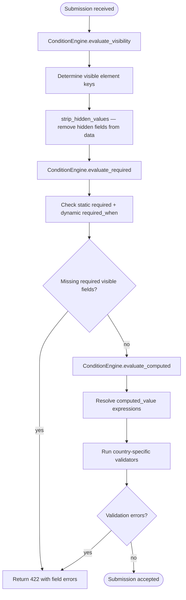
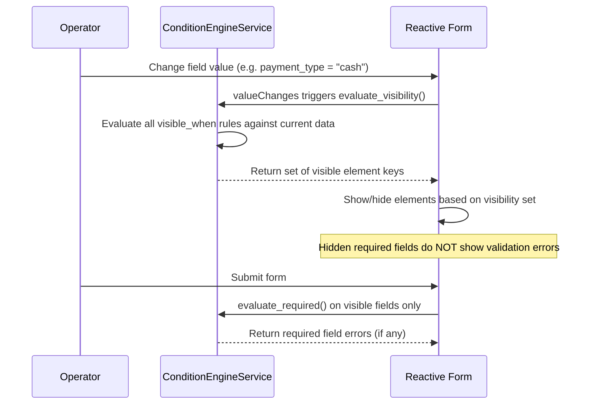
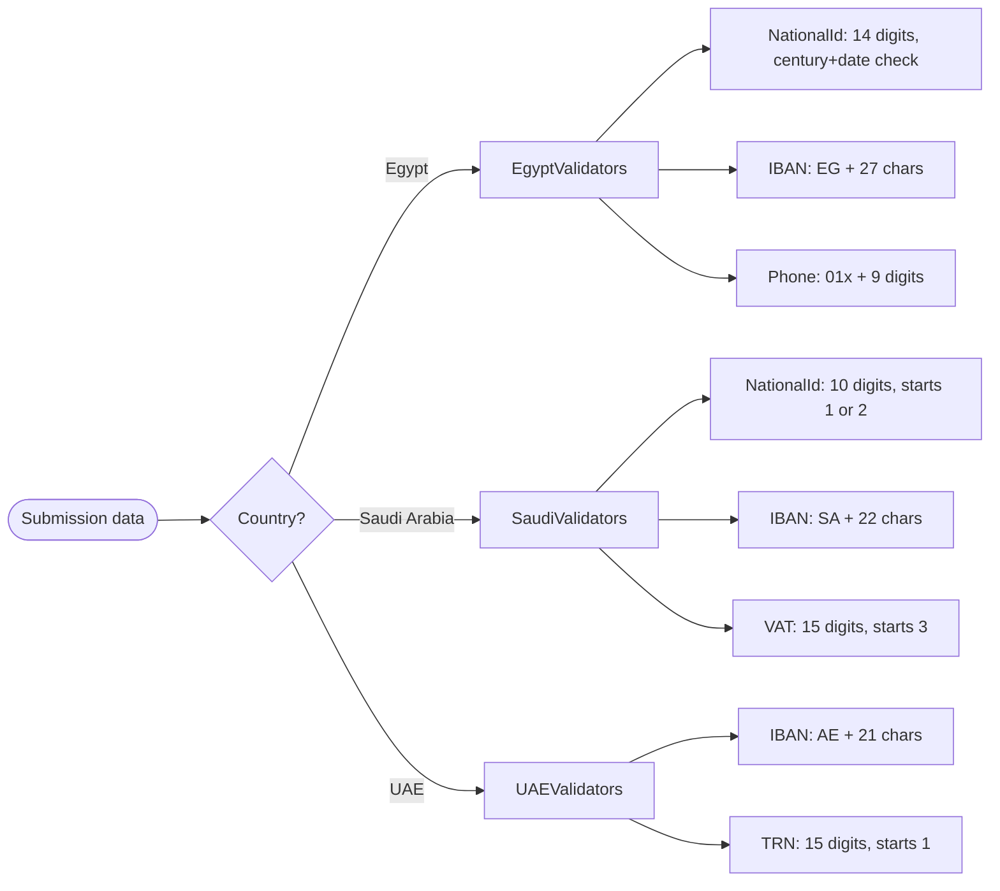

# F22 — Advanced Form Validation

**Roles**: Designer (configure rules) · Operator (fill forms) · System (evaluate)  
**Related**: [F07 Validation](f07-validation.md) · [F04 Design Studio](f04-design-studio.md) · [F03 Templates](f03-templates.md)

---

## Condition engine pipeline



---

## Wireflow — Conditional visibility in desk fill



---

## Wireflow — Dependency cycle detection

```mermaid
flowchart TD
    A([Designer saves template with conditions]) --> B[POST /templates/{id}/validate-dependencies]
    B --> C[DependencyValidator.detect_cycles]
    C --> D[Build dependency graph from visible_when + required_when + computed_value]
    D --> E[Topological sort]
    E --> F{Cycle found?}
    F -- yes --> G[Return 400 with cycle path: A → B → C → A]
    F -- no --> H[Return 200 with dependency stats]
    H --> I([Designer sees stats: total_fields, total_dependencies, max_depth])
    G --> J([Designer sees error with cycle path])
```

---

## Condition rule format

```
visible_when example:
{
  "field": "payment_type",
  "operator": "eq",
  "value": "cash"
}

required_when example:
{
  "field": "has_attachment",
  "operator": "eq",
  "value": true
}

computed_value example:
{
  "expression": "field_a + field_b",
  "dependencies": ["field_a", "field_b"]
}
```

---

## Country-specific validators



---

## Flows

### 22.1 Designer configures conditional visibility

```
Designer selects an element in Design Studio
→ Opens "Conditions" section in properties panel
→ Adds visible_when rule: field reference, operator (eq/ne/gt/lt/in/not_in), value
→ Element marked with eye icon indicating conditional visibility
→ On save: POST /templates/{id}/validate-dependencies to check for cycles
→ If cycle detected: error toast with cycle path shown
→ If no cycle: template saved with conditions
```

### 22.2 Designer configures conditional required

```
Designer selects an element → opens "Conditions" section
→ Adds required_when rule: same format as visible_when
→ Element shows conditional-required indicator (asterisk with condition icon)
→ At runtime: field becomes required ONLY when condition is met AND field is visible
```

### 22.3 Designer configures computed value

```
Designer selects an element → opens "Computed" section
→ Enters expression (e.g. "quantity * unit_price")
→ System parses dependencies from expression
→ Dependencies validated against existing element keys
→ Computed field rendered as read-only in desk fill
→ Value recalculated when any dependency value changes
```

### 22.4 Operator fills form with conditional fields

```
Operator opens form in desk
→ ConditionEngineService evaluates all visible_when rules against initial data
→ Only visible fields rendered
→ Operator changes a field value that triggers a condition
→ valueChanges fires → ConditionEngineService re-evaluates visibility
→ Newly visible fields appear with animation; hidden fields disappear
→ On submit: backend re-evaluates all conditions server-side
→ Hidden fields stripped from submission data
→ Only visible required fields validated
```

### 22.5 Country-specific validation on submission

```
Template has country setting (e.g. Egypt)
→ Operator fills national ID field → submits
→ ValidationService loads Egypt validator registry
→ EgyptNationalIdValidator checks: 14 digits, century prefix (2/3), valid date embedded
→ EgyptIBANValidator checks: starts with "EG", total 29 characters
→ EgyptPhoneValidator checks: starts with "01", followed by 0/1/2/5, then 8 digits
→ If validation fails: 422 response with per-field error messages
```

### 22.6 Backend re-validates on submission

```
POST /api/submissions with form data
→ ConditionEngine.evaluate_visibility() determines visible fields
→ strip_hidden_values() removes data for hidden fields
→ evaluate_required() checks required + required_when on visible fields only
→ evaluate_computed() recalculates all computed values server-side
→ Country validators run on applicable fields
→ All checks pass → submission stored
```

---

## Edge cases

| Scenario | Expected behavior |
|----------|-------------------|
| Hidden required field | No validation error — hidden fields excluded from required checks |
| Circular dependency: A visible_when B, B visible_when A | detect_cycles returns cycle path; template save blocked |
| Computed field references non-existent key | Dependency validation error on template save |
| required_when condition references a hidden field | Condition evaluates against raw data (field may be hidden but value exists) |
| Country validator on empty optional field | Validator skipped — only runs on non-empty values |
| Multiple visible_when rules on same element | All conditions must be true (AND logic) |
| Client-side and server-side visibility disagree | Server-side is authoritative; client re-syncs on 422 |
| Expression division by zero in computed_value | Result set to null; no error thrown |

---

## Validator registry architecture

```
services/validators/
├── registry.py          # ValidatorRegistry: load validators by country
├── egypt.py             # NationalId, IBAN, Phone validators
├── saudi.py             # NationalId, IBAN, VAT validators
└── uae.py               # IBAN, TRN validators
```

Each validator implements `validate(value: str) -> Optional[str]` returning an error message or None.
