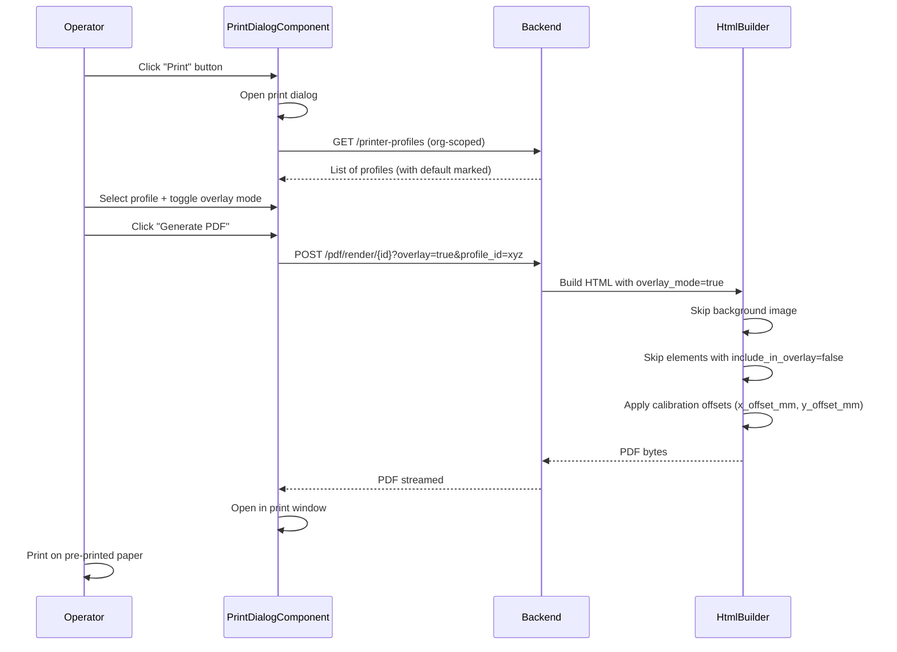
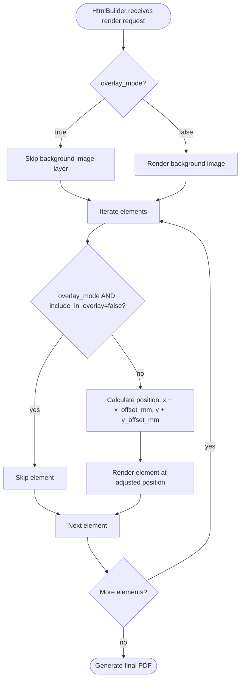

# F22 — Overlay Print Mode

**Roles**: Admin (printer profiles) · Operator (print) · Designer (element overlay flag)  
**Related**: [F06 PDF Engine](f06-pdf-engine.md) · [F04 Design Studio](f04-design-studio.md)

---

## Print mode comparison

```
Full Mode (default):                    Overlay Mode:
┌───────────────────────┐              ┌───────────────────────┐
│ ░░░░░░░░░░░░░░░░░░░░ │              │                       │
│ ░░ BACKGROUND IMAGE ░ │              │                       │
│ ░░░░░░░░░░░░░░░░░░░░ │              │                       │
│                       │              │                       │
│  Name: [Ahmed Ali]    │              │  Name: [Ahmed Ali]    │
│  Date: [2026-05-19]   │              │  Date: [2026-05-19]   │
│  Total: [1,250 EGP]   │              │  Total: [1,250 EGP]   │
│                       │              │                       │
│ ░░░░░░░░░░░░░░░░░░░░ │              │                       │
│ ░░ FOOTER GRAPHICS ░░ │              │                       │
│ ░░░░░░░░░░░░░░░░░░░░ │              │                       │
└───────────────────────┘              └───────────────────────┘
  Prints everything                     Elements only — for
                                        pre-printed paper
```

---

## Wireflow — Operator prints with overlay mode



---

## Wireflow — Admin creates and calibrates a printer profile

```mermaid
flowchart TD
    A([Admin opens /admin/printer-profiles]) --> B[Click 'Add Profile']
    B --> C[Enter name, x_offset_mm=0, y_offset_mm=0]
    C --> D[POST /printer-profiles — profile created]
    D --> E[Click 'Print Calibration Page']
    E --> F[POST /printer-profiles/{id}/calibration-page]
    F --> G[A4 PDF with crosshair markers at known positions]
    G --> H[Admin prints calibration page on target printer]
    H --> I[Measure offset: markers vs expected positions]
    I --> J[Enter corrections: x_offset_mm, y_offset_mm]
    J --> K[PATCH /printer-profiles/{id}]
    K --> L{Set as default?}
    L -- yes --> M[Mark profile as org default]
    L -- no --> N([Done])
    M --> N
```

---

## Calibration page wireframe

```
┌─────────────────────────────────── A4 ───────────────────────────────────┐
│                                                                          │
│    ╋ (20mm, 20mm)                              ╋ (190mm, 20mm)           │
│    Expected: top-left                          Expected: top-right       │
│                                                                          │
│                                                                          │
│                        CALIBRATION PAGE                                  │
│                     Profile: "HP LaserJet"                               │
│                                                                          │
│              Measure offset from ╋ markers to                            │
│              their expected positions.                                   │
│              Enter corrections in profile.                               │
│                                                                          │
│                                                                          │
│    ╋ (20mm, 277mm)                             ╋ (190mm, 277mm)          │
│    Expected: bottom-left                       Expected: bottom-right    │
│                                                                          │
└──────────────────────────────────────────────────────────────────────────┘
```

---

## Print dialog wireframe

```
┌──────────────────────────────────┐
│  Print Settings                  │
│                                  │
│  Printer Profile: [HP LaserJet▼] │
│    Items: Office Printer 1       │
│           Warehouse Printer      │
│           HP LaserJet ✓ (default)│
│                                  │
│  Print Mode:                     │
│    ○ Full (background + fields)  │
│    ● Overlay (fields only)       │
│                                  │
│  [Cancel]          [Generate PDF]│
└──────────────────────────────────┘
```

---

## PDF generation with offsets



---

## Flows

### 22.1 Admin creates a printer profile

```
Admin opens /admin/printer-profiles
→ Clicks "Add Profile"
→ Enters profile name (e.g. "HP LaserJet 3rd Floor")
→ Sets initial offsets to 0, 0
→ POST /printer-profiles creates profile scoped to org_id
→ Profile appears in list
```

### 22.2 Admin calibrates a printer profile

```
Admin selects a profile → clicks "Print Calibration Page"
→ POST /printer-profiles/{id}/calibration-page
→ Backend generates A4 PDF with crosshair markers at four corners at known mm positions
→ Admin prints page on the target physical printer
→ Admin measures actual marker positions vs expected positions
→ Admin enters corrections: x_offset_mm = +1.5, y_offset_mm = -0.8
→ PATCH /printer-profiles/{id} saves corrections
→ All future prints using this profile shift elements by (1.5, -0.8) mm
```

### 22.3 Admin sets a default profile

```
Admin selects a profile → clicks "Set as Default"
→ PATCH /printer-profiles/{id} with is_default=true
→ Previous default (if any) loses default status
→ Print dialog pre-selects this profile for all operators in the org
```

### 22.4 Operator prints in overlay mode

```
Operator opens a filled submission → clicks "Print"
→ PrintDialogComponent opens
→ Profile selector loads org profiles (default pre-selected)
→ Operator selects "Overlay" mode
→ Clicks "Generate PDF"
→ POST /pdf/render/{template_id} with overlay=true, profile_id, submission data
→ HtmlBuilder skips background image
→ Elements with include_in_overlay=false skipped
→ Remaining elements positioned with calibration offsets applied
→ PDF opens in browser print window
→ Operator prints on pre-printed paper
```

### 22.5 Designer marks elements for overlay exclusion

```
Designer opens template in Design Studio
→ Selects a decorative element (e.g. logo, static label)
→ In properties panel: unchecks "Include in Overlay"
→ Element tagged with include_in_overlay=false
→ In overlay print mode, this element is omitted
```

---

## Edge cases

| Scenario | Expected behavior |
|----------|-------------------|
| No printer profiles exist for org | Profile selector shows empty; operator can still print in full mode with no offsets |
| Profile deleted while dialog open | Refresh on generate; 404 falls back to zero offsets |
| Offsets push element off page boundary | Element clipped at A4 edge; no error |
| All elements have include_in_overlay=false | Overlay PDF renders as blank page (valid use case for testing) |
| Non-admin tries to create profile | 403 Forbidden |
| Calibration page printed on wrong paper size | Markers will be off; admin re-calibrates with correct paper |
| Org has multiple default profiles | Backend enforces single default; PATCH unsets previous default atomically |

---

## Org-scoped security

```
All printer profile queries scoped to org_id
→ Service-role client bypasses RLS
→ Application-level .eq("org_id", org_id) filtering enforced in printer_profile_service
→ Admin role required for CRUD operations
→ Operator role sufficient for read-only (listing profiles for print dialog)
```
