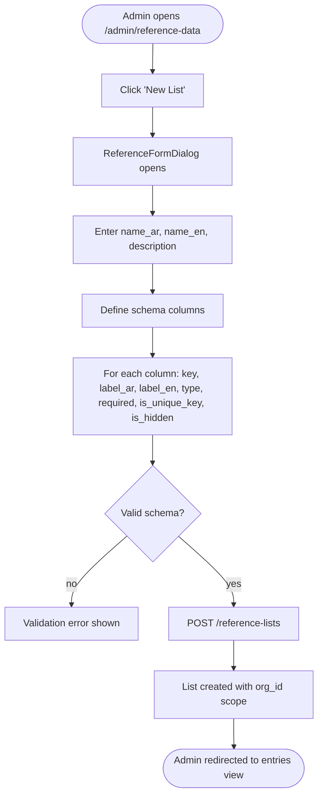
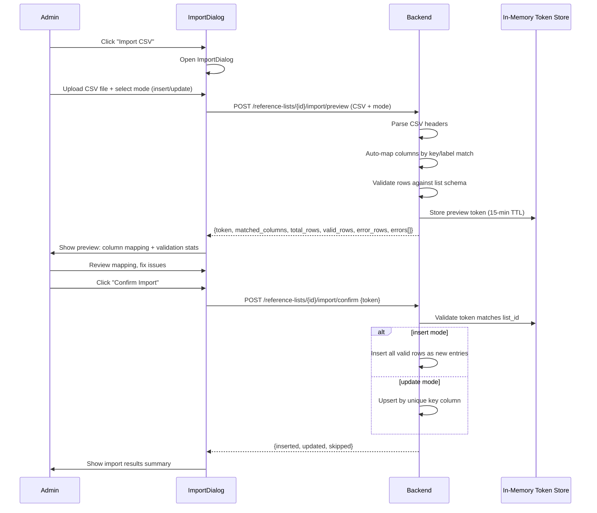
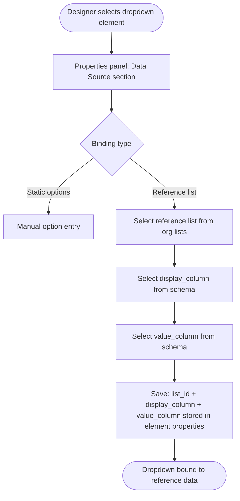
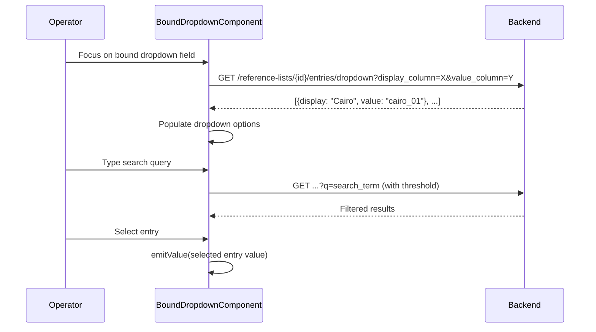

# F23 — Reference Data Manager

**Roles**: Admin (manage lists/entries) · Designer (bind dropdowns) · Operator (use bound dropdowns)  
**Related**: [F04 Design Studio](f04-design-studio.md) · [F03 Templates](f03-templates.md)

---

## Reference data architecture

```mermaid
flowchart TD
    A[reference_lists] --> B[reference_entries]
    A --> C[Schema: column definitions]
    B --> D[Values: JSONB matching schema keys]
    A --> E[Dropdown binding in designer]
    E --> F[BoundDropdownComponent in desk fill]
    F --> G[GET /reference-lists/{id}/entries/dropdown]
```

---

## Wireflow — Admin creates a reference list



---

## Wireflow — CSV import (two-phase)



---

## Wireflow — Designer binds dropdown to reference list



---

## Wireflow — Operator uses bound dropdown



---

## Reference list admin wireframe

```
┌────────────────────────────────────────────────────────────┐
│  Reference Data Manager                                    │
│                                                            │
│  [+ New List]  [Search: ___________]                       │
│                                                            │
│  ┌──────────────┬───────────────┬────────┬───────────────┐ │
│  │ Name (AR)    │ Name (EN)     │ Entries│ Actions        │ │
│  ├──────────────┼───────────────┼────────┼───────────────┤ │
│  │ المحافظات    │ Governorates  │ 27     │ [Edit][Import] │ │
│  │ العملات      │ Currencies    │ 15     │ [Edit][Import] │ │
│  │ الأقسام      │ Departments   │ 8      │ [Edit][Import] │ │
│  └──────────────┴───────────────┴────────┴───────────────┘ │
└────────────────────────────────────────────────────────────┘
```

---

## Reference entries view wireframe

```
┌────────────────────────────────────────────────────────────┐
│  Governorates — Entries                    [Import CSV]     │
│                                                            │
│  Search: [___________]                                     │
│                                                            │
│  ┌──────────┬─────────────┬──────────────┬────────┐        │
│  │ Code     │ Name (AR)   │ Name (EN)    │ Active │        │
│  ├──────────┼─────────────┼──────────────┼────────┤        │
│  │ CAI      │ القاهرة     │ Cairo        │ ☑      │        │
│  │ ALX      │ الاسكندرية  │ Alexandria   │ ☑      │        │
│  │ GIZ      │ الجيزة      │ Giza         │ ☑      │        │
│  │ ...      │ ...         │ ...          │        │        │
│  └──────────┴─────────────┴──────────────┴────────┘        │
│                                                            │
│  Showing 1-10 of 27           [< Prev] [1] [2] [3] [Next >]│
└────────────────────────────────────────────────────────────┘
```

---

## Flows

### 23.1 Admin creates a reference list

```
Admin opens /admin/reference-data
→ Clicks "New List"
→ ReferenceFormDialog opens
→ Enters name_ar, name_en, description
→ Defines schema: array of column definitions
→ Each column: key, label_ar, label_en, type (text/number/date/dropdown), required, is_unique_key, is_hidden
→ POST /reference-lists with schema field (not columns)
→ List created, scoped to admin's org_id
```

### 23.2 Admin manages entries

```
Admin opens a reference list → entries view
→ Paginated list of entries displayed
→ Click "Add Entry" → inline form with fields matching schema columns
→ Values stored as JSONB: {"code": "CAI", "name_ar": "القاهرة", "name_en": "Cairo"}
→ Edit entry: inline edit → PATCH /reference-entries/{id}
→ Deactivate entry: toggle is_active flag (soft delete)
→ Search/filter by any column value via query param
```

### 23.3 Admin imports entries via CSV

```
Admin clicks "Import CSV" on a list
→ ImportDialog opens: upload CSV + select mode (insert/update)
→ Phase 1 — Preview:
  POST /reference-lists/{id}/import/preview
  → CSV parsed, columns auto-mapped by key or label match
  → Rows validated against list schema
  → Preview token stored in-memory (15-min TTL)
  → Response: token, column mapping, total/valid/error row counts
→ Admin reviews preview, adjusts column mapping if needed
→ Phase 2 — Confirm:
  POST /reference-lists/{id}/import/confirm with {token}
  → Token validated against list_id (security check)
  → Insert mode: all valid rows added as new entries
  → Update mode: upsert by is_unique_key column
  → Response: inserted/updated/skipped counts
```

### 23.4 Designer binds a dropdown to a reference list

```
Designer selects a dropdown element in Design Studio
→ Properties panel shows "Data Source" section
→ Selects "Reference List" binding type
→ Picks a reference list from org lists
→ Selects display_column (shown to operator) and value_column (stored in submission)
→ Binding saved: element.properties.list_id, display_column, value_column
```

### 23.5 Operator uses a bound dropdown

```
Operator opens form with bound dropdown
→ BoundDropdownComponent initializes
→ On focus: GET /reference-lists/{id}/entries/dropdown?display_column=X&value_column=Y
→ Options populated in dropdown
→ Operator types search query → typeahead with configurable threshold
→ GET .../dropdown?q=search_term filters results server-side
→ Operator selects entry → emitValue emits full entry (value_column value)
```

---

## Edge cases

| Scenario | Expected behavior |
|----------|-------------------|
| CSV column name matches neither key nor label | Column shown as unmapped in preview; admin can manually map |
| CSV has duplicate unique keys in insert mode | Duplicate rows flagged as errors in preview |
| Import token expired (>15 min) | Confirm returns 400: "Preview expired, re-upload" |
| Import token used for wrong list_id | Confirm returns 400: "Token does not match list" |
| Reference list deleted while dropdown bound | Bound dropdown shows empty options; form still submittable |
| Entry deactivated after dropdown populated | Deactivated entries excluded from dropdown query |
| Typeahead search with no matches | Dropdown shows "No results found" |
| Schema change after entries exist | Existing entries retain old values; new entries must match new schema |
| CSV file with BOM or mixed encodings | CSV parser handles UTF-8 BOM; other encodings return parse error |

---

## Data model

```
reference_lists
├── id (UUID)
├── org_id (UUID, FK → organizations)
├── name_ar, name_en
├── description
├── schema (JSONB: [{key, label_ar, label_en, type, required, is_unique_key, is_hidden}])
├── created_at, updated_at

reference_entries
├── id (UUID)
├── list_id (UUID, FK → reference_lists)
├── org_id (UUID, FK → organizations)
├── values (JSONB matching schema column keys)
├── is_active (boolean, default true)
├── created_at, updated_at
```
