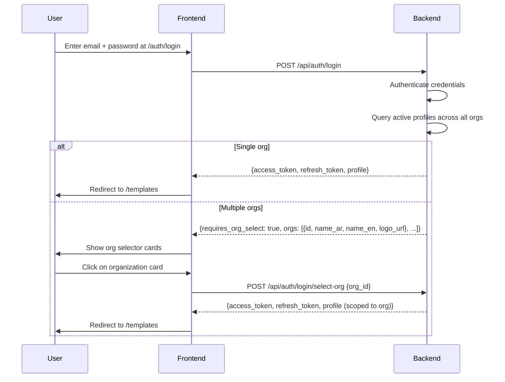
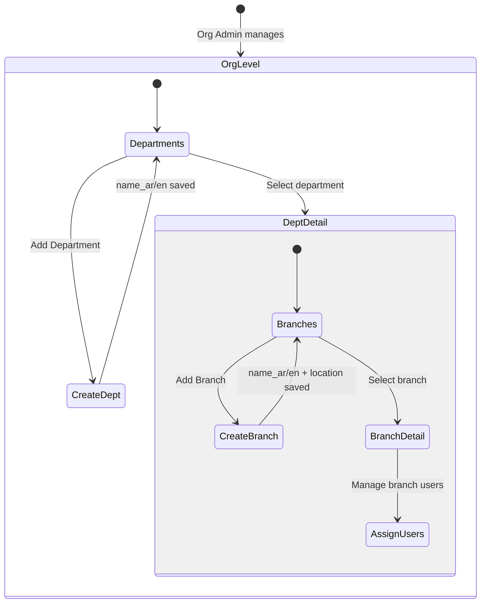
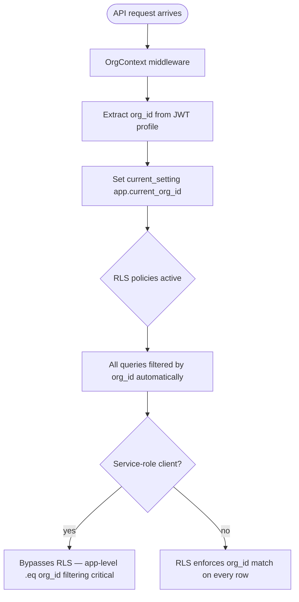

# F24 — Multi-Tenancy

**Roles**: Platform Admin · Org Admin · Designer · Operator · Viewer · Branch Manager  
**Related**: [F01 Auth](f01-auth.md) · [F08 Security](f08-security.md) · [F22 Overlay Print](f22-overlay-print-mode.md) · [F23 Reference Data](f23-reference-data.md)

---

## Organizational hierarchy

```
┌─────────────────────────────────────────┐
│              Organization               │
│  name_ar/en, logo, primary_color,       │
│  subscription_tier, custom_domain       │
├─────────────┬─────────────┬─────────────┤
│ Department  │ Department  │ Department  │
│  (Finance)  │   (HR)      │   (Ops)     │
├──────┬──────┼──────┬──────┼──────┬──────┤
│Branch│Branch│Branch│Branch│Branch│Branch│
│Cairo │Alex  │Cairo │Riyadh│Cairo │Dubai │
└──────┴──────┴──────┴──────┴──────┴──────┘
```

---

## Wireflow — Multi-org login



---

## Org selector wireframe

```
┌─────────────────────────────────────────────────┐
│           Select Your Organization              │
│                                                 │
│  ┌───────────────────┐  ┌───────────────────┐   │
│  │  ┌──┐             │  │  ┌──┐             │   │
│  │  │🏢│  Acme Corp  │  │  │🏭│  Beta Inc   │   │
│  │  └──┘             │  │  └──┘             │   │
│  │  أكمي كورب        │  │  بيتا             │   │
│  │                   │  │                   │   │
│  │  Role: Admin      │  │  Role: Designer   │   │
│  └───────────────────┘  └───────────────────┘   │
│                                                 │
│  ┌───────────────────┐                          │
│  │  ┌──┐             │                          │
│  │  │🏗️│  Gamma LLC   │                          │
│  │  └──┘             │                          │
│  │  جاما             │                          │
│  │                   │                          │
│  │  Role: Operator   │                          │
│  └───────────────────┘                          │
└─────────────────────────────────────────────────┘
```

---

## Wireflow — Invitation workflow

```mermaid
flowchart TD
    A([Org Admin opens /admin/invitations]) --> B[Click 'Invite User']
    B --> C[Enter email, select role, department, branch]
    C --> D[POST /invitations]
    D --> E[Generate unique token, 72-hour expiry]
    E --> F[Send invitation email with link]
    F --> G([Invitee receives email])
    G --> H[Click link → /auth/accept-invitation/{token}]
    H --> I[GET /invitations/{token} — public endpoint]
    I --> J[Prefill: email, role, org name/logo, expires_at]
    J --> K[Invitee enters display_name + password]
    K --> L[POST /invitations/accept/{token}]
    L --> M[Create Supabase Auth user]
    M --> N[Create profile: org_id, role, department_id, branch_id]
    N --> O[Mark invitation as accepted]
    O --> P([Invitee redirected to login])
```

---

## Wireflow — User assignment

```mermaid
flowchart TD
    A([Org Admin opens /admin/users]) --> B[Select user from list]
    B --> C[Click 'Edit Assignment']
    C --> D[Select role from dropdown]
    D --> E[Select department from org departments]
    E --> F[Select branch from department branches]
    F --> G[PATCH /users/{id}/assignment]
    G --> H{Action}
    H -- Update role --> I[Profile role updated]
    H -- Change department --> J[Profile department_id updated]
    H -- Change branch --> K[Profile branch_id updated]
    H -- Deactivate --> L[Profile is_active set to false]
    I --> M([User list refreshed])
    J --> M
    K --> M
    L --> M
```

---

## Wireflow — Org settings and branding

```mermaid
flowchart LR
    A([Org Admin]) --> B[GET /org-settings]
    B --> C[Settings form loads]
    C --> D[Edit settings: approval_workflow, hijri_date_support, etc.]
    D --> E[Upload logo to Supabase Storage org-logos/{org_id}/]
    E --> F[PATCH /org-settings]
    F --> G([Settings saved])

    H([Public login page]) --> I[GET /auth/branding/{domain}]
    I --> J[Returns: org name, logo_url, primary_color, default_language]
    J --> K[Login page renders with org branding]
```

---

## Org settings wireframe

```
┌──────────────────────────────────────────────────┐
│  Organization Settings                            │
│                                                  │
│  Logo: [Upload]  ┌────┐                          │
│                   │ 🏢 │  Current logo            │
│                   └────┘                          │
│                                                  │
│  Name (AR): [___________]                        │
│  Name (EN): [___________]                        │
│  Primary Color: [#1976D2] 🎨                      │
│  Default Language: [Arabic ▼]                     │
│  Default Country: [Egypt ▼]                       │
│  Default Currency: [EGP ▼]                        │
│  Custom Domain: [forms.acme.com]                 │
│                                                  │
│  ── Workflow Settings ──                          │
│  Approval Workflow: ☑                            │
│  Hijri Date Support: ☐                           │
│  Draft Expiry (days): [30]                       │
│  Data Retention (months): [24]                   │
│  Max Batch Size: [100]                           │
│                                                  │
│  [Save Settings]                                 │
└──────────────────────────────────────────────────┘
```

---

## Department and branch management



---

## RLS and data isolation



---

## Flows

### 24.1 Platform admin creates an organization

```
Platform admin (is_platform_admin=true) accesses /platform/organizations
→ Clicks "Create Organization"
→ Fills: name_ar, name_en, logo, primary_color, default_language, default_country, default_currency
→ Sets subscription_tier (free/basic/enterprise)
→ Optionally sets custom_domain
→ POST /organizations creates org
→ First admin user invited via invitation workflow
```

### 24.2 Multi-org login flow

```
User enters email + password at /auth/login
→ POST /api/auth/login authenticates credentials
→ Backend queries all active profiles for this user across orgs
→ If single org: returns token + profile immediately
→ If multiple orgs: returns requires_org_select=true + orgs list
  (no response_model restriction — direct dict response)
→ Frontend shows org selector cards with logo, name_ar/en, user role
→ User clicks org card → POST /api/auth/login/select-org {org_id}
→ Returns scoped access_token + refresh_token + profile for selected org
→ Frontend stores tokens and redirects to /templates
```

### 24.3 Org admin invites a user

```
Org admin opens /admin/invitations
→ Clicks "Invite User"
→ Enters email, selects role (admin/designer/operator/viewer/branch_manager)
→ Optionally selects department and branch
→ POST /invitations — duplicate email check per org
→ Token generated, 72-hour expiry
→ Invitation email sent with accept link
→ Invitee clicks link → /auth/accept-invitation/{token}
→ GET /invitations/{token} (public) returns prefill data
→ Invitee enters display_name + password
→ POST /invitations/accept/{token} creates Supabase Auth user + profile
→ Profile assigned: org_id, role, department_id, branch_id
→ Invitation marked as accepted
```

### 24.4 Org admin manages user assignments

```
Org admin opens /admin/users → user management
→ Selects a user → clicks "Edit Assignment"
→ Can change: role, department, branch
→ PATCH /users/{id}/assignment updates profile
→ Can activate/deactivate users (soft enable/disable)
→ Deactivated users cannot log in
```

### 24.5 Org admin configures settings

```
Org admin opens /admin/org-settings
→ GET /org-settings returns current settings
→ Admin edits:
  - approval_workflow (boolean)
  - hijri_date_support (boolean)
  - draft_expiry_days (integer)
  - data_retention_months (integer)
  - max_batch_size (integer)
→ Uploads logo to Supabase Storage: org-logos/{org_id}/
→ PATCH /org-settings saves changes
```

### 24.6 Custom domain branding

```
User navigates to forms.acme.com/auth/login
→ Frontend calls GET /auth/branding/forms.acme.com (public endpoint)
→ Returns: org name_ar/en, logo_url, primary_color, default_language
→ Login page renders with org-specific branding
→ After login, user lands in correct org context
```

### 24.7 Department-scoped templates

```
Designer creates a template → assigns to department (optional)
→ template.department_id set (null = org-wide)
→ Template list queries filter:
  .or_("department_id.is.null", f"department_id.eq.{user_dept_id}")
→ Org-wide templates visible to all; department templates only to department members
```

### 24.8 Branch-tagged submissions

```
Operator submits a form
→ Submission auto-tagged with operator's branch_id from profile
→ Reports and queries can filter by branch
→ Branch managers see submissions from their branch only
```

---

## Role hierarchy and access

| Role | Scope | Capabilities |
|------|-------|-------------|
| platform_admin | Cross-org | Create/manage orgs, global settings |
| admin | Org-wide | All org settings, users, departments, branches, templates |
| designer | Org-wide | Create/edit templates, element configuration |
| branch_manager | Branch | View branch submissions, manage branch operators |
| operator | Branch/Dept | Fill forms, view own submissions |
| viewer | Org-wide | Read-only access to submissions and templates |

---

## Middleware authorization

```
require_platform_admin → checks profile.is_platform_admin = true
require_org_admin → checks profile.role = 'admin' within current org
require_org_role(roles) → checks profile.role in allowed roles list
```

---

## Edge cases

| Scenario | Expected behavior |
|----------|-------------------|
| User has profiles in 3 orgs, 1 deactivated | Org selector shows only 2 active orgs |
| Invitation email already exists in org | POST /invitations returns 409 Conflict |
| Invitation token expired (>72 hours) | Accept returns 410 Gone |
| Invitation cancelled by admin | Accept returns 410 Gone |
| User deactivated mid-session | Next API call returns 403; frontend redirects to login |
| Custom domain not found in branding lookup | Returns default FormCraft branding |
| Department deleted with active templates | Templates retain department_id; become orphaned (admin cleanup needed) |
| Branch deleted with assigned users | Users retain branch_id; admin must reassign |
| Service-role client without app-level org_id filter | Data leak risk — all org_id filtering mandatory in service code |
| Login with 0 active profiles | Returns 403: "No active profiles found" |

---

## Data model (migration 027)

```
organizations
├── id, name_ar, name_en, logo_url, primary_color
├── default_language, default_country, default_currency
├── custom_domain, settings (JSONB), subscription_tier
├── created_at, updated_at

departments
├── id, org_id (FK), name_ar, name_en
├── created_at, updated_at

branches
├── id, org_id (FK), department_id (FK), name_ar, name_en, location
├── created_at, updated_at

user_invitations
├── id, org_id (FK), email, role, department_id, branch_id
├── token, expires_at, accepted_at, cancelled_at
├── created_at

profiles (extended)
├── org_id (FK), department_id (FK), branch_id (FK)
├── is_platform_admin (boolean)
├── is_active (boolean)
```
