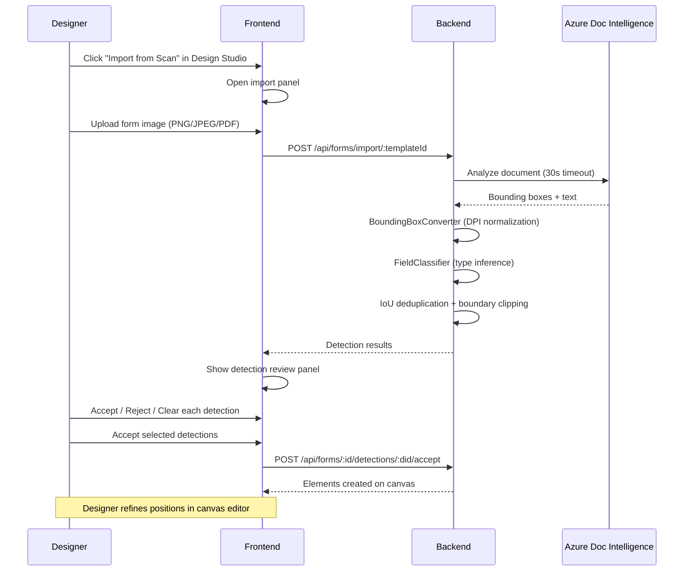

# F26 — Form Import & OCR Detection

> Automatic field detection from uploaded form images using Azure Document Intelligence OCR, with manual review and element creation workflow in the Design Studio.

---

## Status

**Code-complete** — 76/76 tests passing. Awaiting Azure Document Intelligence credentials for live OCR.

---

## Architecture

```
Designer uploads form image
    → POST /api/forms/import/:templateId (multipart: image file)
    → Backend: Azure Document Intelligence analyzes image
    → BoundingBoxConverter: normalize bounding boxes (DPI + page-aware)
    → FieldClassifier: classify detected fields (Arabic/Hijri support)
    → IoU deduplication + boundary clipping
    → Response: array of detected fields with positions and suggested types
    → Frontend: detection review panel overlaid on Design Studio canvas
```

---

## User flow



---

## API endpoints

| Endpoint | Method | Purpose |
|----------|--------|---------|
| `/api/forms/import/:templateId` | POST | Upload image and run OCR detection |
| `/api/forms/:id/detections` | GET | List detection results for a template |
| `/api/forms/:id/detections/:did/accept` | POST | Accept a detection → create element |
| `/api/forms/detections/:did` | DELETE | Delete/reject a detection |

---

## Backend components

| Component | File | Purpose |
|-----------|------|---------|
| BoundingBoxConverter | `services/ocr/bounding_box_converter.py` | DPI-aware coordinate normalization, page-aware multi-page support |
| FieldClassifier | `services/ocr/field_classifier.py` | Classify detected text into field types (text, number, date, currency, checkbox, etc.) with Arabic/Hijri support |
| Forms routes | `api/routes/forms.py` | API endpoints for import, list, accept, delete |
| Migration 028 | `migrations/028_form_detections.sql` | `form_detections` table |

---

## Frontend components

| Component | Purpose |
|-----------|---------|
| Import panel | Upload UI in Design Studio toolbar |
| Detection review panel | Accept/reject/clear detections overlaid on canvas |
| Debug grid overlay | Ctrl+G toggle for pixel-level position debugging |
| Replace confirmation dialog | Warns before replacing existing elements |

---

## Test coverage

| Test suite | Count | Coverage |
|-----------|:-----:|---------|
| BoundingBoxConverter | 21 | DPI normalization, page offsets, boundary clipping |
| FieldClassifier | 45 | Type inference, Arabic text (19 Arabic-specific), Hijri dates |
| Forms route integration | 10 | Upload, list, accept, delete endpoints |
| **Total** | **76** | All passing |

---

## Data model

```
form_detections (migration 028)
    id              UUID PK
    template_id     UUID FK -> templates
    page_number     INTEGER
    field_type      TEXT
    label           TEXT
    confidence      FLOAT
    bbox_x_mm       FLOAT
    bbox_y_mm       FLOAT
    bbox_w_mm       FLOAT
    bbox_h_mm       FLOAT
    raw_text        TEXT
    status          TEXT (pending/accepted/rejected)
    accepted_element_id UUID FK -> elements (nullable)
    org_id          UUID FK -> organizations
    created_by      UUID FK -> auth.users
    created_at      TIMESTAMPTZ
```

---

## Constraints

- 30-second timeout on Azure Document Intelligence API calls
- IoU > 0.5 triggers deduplication (keeps higher confidence detection)
- Boundary clipping ensures no detection extends beyond page dimensions
- Audit logging on all import and accept operations
- i18n: full Arabic + English support in frontend panels
