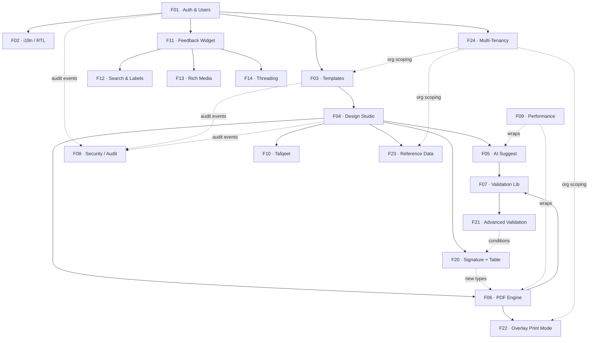
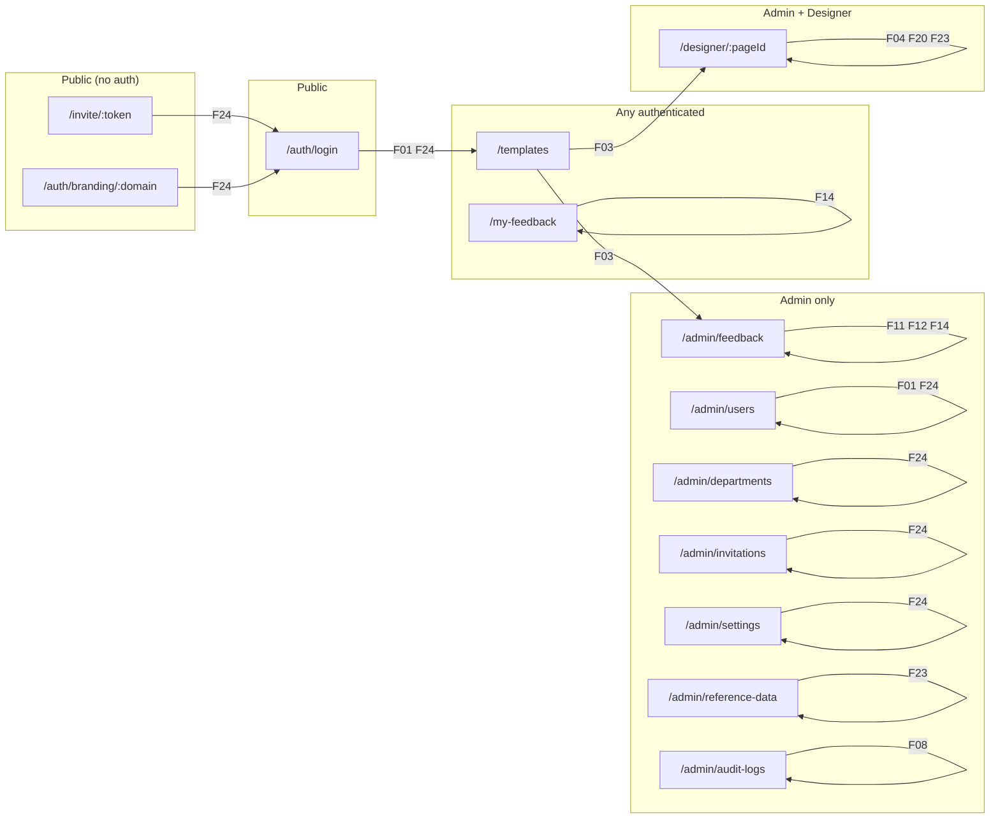
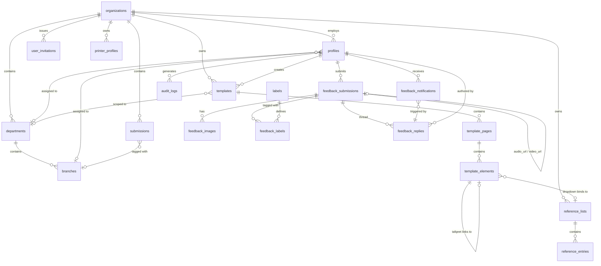

# FormCraft — Feature Map

> System-level view of how all 19 features connect, which roles own them, and how data flows between modules.

---

## Feature dependency graph

---

## Role × Feature access matrix

| Feature | Admin | Designer | Operator | Viewer | Any Auth |
|---------|:-----:|:--------:|:--------:|:------:|:--------:|
| F01 Auth | ✅ manage users | ✅ own profile | ✅ own profile | ✅ own profile | — |
| F02 i18n | ✅ | ✅ | ✅ | ✅ | ✅ |
| F03 Templates | ✅ publish | ✅ create/edit draft | 📖 published only | 📖 published only | — |
| F04 Design Studio | ✅ | ✅ | — | — | — |
| F05 AI Suggest | ✅ | ✅ | — | — | — |
| F06 PDF Engine | ✅ | ✅ preview | ✅ export | — | — |
| F07 Validation | system | system | system | system | — |
| F08 Security / Audit | ✅ view logs | — | — | — | — |
| F09 Performance | system / devops | — | — | — | — |
| F10 Tafqeet | ✅ | ✅ configure | — | — | — |
| F11 Feedback Widget | ✅ | ✅ | ✅ | ✅ | ✅ submit |
| F12 Search & Labels | ✅ | — | — | — | — |
| F13 Rich Media | ✅ view | ✅ attach | ✅ attach | ✅ attach | ✅ attach |
| F14 Threading | ✅ reply | — | ✅ reply | ✅ reply | ✅ reply |
| F20 Signature + Table | ✅ | ✅ configure | ✅ fill | — | — |
| F21 Advanced Validation | system | ✅ configure rules | system | system | — |
| F22 Overlay Print | ✅ profiles | ✅ overlay flag | ✅ print | — | — |
| F23 Reference Data | ✅ manage lists | ✅ bind dropdowns | ✅ use dropdowns | — | — |
| F24 Multi-Tenancy | ✅ org admin | ✅ scoped | ✅ scoped | ✅ scoped | — |

---

## Module map (frontend routes → feature)

---

## Data model relationships (simplified)

---

## API surface summary

| Domain | Base path | Auth required | Role gate |
|--------|-----------|:-------------:|:---------:|
| Auth | `/api/auth/*` | partial | — |
| Users | `/api/users/*` | ✅ | admin (manage), self (read/update) |
| Templates | `/api/templates/*` | ✅ | role-based per operation |
| Elements | `/api/templates/{id}/pages/{p}/elements/*` | ✅ | admin / designer |
| AI | `/api/ai/suggest` | ✅ | admin / designer |
| PDF | `/api/pdf/render/{id}` | ✅ | admin / designer / operator |
| Admin feedback | `/api/admin/feedback/*` | ✅ | admin |
| Admin labels | `/api/admin/labels/*` | ✅ | admin |
| Feedback (user) | `/api/feedback/*` | ✅ | any authenticated |
| My feedback | `/api/my-feedback` | ✅ | any authenticated |
| Notifications | `/api/notifications/*` | ✅ | any authenticated |
| Health | `/api/health` | — | — |
| Audit | `/api/admin/audit-logs` | ✅ | admin |
| Organizations | `/api/organizations/*` | ✅ | platform admin |
| Org Settings | `/api/org-settings` | ✅ | org admin |
| Departments | `/api/departments/*` | ✅ | org admin |
| Branches | `/api/branches/*` | ✅ | org admin |
| Invitations | `/api/invitations/*` | ✅ / partial | org admin (manage), public (accept) |
| Printer Profiles | `/api/printer-profiles/*` | ✅ | admin |
| Reference Lists | `/api/reference-lists/*` | ✅ | admin (manage), any auth (dropdown) |
| Branding | `/api/auth/branding/{domain}` | — | public |
