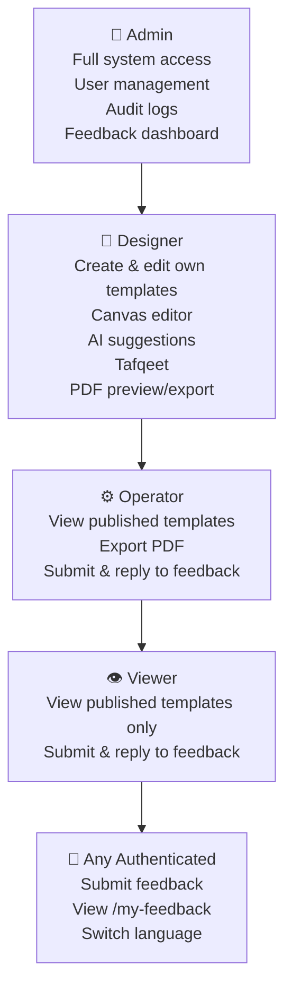
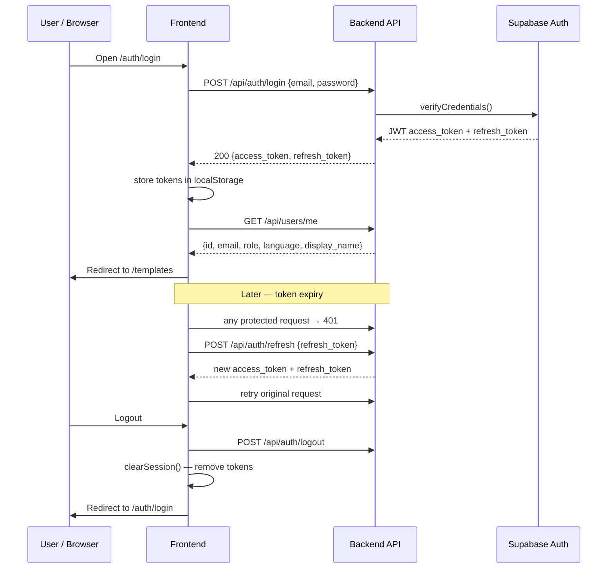
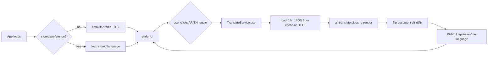

# FormCraft — Cross-Cutting User Flows

> Flows and rules that apply across all features.

---

## Role hierarchy

---

## Route guard matrix

| Route | Guard | Allowed roles |
|-------|-------|:-------------:|
| `/auth/login` | — | public |
| `/templates` | AuthGuard | any authenticated |
| `/designer/:pageId` | AuthGuard + RoleGuard | admin, designer |
| `/admin/feedback` | AuthGuard + RoleGuard | admin |
| `/admin/users` | AuthGuard + RoleGuard | admin |
| `/admin/audit-logs` | AuthGuard + RoleGuard | admin |
| `/my-feedback` | AuthGuard | any authenticated |

---

## Session lifecycle

---

## Language switching wireflow

---

## Error handling (all features)

| HTTP status | Frontend behaviour |
|-------------|-------------------|
| Network / 5xx | Toast "حدث خطأ، حاول مرة أخرى" |
| 401 Unauthorized | Attempt token refresh → on failure, redirect to `/auth/login` |
| 403 Forbidden | Toast "غير مصرح بهذا الإجراء"; redirect to `/templates` |
| 404 Not Found | Inline empty state or toast |
| 422 Validation | Inline field-level error messages |
| 429 Rate Limited | Submit button disabled; countdown shown until cooldown ends |

---

## RTL / Bilingual consistency rules

- All flows operate equally in Arabic (RTL) and English (LTR)
- Form labels, error messages, toasts, and email notifications are served from the active language's i18n JSON
- Arabic text in PDFs uses Noto Naskh Arabic font with proper Unicode shaping (`arabic-reshaper` + `python-bidi`)
- Western Arabic numerals (0–9) always used; no Eastern Arabic digits
- Missing translation key → key string shown as fallback (no crash)
- Long strings in fixed containers → `text-overflow: ellipsis`; full text on tooltip
